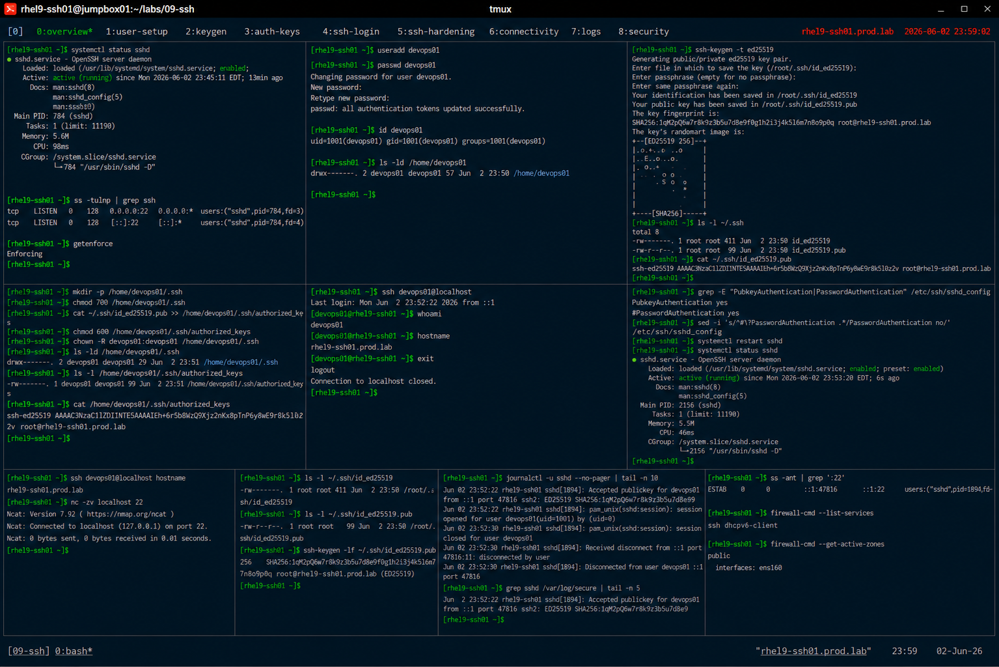

# SSH Key-Based Authentication

## Overview

This lab demonstrates enterprise Linux SSH key-based authentication on RHEL 9 systems.

The workflow simulates production secure access management involving SSH key generation, public key deployment, passwordless authentication, and enterprise remote access hardening.

---

# Objective

This exercise covers:

- SSH key generation
- public/private key management
- passwordless authentication
- authorized_keys configuration
- SSH client validation
- secure remote access
- enterprise authentication practices

---

# Environment Information

| Item | Details |
|---|---|
| Operating System | RHEL 9.6 |
| Hostname | rhel9-ssh01.prod.lab |
| SSH Service | OpenSSH |
| Authentication Method | RSA/ED25519 Keys |
| SELinux | Enforcing |

---

# SSH Key Authentication Overview

SSH key-based authentication provides:

- secure remote access
- passwordless login
- stronger authentication
- automation support
- enterprise access control

---

# Initial Validation

## Verify SSH Service Status

```bash
systemctl status sshd
```

Expected output:

```text
active (running)
```

---

## Verify SSH Port

```bash
ss -tulnp | grep ssh
```

Expected output:

```text
:22
```

---

## Verify SELinux Status

```bash
getenforce
```

Expected output:

```text
Enforcing
```

---

# Create Test User

## Create SSH User

```bash
useradd devops01
```

---

## Configure Password

```bash
passwd devops01
```

Expected output:

```text
password updated successfully
```

---

## Verify User Account

```bash
id devops01
```

Expected output:

```text
uid=
```

---

# SSH Key Generation

## Generate ED25519 Key Pair

```bash
ssh-keygen -t ed25519
```

Expected prompts:

```text
Enter file in which to save the key
```

---

## Verify Generated Keys

```bash
ls -l ~/.ssh
```

Expected output:

```text
id_ed25519
id_ed25519.pub
```

---

## Verify Public Key Contents

```bash
cat ~/.ssh/id_ed25519.pub
```

Expected output:

```text
ssh-ed25519
```

---

# Configure SSH Authorized Keys

## Create .ssh Directory

```bash
mkdir -p /home/devops01/.ssh
```

---

## Configure Secure Permissions

```bash
chmod 700 /home/devops01/.ssh
```

---

## Copy Public Key

```bash
cat ~/.ssh/id_ed25519.pub \
>> /home/devops01/.ssh/authorized_keys
```

---

## Configure authorized_keys Permissions

```bash
chmod 600 /home/devops01/.ssh/authorized_keys
```

---

## Configure Ownership

```bash
chown -R devops01:devops01 /home/devops01/.ssh
```

---

## Verify Authorized Keys

```bash
cat /home/devops01/.ssh/authorized_keys
```

Expected output:

```text
ssh-ed25519
```

---

# SSH Login Validation

## Test Passwordless SSH Login

```bash
ssh devops01@localhost
```

Expected output:

```text
Last login:
```

No password prompt should appear.

---

## Verify Authenticated User

```bash
whoami
```

Expected output:

```text
devops01
```

---

# SSH Client Validation

## Verify SSH Fingerprint

```bash
ssh-keygen -lf ~/.ssh/id_ed25519.pub
```

Expected output:

```text
SHA256:
```

---

## Verify SSH Configuration

```bash
ssh -v devops01@localhost
```

Expected output:

```text
Authentication succeeded
```

---

# SSH Hardening Validation

## Verify SSH Configuration File

```bash
grep -E "PubkeyAuthentication|PasswordAuthentication" \
/etc/ssh/sshd_config
```

Expected output:

```text
PubkeyAuthentication yes
```

---

## Disable Password Authentication

```bash
vi /etc/ssh/sshd_config
```

Set:

```text
PasswordAuthentication no
```

---

## Restart SSH Service

```bash
systemctl restart sshd
```

---

## Verify SSH Service

```bash
systemctl status sshd
```

Expected output:

```text
active (running)
```

---

# SSH Connectivity Validation

## Verify Local SSH Access

```bash
ssh devops01@localhost hostname
```

Expected output:

```text
rhel9-ssh01.prod.lab
```

---

## Verify SSH Port Accessibility

```bash
nc -zv localhost 22
```

Expected output:

```text
succeeded
```

---

# Key Security Validation

## Verify Private Key Permissions

```bash
ls -l ~/.ssh/id_ed25519
```

Expected output:

```text
-rw-------
```

---

## Verify Public Key Permissions

```bash
ls -l ~/.ssh/id_ed25519.pub
```

Expected output:

```text
-rw-r--r--
```

---

# SSH Logging Validation

## Verify SSH Authentication Logs

```bash
journalctl -u sshd
```

Expected output:

```text
Accepted publickey
```

---

## Verify Failed Login Attempts

```bash
grep sshd /var/log/secure
```

Expected output:

```text
Accepted publickey
```

---

# Connectivity Monitoring

## Verify Established SSH Sessions

```bash
ss -ant | grep :22
```

Expected output:

```text
ESTAB
```

---

# Persistence Validation

## Reboot Validation

```bash
reboot
```

After reboot:

```bash
ssh devops01@localhost
```

Expected output:

```text
Last login
```

SSH key authentication remains persistent after reboot.

---

# Security Validation

## Verify Firewall Access

```bash
firewall-cmd --list-services
```

Expected output:

```text
ssh
```

---

## Verify Active Firewall Zone

```bash
firewall-cmd --get-active-zones
```

Expected output:

```text
public
```

---

# Operational Recommendations

## Prefer Key-Based Authentication

Enterprise environments should avoid:

- password-only authentication
- shared administrative passwords
- weak credential policies

---

## Protect Private Keys Carefully

Private keys should:

- remain confidential
- use secure permissions
- avoid unauthorized sharing
- use passphrases where possible

---

## Audit SSH Access Regularly

Enterprise monitoring should validate:

- unauthorized login attempts
- weak authentication methods
- inactive SSH keys
- unusual remote access patterns

---

# Operational Notes

- SSH keys improve authentication security
- authorized_keys controls remote access
- passwordless login supports automation
- SSH hardening improves enterprise security
- enterprise environments require continuous SSH auditing

---

# Expected Outcome

After completing this lab:

- SSH key authentication is operational
- passwordless login is validated
- SSH hardening is configured
- authentication logging is verified
- enterprise remote access practices are applied

---

# Screenshot Reference


