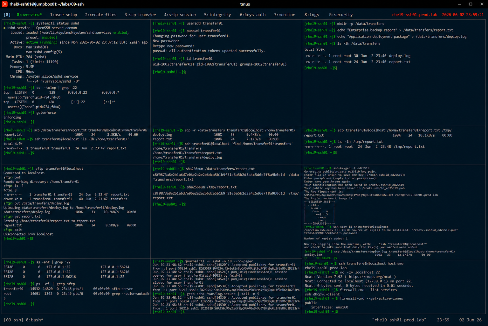

# SCP and SFTP File Transfer Operations

## Overview

This lab demonstrates enterprise Linux secure file transfer operations using SCP and SFTP on RHEL 9 systems.

The workflow simulates production secure file exchange scenarios involving encrypted transfers, remote directory management, automated copy operations, and enterprise data movement practices.

---

# Objective

This exercise covers:

- SCP file transfers
- SFTP interactive sessions
- secure remote file management
- SSH-based authentication
- transfer validation
- file integrity verification
- enterprise secure transfer practices

---

# Environment Information

| Item | Details |
|---|---|
| Operating System | RHEL 9.6 |
| Hostname | rhel9-ssh01.prod.lab |
| Transfer Protocols | SCP, SFTP |
| SSH Service | OpenSSH |
| SELinux | Enforcing |

---

# SCP and SFTP Overview

SCP and SFTP provide:

- encrypted file transfers
- secure remote access
- enterprise data movement
- authenticated sessions
- secure administrative operations

---

# Initial Validation

## Verify SSH Service Status

```bash
systemctl status sshd
```

Expected output:

```text
active (running)
```

---

## Verify SSH Port

```bash
ss -tulnp | grep :22
```

Expected output:

```text
LISTEN
```

---

## Verify SELinux Status

```bash
getenforce
```

Expected output:

```text
Enforcing
```

---

# Create Test User

## Create Transfer User

```bash
useradd transfer01
```

---

## Configure Password

```bash
passwd transfer01
```

Expected output:

```text
password updated successfully
```

---

## Verify User Account

```bash
id transfer01
```

Expected output:

```text
uid=
```

---

# Create Test Files

## Create Local Transfer Files

```bash
mkdir -p /data/transfers
```

---

## Generate Sample Files

```bash
echo "Enterprise backup report" \
> /data/transfers/report.txt

echo "Application deployment package" \
> /data/transfers/deploy.log
```

---

## Verify File Creation

```bash
ls -lh /data/transfers
```

Expected output:

```text
report.txt
deploy.log
```

---

# SCP File Transfer

## Copy File to Remote User Home

```bash
scp /data/transfers/report.txt \
transfer01@localhost:/home/transfer01/
```

Expected output:

```text
100%
```

---

## Verify Remote File

```bash
ssh transfer01@localhost \
'ls -lh /home/transfer01/'
```

Expected output:

```text
report.txt
```

---

# SCP Recursive Copy

## Copy Entire Directory

```bash
scp -r /data/transfers \
transfer01@localhost:/home/transfer01/
```

---

## Verify Recursive Transfer

```bash
ssh transfer01@localhost \
'find /home/transfer01/transfers'
```

Expected output:

```text
deploy.log
```

---

# SCP File Retrieval

## Retrieve Remote File

```bash
scp transfer01@localhost:/home/transfer01/report.txt \
/tmp/
```

---

## Verify Retrieved File

```bash
ls -lh /tmp/report.txt
```

Expected output:

```text
report.txt
```

---

# SFTP Interactive Session

## Start SFTP Session

```bash
sftp transfer01@localhost
```

Expected prompt:

```text
sftp>
```

---

## Verify Remote Directory

```bash
pwd
ls
```

Expected output:

```text
/home/transfer01
```

---

## Upload File via SFTP

```bash
put /data/transfers/deploy.log
```

Expected output:

```text
Uploading
```

---

## Download File via SFTP

```bash
get report.txt
```

Expected output:

```text
Fetching
```

---

## Exit SFTP Session

```bash
exit
```

---

# File Integrity Validation

## Generate File Checksums

```bash
sha256sum /data/transfers/report.txt
sha256sum /tmp/report.txt
```

Expected output:

```text
matching checksum values
```

---

# SSH Key-Based Transfer Validation

## Generate SSH Key Pair

```bash
ssh-keygen -t ed25519
```

---

## Deploy Public Key

```bash
ssh-copy-id transfer01@localhost
```

Expected output:

```text
Number of key(s) added
```

---

## Verify Passwordless SCP

```bash
scp /data/transfers/deploy.log \
transfer01@localhost:/home/transfer01/
```

Expected behavior:

```text
No password prompt
```

---

# Transfer Monitoring

## Verify Established SSH Sessions

```bash
ss -ant | grep :22
```

Expected output:

```text
ESTAB
```

---

## Verify Active SFTP Processes

```bash
ps -ef | grep sftp
```

Expected output:

```text
sftp-server
```

---

# Logging Validation

## Verify SSH Transfer Logs

```bash
journalctl -u sshd
```

Expected output:

```text
subsystem request for sftp
```

---

## Verify Secure Logs

```bash
grep sshd /var/log/secure
```

Expected output:

```text
Accepted publickey
```

---

# Connectivity Validation

## Verify SSH Connectivity

```bash
ssh transfer01@localhost hostname
```

Expected output:

```text
rhel9-ssh01.prod.lab
```

---

## Verify Port Connectivity

```bash
nc -zv localhost 22
```

Expected output:

```text
succeeded
```

---

# Persistence Validation

## Reboot Validation

```bash
reboot
```

After reboot:

```bash
scp /data/transfers/report.txt \
transfer01@localhost:/tmp/
```

Expected output:

```text
100%
```

Secure transfer services remain operational after reboot.

---

# Security Validation

## Verify Firewall Access

```bash
firewall-cmd --list-services
```

Expected output:

```text
ssh
```

---

## Verify Active Firewall Zones

```bash
firewall-cmd --get-active-zones
```

Expected output:

```text
public
```

---

# Operational Recommendations

## Prefer Encrypted Transfers

Enterprise environments should avoid:

- FTP
- Telnet-based transfers
- unsecured file movement

---

## Use SSH Keys for Automation

Benefits:

- secure automation
- passwordless authentication
- reduced credential exposure
- enterprise scalability

---

## Validate File Integrity

Enterprise file transfers should verify:

- checksums
- successful transfer completion
- expected file ownership
- transfer logging

---

# Operational Notes

- SCP and SFTP use encrypted SSH transport
- SFTP provides interactive remote file management
- SSH keys improve automation security
- integrity validation protects enterprise data
- enterprise environments require audited transfer workflows

---

# Expected Outcome

After completing this lab:

- SCP and SFTP operations are operational
- secure file transfers are validated
- SSH key-based transfers are configured
- integrity validation is verified
- enterprise secure transfer practices are applied

---

# Screenshot Reference


