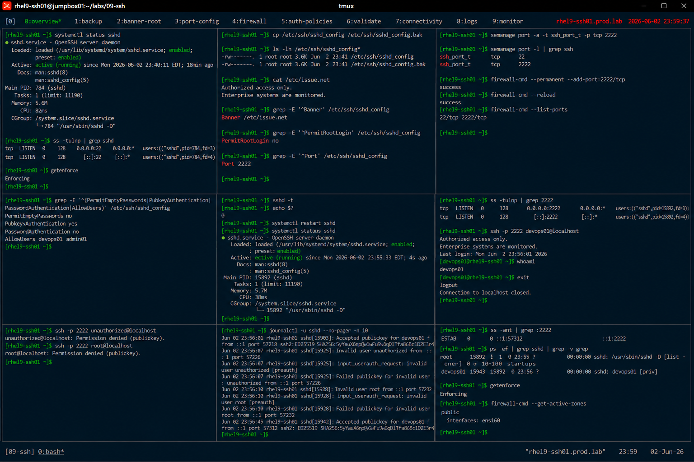

# SSH Server Configuration and Hardening

## Overview

This lab demonstrates enterprise Linux SSH server administration and hardening on RHEL 9 systems.

The workflow simulates production secure remote access management involving SSH daemon configuration, access restrictions, authentication hardening, logging, and enterprise security validation.

---

# Objective

This exercise covers:

- SSH daemon configuration
- SSH hardening
- port customization
- access restrictions
- authentication policy management
- SSH logging and auditing
- enterprise remote access security practices

---

# Environment Information

| Item | Details |
|---|---|
| Operating System | RHEL 9.6 |
| Hostname | rhel9-ssh01.prod.lab |
| SSH Service | OpenSSH |
| SSH Configuration | sshd_config |
| SELinux | Enforcing |

---

# SSH Server Overview

OpenSSH provides:

- encrypted remote administration
- secure authentication
- centralized access control
- enterprise remote connectivity
- administrative automation support

---

# Initial Validation

## Verify SSH Service Status

```bash
systemctl status sshd
```

Expected output:

```text
active (running)
```

---

## Verify SSH Listening Port

```bash
ss -tulnp | grep sshd
```

Expected output:

```text
:22
```

---

## Verify SELinux Status

```bash
getenforce
```

Expected output:

```text
Enforcing
```

---

# Backup SSH Configuration

## Create SSH Configuration Backup

```bash
cp /etc/ssh/sshd_config \
/etc/ssh/sshd_config.bak
```

---

## Verify Backup File

```bash
ls -lh /etc/ssh/sshd_config*
```

Expected output:

```text
sshd_config.bak
```

---

# Configure SSH Banner

## Create Login Banner

```bash
vi /etc/issue.net
```

Add:

```text
Authorized access only.
Enterprise systems are monitored.
```

---

## Configure Banner in sshd_config

```bash
vi /etc/ssh/sshd_config
```

Set:

```text
Banner /etc/issue.net
```

---

# Disable Root Login

## Modify SSH Configuration

```bash
vi /etc/ssh/sshd_config
```

Set:

```text
PermitRootLogin no
```

---

## Verify Configuration

```bash
grep PermitRootLogin /etc/ssh/sshd_config
```

Expected output:

```text
PermitRootLogin no
```

---

# Configure SSH Port

## Change SSH Port

```bash
vi /etc/ssh/sshd_config
```

Set:

```text
Port 2222
```

---

## Configure SELinux SSH Port

```bash
semanage port -a -t ssh_port_t -p tcp 2222
```

---

## Verify SELinux Port Assignment

```bash
semanage port -l | grep ssh
```

Expected output:

```text
2222
```

---

# Configure Firewall Access

## Open Custom SSH Port

```bash
firewall-cmd --permanent --add-port=2222/tcp
```

---

## Reload Firewall Rules

```bash
firewall-cmd --reload
```

Expected output:

```text
success
```

---

## Verify Firewall Configuration

```bash
firewall-cmd --list-ports
```

Expected output:

```text
2222/tcp
```

---

# Configure Authentication Policies

## Disable Empty Passwords

```bash
vi /etc/ssh/sshd_config
```

Set:

```text
PermitEmptyPasswords no
```

---

## Enable Public Key Authentication

```bash
vi /etc/ssh/sshd_config
```

Set:

```text
PubkeyAuthentication yes
```

---

## Disable Password Authentication

```bash
vi /etc/ssh/sshd_config
```

Set:

```text
PasswordAuthentication no
```

---

## Restrict SSH Users

```bash
vi /etc/ssh/sshd_config
```

Add:

```text
AllowUsers devops01 admin01
```

---

# Validate SSH Configuration

## Verify sshd Syntax

```bash
sshd -t
```

Expected output:

```text
(no output)
```

No output indicates valid syntax.

---

# Restart SSH Service

## Restart sshd

```bash
systemctl restart sshd
```

---

## Verify Service Status

```bash
systemctl status sshd
```

Expected output:

```text
active (running)
```

---

# SSH Connectivity Validation

## Verify Custom SSH Port

```bash
ss -tulnp | grep 2222
```

Expected output:

```text
:2222
```

---

## Test SSH Connectivity

```bash
ssh -p 2222 devops01@localhost
```

Expected output:

```text
Authorized access only
```

---

## Verify Authenticated User

```bash
whoami
```

Expected output:

```text
devops01
```

---

# Authentication Validation

## Test Unauthorized User

```bash
ssh -p 2222 unauthorized@localhost
```

Expected output:

```text
Permission denied
```

---

## Verify Root Login Restriction

```bash
ssh -p 2222 root@localhost
```

Expected output:

```text
Permission denied
```

---

# Logging Validation

## Verify SSH Logs

```bash
journalctl -u sshd
```

Expected output:

```text
Accepted publickey
```

---

## Verify Authentication Events

```bash
grep sshd /var/log/secure
```

Expected output:

```text
Failed password
Accepted publickey
```

---

# Monitoring Validation

## Verify Active SSH Sessions

```bash
ss -ant | grep :2222
```

Expected output:

```text
ESTAB
```

---

## Verify SSH Processes

```bash
ps -ef | grep sshd
```

Expected output:

```text
sshd:
```

---

# Persistence Validation

## Reboot Validation

```bash
reboot
```

After reboot:

```bash
ss -tulnp | grep 2222
```

Expected output:

```text
:2222
```

SSH hardening configuration remains persistent after reboot.

---

# Security Validation

## Verify SELinux Enforcement

```bash
getenforce
```

Expected output:

```text
Enforcing
```

---

## Verify Active Firewall Zones

```bash
firewall-cmd --get-active-zones
```

Expected output:

```text
public
```

---

# Operational Recommendations

## Disable Direct Root Access

Enterprise systems should require:

- named administrative accounts
- sudo-based privilege escalation
- audited administrator access

---

## Prefer SSH Keys Over Passwords

Benefits:

- stronger authentication
- automation support
- reduced brute-force exposure
- enterprise scalability

---

## Audit SSH Logs Regularly

Enterprise monitoring should validate:

- unauthorized login attempts
- repeated authentication failures
- unusual remote access activity
- inactive administrative accounts

---

# Operational Notes

- SSH hardening improves enterprise security posture
- custom ports reduce opportunistic scanning
- SELinux policies require custom port mapping
- firewall validation is critical after SSH changes
- enterprise environments require continuous access auditing

---

# Expected Outcome

After completing this lab:

- SSH server hardening is operational
- custom SSH access policies are configured
- authentication restrictions are validated
- logging and auditing are verified
- enterprise remote access security practices are applied

---

# Screenshot Reference


