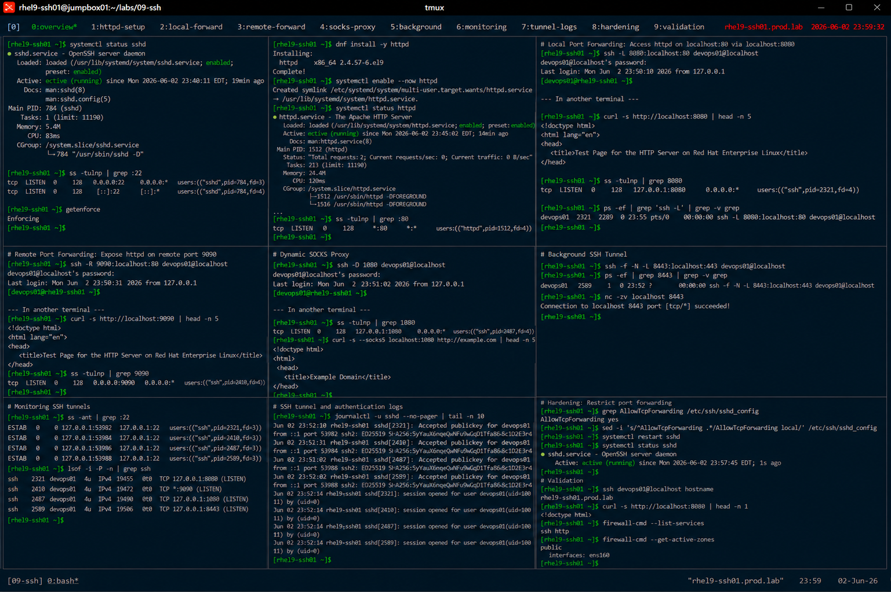

# SSH Tunneling and Port Forwarding

## Overview

This lab demonstrates enterprise Linux SSH tunneling and secure port forwarding on RHEL 9 systems.

The workflow simulates production secure connectivity scenarios involving local forwarding, remote forwarding, dynamic SOCKS proxies, encrypted service access, and enterprise secure transport practices.

---

# Objective

This exercise covers:

- local SSH port forwarding
- remote SSH port forwarding
- dynamic SOCKS proxy configuration
- secure application tunneling
- SSH connectivity validation
- encrypted transport monitoring
- enterprise secure access practices

---

# Environment Information

| Item | Details |
|---|---|
| Operating System | RHEL 9.6 |
| Hostname | rhel9-ssh01.prod.lab |
| SSH Service | OpenSSH |
| Tunnel Methods | Local, Remote, Dynamic |
| SELinux | Enforcing |

---

# SSH Tunneling Overview

SSH tunneling provides:

- encrypted traffic forwarding
- secure remote application access
- network segmentation bypass for approved workflows
- administrative service protection
- enterprise secure transport

---

# Initial Validation

## Verify SSH Service Status

```bash
systemctl status sshd
```

Expected output:

```text
active (running)
```

---

## Verify SSH Listening Port

```bash
ss -tulnp | grep :22
```

Expected output:

```text
LISTEN
```

---

## Verify SELinux Status

```bash
getenforce
```

Expected output:

```text
Enforcing
```

---

# Create Test Web Service

## Install HTTP Service

```bash
dnf install -y httpd
```

---

## Start HTTP Service

```bash
systemctl enable --now httpd
```

---

## Verify HTTP Service

```bash
systemctl status httpd
```

Expected output:

```text
active (running)
```

---

## Verify HTTP Listening Port

```bash
ss -tulnp | grep :80
```

Expected output:

```text
:80
```

---

# Local Port Forwarding

## Create Local SSH Tunnel

```bash
ssh -L 8080:localhost:80 \
devops01@localhost
```

---

## Verify Tunnel Session

Expected behavior:

```text
SSH session established
```

---

## Validate Local Forwarding

In another terminal:

```bash
curl http://localhost:8080
```

Expected output:

```text
Test Page
```

Traffic is securely forwarded through SSH.

---

# Tunnel Validation

## Verify Listening Tunnel Port

```bash
ss -tulnp | grep 8080
```

Expected output:

```text
127.0.0.1:8080
```

---

## Verify SSH Tunnel Process

```bash
ps -ef | grep ssh
```

Expected output:

```text
ssh -L
```

---

# Remote Port Forwarding

## Create Remote Forwarding Session

```bash
ssh -R 9090:localhost:80 \
devops01@localhost
```

---

## Validate Remote Tunnel

In another terminal:

```bash
curl http://localhost:9090
```

Expected output:

```text
Test Page
```

---

# Dynamic SOCKS Proxy

## Create Dynamic SSH Tunnel

```bash
ssh -D 1080 devops01@localhost
```

---

## Verify SOCKS Listener

```bash
ss -tulnp | grep 1080
```

Expected output:

```text
127.0.0.1:1080
```

---

## Test SOCKS Proxy

```bash
curl --socks5 localhost:1080 \
http://example.com
```

Expected output:

```text
Example Domain
```

---

# Background Tunnel Configuration

## Create Background Tunnel

```bash
ssh -f -N -L 8443:localhost:443 \
devops01@localhost
```

---

## Verify Background Tunnel

```bash
ps -ef | grep 8443
```

Expected output:

```text
ssh -f -N
```

---

## Validate Tunnel Connectivity

```bash
nc -zv localhost 8443
```

Expected output:

```text
succeeded
```

---

# Tunnel Monitoring

## Verify Established SSH Sessions

```bash
ss -ant | grep :22
```

Expected output:

```text
ESTAB
```

---

## Verify Active Tunnels

```bash
lsof -i -P -n | grep ssh
```

Expected output:

```text
LISTEN
```

---

# SSH Hardening Validation

## Verify Tunnel Permissions

```bash
grep AllowTcpForwarding /etc/ssh/sshd_config
```

Expected output:

```text
AllowTcpForwarding yes
```

---

## Restrict Tunnel Access

```bash
vi /etc/ssh/sshd_config
```

Set:

```text
AllowTcpForwarding local
```

---

## Restart SSH Service

```bash
systemctl restart sshd
```

---

## Verify SSH Service

```bash
systemctl status sshd
```

Expected output:

```text
active (running)
```

---

# Logging Validation

## Verify SSH Tunnel Logs

```bash
journalctl -u sshd
```

Expected output:

```text
Accepted publickey
```

---

## Verify Secure Logs

```bash
grep sshd /var/log/secure
```

Expected output:

```text
session opened
```

---

# Connectivity Validation

## Verify SSH Connectivity

```bash
ssh devops01@localhost hostname
```

Expected output:

```text
rhel9-ssh01.prod.lab
```

---

## Verify HTTP Access Through Tunnel

```bash
curl http://localhost:8080
```

Expected output:

```text
Test Page
```

---

# Security Validation

## Verify Firewall Services

```bash
firewall-cmd --list-services
```

Expected output:

```text
ssh http
```

---

## Verify Active Firewall Zones

```bash
firewall-cmd --get-active-zones
```

Expected output:

```text
public
```

---

# Persistence Validation

## Reboot Validation

```bash
reboot
```

After reboot:

```bash
systemctl status sshd
```

Expected output:

```text
active (running)
```

SSH services remain operational after reboot.

---

# Operational Recommendations

## Use SSH Tunnels for Secure Administrative Access

Recommended use cases:

- internal web applications
- database administration
- secure API access
- temporary maintenance operations

---

## Restrict Port Forwarding Carefully

Enterprise systems should:

- limit unnecessary forwarding
- monitor tunnel activity
- audit remote access
- restrict unauthorized SOCKS proxies

---

## Monitor SSH Tunnel Usage

Enterprise monitoring should validate:

- unusual forwarding activity
- unauthorized remote tunnels
- excessive SSH sessions
- exposed internal services

---

# Operational Notes

- SSH tunneling encrypts forwarded traffic
- local forwarding secures internal services
- SOCKS proxies provide dynamic encrypted routing
- unrestricted forwarding may introduce security risks
- enterprise environments require tunnel auditing and monitoring

---

# Expected Outcome

After completing this lab:

- SSH tunneling is operational
- local and remote forwarding are validated
- dynamic SOCKS proxies are configured
- tunnel monitoring is verified
- enterprise secure transport practices are applied

---

# Screenshot Reference


