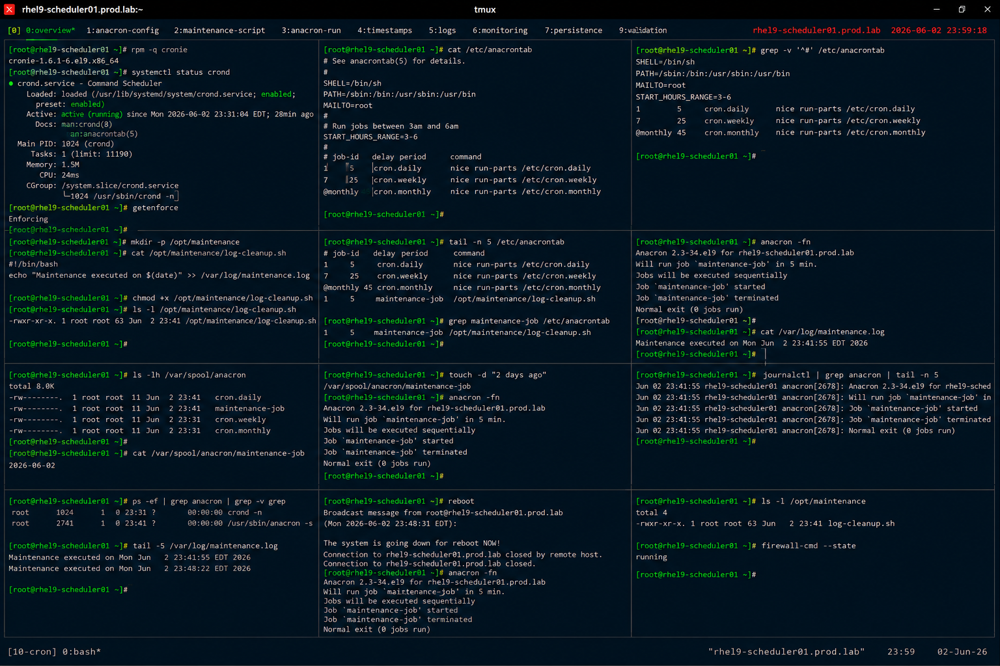

# Anacron Job Scheduling

## Overview

This lab demonstrates enterprise Linux delayed job scheduling using Anacron on RHEL 9 systems.

The workflow simulates production maintenance scheduling scenarios involving periodic task execution, delayed cron processing, system uptime independence, and enterprise automation reliability.

---

# Objective

This exercise covers:

- anacron configuration
- delayed scheduled jobs
- periodic maintenance execution
- anacrontab management
- log validation
- automation monitoring
- enterprise scheduling practices

---

# Environment Information

| Item | Details |
|---|---|
| Operating System | RHEL 9.6 |
| Hostname | rhel9-scheduler01.prod.lab |
| Scheduler Service | anacron |
| Scheduling Utility | cronie |
| SELinux | Enforcing |

---

# Anacron Overview

Anacron provides:

- delayed task execution
- scheduling for non-continuous systems
- periodic maintenance automation
- uptime-independent scheduling
- enterprise maintenance reliability

Unlike cron, anacron ensures jobs execute even if the system was powered off during the scheduled interval.

---

# Initial Validation

## Verify cronie Installation

```bash
rpm -q cronie
```

Expected output:

```text
cronie
```

---

## Verify Anacron Service

```bash
systemctl status crond
```

Expected output:

```text
active (running)
```

---

## Verify SELinux Status

```bash
getenforce
```

Expected output:

```text
Enforcing
```

---

# Anacron Configuration Validation

## View anacrontab Configuration

```bash
cat /etc/anacrontab
```

Expected output:

```text
START_HOURS_RANGE
```

---

## Review Existing Scheduled Jobs

```bash
grep -v '^#' /etc/anacrontab
```

Expected output:

```text
cron.daily
cron.weekly
cron.monthly
```

---

# Create Maintenance Script

## Create Log Cleanup Script

```bash
mkdir -p /opt/maintenance
```

---

## Create Maintenance Job

```bash
vi /opt/maintenance/log-cleanup.sh
```

Add:

```bash
#!/bin/bash
echo "Maintenance executed on $(date)" \
>> /var/log/maintenance.log
```

---

## Configure Script Permissions

```bash
chmod +x /opt/maintenance/log-cleanup.sh
```

---

## Verify Script Permissions

```bash
ls -l /opt/maintenance/log-cleanup.sh
```

Expected output:

```text
-rwxr-xr-x
```

---

# Configure Custom Anacron Job

## Edit anacrontab

```bash
vi /etc/anacrontab
```

Add:

```text
1   5   maintenance-job   /opt/maintenance/log-cleanup.sh
```

---

## Validate Configuration

```bash
grep maintenance-job /etc/anacrontab
```

Expected output:

```text
maintenance-job
```

---

# Manual Job Execution

## Run anacron Manually

```bash
anacron -fn
```

Expected output:

```text
Job `maintenance-job'
```

---

## Verify Job Execution

```bash
cat /var/log/maintenance.log
```

Expected output:

```text
Maintenance executed
```

---

# Anacron Timestamp Validation

## Verify Anacron Spool Files

```bash
ls -lh /var/spool/anacron
```

Expected output:

```text
cron.daily
maintenance-job
```

---

## Inspect Timestamp File

```bash
cat /var/spool/anacron/maintenance-job
```

Expected output:

```text
date stamp
```

---

# Delay and Frequency Validation

## Simulate Delayed Execution

```bash
touch -d "2 days ago" \
/var/spool/anacron/maintenance-job
```

---

## Run anacron Again

```bash
anacron -fn
```

Expected output:

```text
maintenance-job
```

Job executes because scheduled interval was missed.

---

# Logging Validation

## Verify System Logs

```bash
journalctl | grep anacron
```

Expected output:

```text
Job `maintenance-job'
```

---

## Verify crond Logs

```bash
journalctl -u crond
```

Expected output:

```text
anacron
```

---

# Monitoring Validation

## Verify Running Scheduler Processes

```bash
ps -ef | grep anacron
```

Expected output:

```text
anacron
```

---

## Verify Scheduled Maintenance Log

```bash
tail -5 /var/log/maintenance.log
```

Expected output:

```text
Maintenance executed
```

---

# Persistence Validation

## Reboot Validation

```bash
reboot
```

After reboot:

```bash
anacron -fn
```

Expected output:

```text
maintenance-job
```

Anacron scheduling remains persistent after reboot.

---

# Security Validation

## Verify Script Ownership

```bash
ls -l /opt/maintenance
```

Expected output:

```text
root root
```

---

## Verify Firewall Status

```bash
firewall-cmd --state
```

Expected output:

```text
running
```

---

# Operational Recommendations

## Use Anacron for Non-Continuous Systems

Recommended systems:

- workstations
- laptops
- intermittently powered servers
- maintenance hosts

---

## Separate Maintenance Scripts Clearly

Enterprise environments should:

- centralize automation scripts
- maintain audit visibility
- use secure permissions
- validate scheduled execution

---

## Monitor Scheduled Job Failures

Enterprise monitoring should validate:

- missed maintenance tasks
- failed automation scripts
- delayed job execution
- scheduler service failures

---

# Operational Notes

- anacron executes missed scheduled jobs
- timestamp files track execution history
- delayed execution improves scheduling reliability
- automation scripts require secure permissions
- enterprise environments require continuous scheduler monitoring

---

# Expected Outcome

After completing this lab:

- anacron scheduling is operational
- delayed job execution is validated
- maintenance automation is configured
- scheduler logging is verified
- enterprise maintenance scheduling practices are applied

---

# Screenshot Reference


