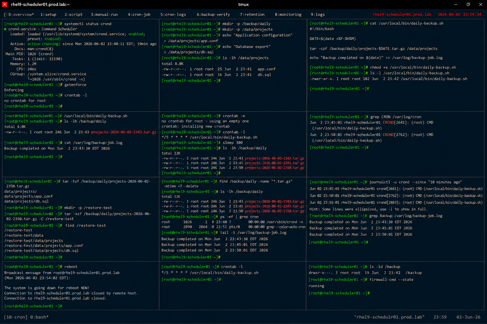

# Automated Backup Script with Cron

## Overview

This lab demonstrates enterprise Linux automated backup scheduling using cron jobs on RHEL 9 systems.

The workflow simulates production backup automation involving scheduled archive creation, log rotation, cron execution validation, backup monitoring, and enterprise data protection practices.

---

# Objective

This exercise covers:

- cron-based backup automation
- scheduled shell scripting
- archive creation
- backup logging
- cron monitoring
- retention validation
- enterprise backup scheduling practices

---

# Environment Information

| Item | Details |
|---|---|
| Operating System | RHEL 9.6 |
| Hostname | rhel9-scheduler01.prod.lab |
| Scheduler Service | crond |
| Backup Directory | /backup |
| SELinux | Enforcing |

---

# Backup Automation Overview

Cron-based backup scheduling provides:

- automated data protection
- recurring maintenance execution
- operational consistency
- unattended backup workflows
- enterprise recovery readiness

---

# Initial Validation

## Verify crond Service

```bash
systemctl status crond
```

Expected output:

```text
active (running)
```

---

## Verify SELinux Status

```bash
getenforce
```

Expected output:

```text
Enforcing
```

---

## Verify Current Cron Jobs

```bash
crontab -l
```

Expected output:

```text
no crontab for root
```

---

# Create Backup Environment

## Create Backup Directories

```bash
mkdir -p /backup/daily
mkdir -p /data/projects
```

---

## Create Sample Data

```bash
echo "Application configuration" \
> /data/projects/app.conf

echo "Database export" \
> /data/projects/db.sql
```

---

## Verify Source Files

```bash
ls -lh /data/projects
```

Expected output:

```text
app.conf
db.sql
```

---

# Create Backup Script

## Create Backup Script File

```bash
vi /usr/local/bin/daily-backup.sh
```

Add:

```bash
#!/bin/bash

DATE=$(date +%F-%H%M)

tar -czf /backup/daily/projects-$DATE.tar.gz \
/data/projects

echo "Backup completed on $(date)" \
>> /var/log/backup-job.log
```

---

## Configure Script Permissions

```bash
chmod +x /usr/local/bin/daily-backup.sh
```

---

## Verify Script Permissions

```bash
ls -l /usr/local/bin/daily-backup.sh
```

Expected output:

```text
-rwxr-xr-x
```

---

# Manual Backup Validation

## Execute Backup Script

```bash
/usr/local/bin/daily-backup.sh
```

---

## Verify Backup Archive

```bash
ls -lh /backup/daily
```

Expected output:

```text
projects-
```

---

## Verify Backup Log

```bash
cat /var/log/backup-job.log
```

Expected output:

```text
Backup completed
```

---

# Configure Cron Job

## Edit Root Crontab

```bash
crontab -e
```

Add:

```text
*/5 * * * * /usr/local/bin/daily-backup.sh
```

---

## Verify Scheduled Cron Job

```bash
crontab -l
```

Expected output:

```text
daily-backup.sh
```

---

# Cron Execution Validation

## Wait for Scheduled Execution

```bash
sleep 300
```

---

## Verify Multiple Backup Archives

```bash
ls -lh /backup/daily
```

Expected output:

```text
multiple backup archives
```

---

## Verify Cron Execution Logs

```bash
grep CRON /var/log/cron
```

Expected output:

```text
CMD (/usr/local/bin/daily-backup.sh)
```

---

# Backup Integrity Validation

## Inspect Archive Contents

```bash
tar -tzf /backup/daily/projects-*.tar.gz
```

Expected output:

```text
data/projects
```

---

## Restore Test File

```bash
mkdir -p /restore-test

tar -xzf /backup/daily/projects-*.tar.gz \
-C /restore-test
```

---

## Verify Restored Files

```bash
find /restore-test
```

Expected output:

```text
app.conf
db.sql
```

---

# Backup Retention Validation

## Remove Old Backups

```bash
find /backup/daily \
-name "*.tar.gz" \
-mtime +7 -delete
```

---

## Verify Remaining Backups

```bash
ls -lh /backup/daily
```

Expected output:

```text
recent backup archives
```

---

# Monitoring Validation

## Verify Running Scheduler Processes

```bash
ps -ef | grep cron
```

Expected output:

```text
crond
```

---

## Monitor Backup Logs

```bash
tail -f /var/log/backup-job.log
```

Expected output:

```text
Backup completed
```

---

# Logging Validation

## Verify System Cron Logs

```bash
journalctl -u crond
```

Expected output:

```text
daily-backup.sh
```

---

## Verify Backup Activity

```bash
grep Backup /var/log/backup-job.log
```

Expected output:

```text
Backup completed
```

---

# Persistence Validation

## Reboot Validation

```bash
reboot
```

After reboot:

```bash
crontab -l
```

Expected output:

```text
daily-backup.sh
```

Cron scheduling remains persistent after reboot.

---

# Security Validation

## Verify Backup Permissions

```bash
ls -ld /backup
```

Expected output:

```text
root root
```

---

## Verify Firewall Status

```bash
firewall-cmd --state
```

Expected output:

```text
running
```

---

# Operational Recommendations

## Automate Backup Validation

Enterprise environments should verify:

- backup completion
- archive integrity
- successful restoration
- backup retention enforcement

---

## Protect Backup Storage

Backup systems should:

- use restricted permissions
- isolate backup storage
- monitor storage usage
- protect backup archives

---

## Monitor Cron Failures

Enterprise monitoring should validate:

- missed backup jobs
- failed script execution
- storage exhaustion
- archive corruption

---

# Operational Notes

- cron automates recurring backup tasks
- archive validation improves recovery readiness
- retention cleanup prevents storage exhaustion
- backup monitoring improves operational visibility
- enterprise environments require tested recovery workflows

---

# Expected Outcome

After completing this lab:

- cron-based backup automation is operational
- archive creation is validated
- scheduled execution is verified
- backup integrity testing is configured
- enterprise backup scheduling practices are applied

---

# Screenshot Reference


