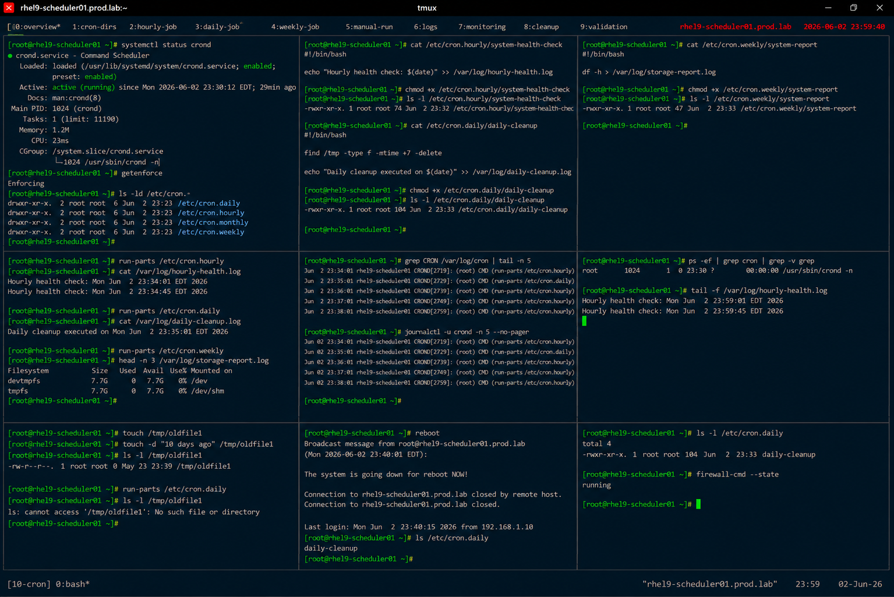

# System Cron Directories Administration

## Overview

This lab demonstrates enterprise Linux system-wide cron directory administration on RHEL 9 systems.

The workflow simulates production maintenance automation involving hourly, daily, weekly, and monthly scheduled jobs using `/etc/cron.*` directories and enterprise task management practices.

---

# Objective

This exercise covers:

- system cron directory usage
- periodic task automation
- executable maintenance scripts
- cron.daily and cron.hourly management
- scheduler validation
- automation monitoring
- enterprise scheduled maintenance practices

---

# Environment Information

| Item | Details |
|---|---|
| Operating System | RHEL 9.6 |
| Hostname | rhel9-scheduler01.prod.lab |
| Scheduler Service | crond |
| Cron Directories | /etc/cron.* |
| SELinux | Enforcing |

---

# System Cron Directory Overview

System cron directories provide:

- centralized scheduled maintenance
- automated periodic task execution
- simplified enterprise automation
- system-wide scheduling management
- standardized maintenance workflows

Common directories include:

| Directory | Frequency |
|---|---|
| /etc/cron.hourly | Hourly |
| /etc/cron.daily | Daily |
| /etc/cron.weekly | Weekly |
| /etc/cron.monthly | Monthly |

---

# Initial Validation

## Verify crond Service

```bash
systemctl status crond
```

Expected output:

```text
active (running)
```

---

## Verify SELinux Status

```bash
getenforce
```

Expected output:

```text
Enforcing
```

---

## View Cron Directories

```bash
ls -ld /etc/cron.*
```

Expected output:

```text
cron.daily
cron.hourly
cron.weekly
cron.monthly
```

---

# Create Hourly Maintenance Job

## Create Hourly Script

```bash
vi /etc/cron.hourly/system-health-check
```

Add:

```bash
#!/bin/bash

echo "Hourly health check: $(date)" \
>> /var/log/hourly-health.log
```

---

## Configure Script Permissions

```bash
chmod +x /etc/cron.hourly/system-health-check
```

---

## Verify Script Permissions

```bash
ls -l /etc/cron.hourly/system-health-check
```

Expected output:

```text
-rwxr-xr-x
```

---

# Create Daily Maintenance Job

## Create Daily Cleanup Script

```bash
vi /etc/cron.daily/daily-cleanup
```

Add:

```bash
#!/bin/bash

find /tmp -type f -mtime +7 -delete

echo "Daily cleanup executed on $(date)" \
>> /var/log/daily-cleanup.log
```

---

## Configure Script Permissions

```bash
chmod +x /etc/cron.daily/daily-cleanup
```

---

## Verify Daily Script

```bash
ls -l /etc/cron.daily/daily-cleanup
```

Expected output:

```text
-rwxr-xr-x
```

---

# Create Weekly Maintenance Job

## Create Weekly Report Script

```bash
vi /etc/cron.weekly/system-report
```

Add:

```bash
#!/bin/bash

df -h > /var/log/storage-report.log
```

---

## Configure Script Permissions

```bash
chmod +x /etc/cron.weekly/system-report
```

---

## Verify Weekly Script

```bash
ls -l /etc/cron.weekly/system-report
```

Expected output:

```text
-rwxr-xr-x
```

---

# Manual Execution Validation

## Run Hourly Jobs

```bash
run-parts /etc/cron.hourly
```

---

## Verify Hourly Log

```bash
cat /var/log/hourly-health.log
```

Expected output:

```text
Hourly health check
```

---

## Run Daily Jobs

```bash
run-parts /etc/cron.daily
```

---

## Verify Daily Cleanup Log

```bash
cat /var/log/daily-cleanup.log
```

Expected output:

```text
Daily cleanup executed
```

---

## Run Weekly Jobs

```bash
run-parts /etc/cron.weekly
```

---

## Verify Weekly Report

```bash
cat /var/log/storage-report.log
```

Expected output:

```text
Filesystem
```

---

# Cron Execution Validation

## Verify Scheduled Execution Logs

```bash
grep CRON /var/log/cron
```

Expected output:

```text
run-parts
```

---

## Verify Journal Logs

```bash
journalctl -u crond
```

Expected output:

```text
cron.daily
```

---

# Monitoring Validation

## Verify Scheduler Processes

```bash
ps -ef | grep cron
```

Expected output:

```text
crond
```

---

## Monitor Health Check Logs

```bash
tail -f /var/log/hourly-health.log
```

Expected output:

```text
Hourly health check
```

---

# Cleanup Validation

## Create Temporary Test Files

```bash
touch /tmp/oldfile1
touch -d "10 days ago" /tmp/oldfile1
```

---

## Run Daily Cleanup

```bash
run-parts /etc/cron.daily
```

---

## Verify File Removal

```bash
ls /tmp/oldfile1
```

Expected output:

```text
No such file or directory
```

---

# Persistence Validation

## Reboot Validation

```bash
reboot
```

After reboot:

```bash
ls /etc/cron.daily
```

Expected output:

```text
daily-cleanup
```

Cron directory scripts remain persistent after reboot.

---

# Security Validation

## Verify Script Ownership

```bash
ls -l /etc/cron.daily
```

Expected output:

```text
root root
```

---

## Verify Firewall Status

```bash
firewall-cmd --state
```

Expected output:

```text
running
```

---

# Operational Recommendations

## Use System Cron Directories for Shared Tasks

Recommended tasks:

- log cleanup
- storage reporting
- maintenance automation
- system health checks

---

## Keep Scripts Simple and Auditable

Enterprise automation should:

- use centralized logging
- avoid complex dependencies
- use secure permissions
- document maintenance workflows

---

## Monitor Scheduled Maintenance

Enterprise monitoring should validate:

- failed scheduled jobs
- missing maintenance logs
- script execution errors
- unexpected scheduler interruptions

---

# Operational Notes

- run-parts executes scripts within cron directories
- executable permissions are required
- centralized scheduling simplifies maintenance
- logging improves operational visibility
- enterprise environments require scheduled task auditing

---

# Expected Outcome

After completing this lab:

- system cron directory automation is operational
- hourly and daily maintenance scripts are validated
- scheduled execution monitoring is configured
- maintenance cleanup workflows are verified
- enterprise scheduling practices are applied

---

# Screenshot Reference


