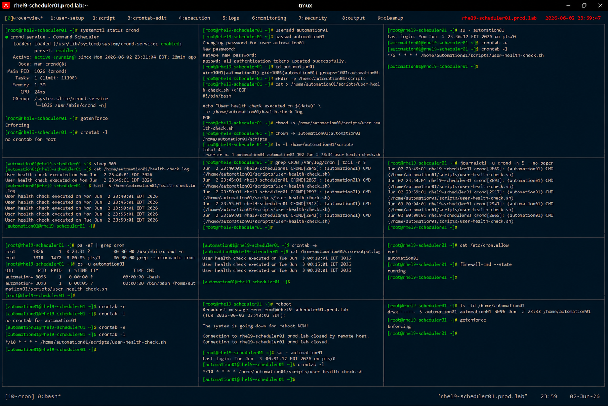

# User Crontab Administration

## Overview

This lab demonstrates enterprise Linux user-level cron scheduling on RHEL 9 systems.

The workflow simulates production automation scenarios involving per-user scheduled tasks, crontab management, execution monitoring, logging validation, and enterprise task scheduling practices.

---

# Objective

This exercise covers:

- user crontab configuration
- scheduled user jobs
- cron expression management
- job logging and validation
- scheduler monitoring
- cron security controls
- enterprise automation practices

---

# Environment Information

| Item | Details |
|---|---|
| Operating System | RHEL 9.6 |
| Hostname | rhel9-scheduler01.prod.lab |
| Scheduler Service | crond |
| Scheduling Method | user crontab |
| SELinux | Enforcing |

---

# User Crontab Overview

User crontabs provide:

- user-specific automation
- recurring maintenance tasks
- isolated scheduled execution
- decentralized task management
- enterprise workflow automation

---

# Initial Validation

## Verify crond Service

```bash
systemctl status crond
```

Expected output:

```text
active (running)
```

---

## Verify SELinux Status

```bash
getenforce
```

Expected output:

```text
Enforcing
```

---

## Verify Current User Crontab

```bash
crontab -l
```

Expected output:

```text
no crontab for
```

---

# Create Scheduled User

## Create Automation User

```bash
useradd automation01
```

---

## Configure Password

```bash
passwd automation01
```

Expected output:

```text
password updated successfully
```

---

## Verify User Account

```bash
id automation01
```

Expected output:

```text
uid=
```

---

# Create Scheduled Task Script

## Create User Script Directory

```bash
mkdir -p /home/automation01/scripts
```

---

## Create Scheduled Script

```bash
vi /home/automation01/scripts/user-health-check.sh
```

Add:

```bash
#!/bin/bash

echo "User health check executed on $(date)" \
>> /home/automation01/health-check.log
```

---

## Configure Script Permissions

```bash
chmod +x \
/home/automation01/scripts/user-health-check.sh
```

---

## Configure Ownership

```bash
chown -R automation01:automation01 \
/home/automation01/scripts
```

---

## Verify Script Permissions

```bash
ls -l /home/automation01/scripts
```

Expected output:

```text
-rwxr-xr-x
```

---

# Configure User Crontab

## Switch to Automation User

```bash
su - automation01
```

---

## Edit User Crontab

```bash
crontab -e
```

Add:

```text
*/5 * * * * /home/automation01/scripts/user-health-check.sh
```

---

## Verify User Crontab

```bash
crontab -l
```

Expected output:

```text
user-health-check.sh
```

---

# Cron Execution Validation

## Wait for Scheduled Execution

```bash
sleep 300
```

---

## Verify User Log File

```bash
cat /home/automation01/health-check.log
```

Expected output:

```text
User health check executed
```

---

## Verify Multiple Executions

```bash
tail -5 /home/automation01/health-check.log
```

Expected output:

```text
multiple timestamps
```

---

# Logging Validation

## Verify Cron Activity

```bash
grep CRON /var/log/cron
```

Expected output:

```text
automation01
```

---

## Verify Scheduler Journal Logs

```bash
journalctl -u crond
```

Expected output:

```text
user-health-check.sh
```

---

# Monitoring Validation

## Verify Running Scheduler Processes

```bash
ps -ef | grep cron
```

Expected output:

```text
crond
```

---

## Verify User Processes

```bash
ps -u automation01
```

Expected output:

```text
user-health-check.sh
```

---

# Cron Output Validation

## Redirect Script Output

Edit user crontab:

```text
*/5 * * * * /home/automation01/scripts/user-health-check.sh >> /home/automation01/cron-output.log 2>&1
```

---

## Verify Output Logging

```bash
cat /home/automation01/cron-output.log
```

Expected output:

```text
health check executed
```

---

# Cron Security Validation

## Verify Allowed Cron Users

```bash
cat /etc/cron.allow
```

Expected output:

```text
authorized users
```

---

## Restrict Unauthorized Cron Access

```bash
echo "automation01" >> /etc/cron.allow
```

---

## Verify Allowed Users

```bash
cat /etc/cron.allow
```

Expected output:

```text
automation01
```

---

# User Cron Removal Validation

## Remove User Crontab

```bash
crontab -r
```

---

## Verify Crontab Removal

```bash
crontab -l
```

Expected output:

```text
no crontab for
```

---

# Persistence Validation

## Reconfigure Crontab

```bash
crontab -e
```

Add:

```text
*/10 * * * * /home/automation01/scripts/user-health-check.sh
```

---

## Reboot Validation

```bash
reboot
```

After reboot:

```bash
crontab -l
```

Expected output:

```text
user-health-check.sh
```

User crontab scheduling remains persistent after reboot.

---

# Security Validation

## Verify Home Directory Permissions

```bash
ls -ld /home/automation01
```

Expected output:

```text
automation01 automation01
```

---

## Verify Firewall Status

```bash
firewall-cmd --state
```

Expected output:

```text
running
```

---

# Operational Recommendations

## Use User Crontabs for Application Automation

Recommended tasks:

- report generation
- log collection
- application maintenance
- user-specific automation

---

## Use Dedicated Automation Accounts

Enterprise systems should:

- isolate scheduled tasks
- avoid shared administrative users
- use restricted permissions
- audit scheduled automation

---

## Monitor Scheduled Job Failures

Enterprise monitoring should validate:

- failed scheduled scripts
- missing cron executions
- permission failures
- excessive cron activity

---

# Operational Notes

- user crontabs isolate scheduled automation
- cron logs improve operational visibility
- dedicated automation users improve security
- redirected output simplifies troubleshooting
- enterprise environments require scheduler auditing

---

# Expected Outcome

After completing this lab:

- user crontab scheduling is operational
- scheduled user automation is validated
- cron monitoring is configured
- scheduler security controls are verified
- enterprise automation practices are applied

---

# Screenshot Reference


