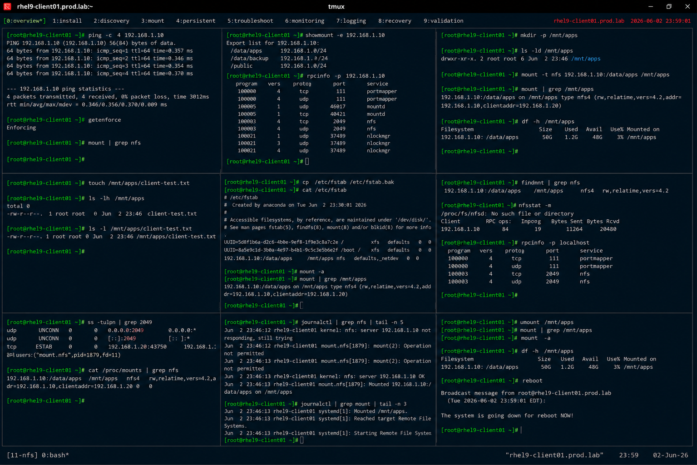

# NFS Client Configuration

## Overview

This lab demonstrates enterprise Linux NFS client configuration on RHEL 9 systems.

The workflow simulates production shared storage access involving NFS mount configuration, persistent client mounting, connectivity validation, and enterprise distributed storage practices.

---

# Objective

This exercise covers:

- NFS client installation
- remote NFS mounting
- persistent mount configuration
- mount troubleshooting
- connectivity validation
- NFS monitoring
- enterprise shared storage practices

---

# Environment Information

| Item | Details |
|---|---|
| Operating System | RHEL 9.6 |
| Hostname | rhel9-client01.prod.lab |
| NFS Server | 192.168.1.10 |
| Shared Export | /data/apps |
| SELinux | Enforcing |

---

# NFS Client Overview

NFS clients provide:

- remote filesystem access
- centralized shared storage
- distributed application data
- enterprise collaboration
- network-based storage integration

---

# Initial Validation

## Verify Network Connectivity

```bash
ping -c 4 192.168.1.10
```

Expected output:

```text
0% packet loss
```

---

## Verify SELinux Status

```bash
getenforce
```

Expected output:

```text
Enforcing
```

---

## Verify Existing Mounts

```bash
mount | grep nfs
```

Expected output:

```text
(no output)
```

---

# Install NFS Client Utilities

## Install nfs-utils Package

```bash
dnf install -y nfs-utils
```

Expected output:

```text
Complete!
```

---

## Verify Installed Package

```bash
rpm -q nfs-utils
```

Expected output:

```text
nfs-utils
```

---

# Discover NFS Exports

## Query Remote NFS Shares

```bash
showmount -e 192.168.1.10
```

Expected output:

```text
/data/apps
```

---

## Verify RPC Connectivity

```bash
rpcinfo -p 192.168.1.10
```

Expected output:

```text
nfs
mountd
```

---

# Create Mount Directory

## Create Local Mount Point

```bash
mkdir -p /mnt/apps
```

---

## Verify Mount Directory

```bash
ls -ld /mnt/apps
```

Expected output:

```text
drwxr-xr-x
```

---

# Mount NFS Share

## Mount Remote Export

```bash
mount -t nfs \
192.168.1.10:/data/apps \
/mnt/apps
```

---

## Verify Mounted Filesystem

```bash
mount | grep /mnt/apps
```

Expected output:

```text
192.168.1.10:/data/apps
```

---

## Verify Disk Usage

```bash
df -h /mnt/apps
```

Expected output:

```text
Filesystem
```

---

# File Access Validation

## Create Test File

```bash
touch /mnt/apps/client-test.txt
```

---

## Verify File Creation

```bash
ls -lh /mnt/apps
```

Expected output:

```text
client-test.txt
```

---

## Verify File Ownership

```bash
ls -l /mnt/apps/client-test.txt
```

Expected output:

```text
root root
```

---

# Persistent Mount Configuration

## Backup fstab

```bash
cp /etc/fstab /etc/fstab.bak
```

---

## Configure Persistent Mount

```bash
vi /etc/fstab
```

Add:

```text
192.168.1.10:/data/apps  /mnt/apps  nfs  defaults,_netdev  0 0
```

---

## Validate fstab Syntax

```bash
mount -a
```

Expected output:

```text
(no errors)
```

---

## Verify Persistent Mount

```bash
mount | grep /mnt/apps
```

Expected output:

```text
/data/apps
```

---

# Mount Troubleshooting

## Verify Active Mounts

```bash
findmnt | grep nfs
```

Expected output:

```text
nfs
```

---

## Verify NFS Statistics

```bash
nfsstat -m
```

Expected output:

```text
/mnt/apps
```

---

## Verify RPC Services

```bash
rpcinfo -p localhost
```

Expected output:

```text
nfs
```

---

# Connectivity Monitoring

## Verify Open NFS Connections

```bash
ss -tulpn | grep 2049
```

Expected output:

```text
2049
```

---

## Verify Mounted Shares

```bash
cat /proc/mounts | grep nfs
```

Expected output:

```text
nfs
```

---

# Logging Validation

## Verify NFS Logs

```bash
journalctl | grep nfs
```

Expected output:

```text
NFS
```

---

## Verify Mount Activity

```bash
journalctl | grep mount
```

Expected output:

```text
mounted
```

---

# Recovery Validation

## Unmount NFS Share

```bash
umount /mnt/apps
```

---

## Verify Unmount

```bash
mount | grep /mnt/apps
```

Expected output:

```text
(no output)
```

---

## Remount Using fstab

```bash
mount -a
```

---

## Verify Recovery Mount

```bash
df -h /mnt/apps
```

Expected output:

```text
Filesystem
```

---

# Persistence Validation

## Reboot Validation

```bash
reboot
```

After reboot:

```bash
mount | grep /mnt/apps
```

Expected output:

```text
192.168.1.10:/data/apps
```

Persistent NFS mounts remain active after reboot.

---

# Security Validation

## Verify Firewall Status

```bash
firewall-cmd --state
```

Expected output:

```text
running
```

---

## Verify SELinux Enforcement

```bash
getenforce
```

Expected output:

```text
Enforcing
```

---

# Operational Recommendations

## Use Persistent Mounts Carefully

Enterprise systems should:

- validate server availability
- use `_netdev` for network mounts
- monitor mount failures
- document shared storage dependencies

---

## Monitor Shared Storage Availability

Enterprise monitoring should validate:

- NFS server reachability
- mount latency
- stale file handles
- storage capacity

---

## Protect Shared Storage Access

Recommended practices:

- restrict export access
- monitor client activity
- enforce least privilege
- audit shared filesystem usage

---

# Operational Notes

- NFS provides centralized shared storage
- persistent mounts simplify enterprise workflows
- mount failures may impact application availability
- RPC services are critical for NFS communication
- enterprise environments require continuous storage monitoring

---

# Expected Outcome

After completing this lab:

- NFS client configuration is operational
- remote mounts are validated
- persistent NFS storage is configured
- mount troubleshooting is verified
- enterprise shared storage practices are applied

---

# Screenshot Reference


