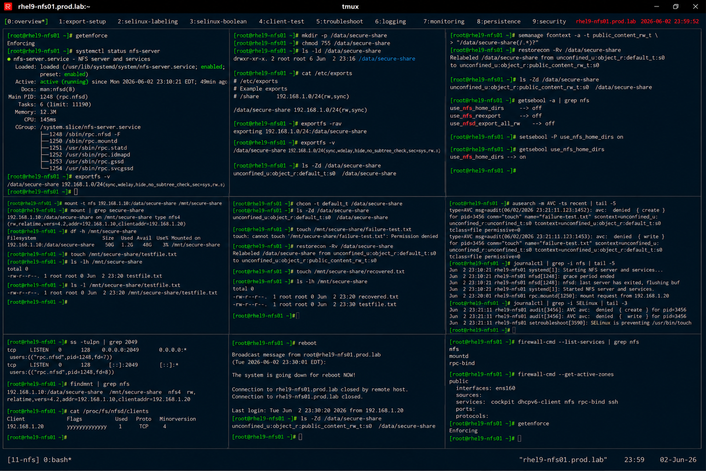

# NFS and SELinux Integration

## Overview

This lab demonstrates enterprise Linux NFS and SELinux integration on RHEL 9 systems.

The workflow simulates production secure shared storage scenarios involving SELinux labeling, NFS policy configuration, access validation, and enterprise storage security practices.

---

# Objective

This exercise covers:

- SELinux and NFS integration
- SELinux booleans for NFS
- secure shared storage access
- NFS labeling validation
- access troubleshooting
- policy monitoring
- enterprise storage security practices

---

# Environment Information

| Item | Details |
|---|---|
| Operating System | RHEL 9.6 |
| Hostname | rhel9-nfs01.prod.lab |
| NFS Export | /data/secure-share |
| SELinux Mode | Enforcing |
| Firewall Service | firewalld |

---

# NFS and SELinux Overview

SELinux integration provides:

- mandatory access control
- secure shared storage enforcement
- restricted application access
- enterprise policy compliance
- enhanced filesystem protection

---

# Initial Validation

## Verify SELinux Status

```bash
getenforce
```

Expected output:

```text
Enforcing
```

---

## Verify NFS Services

```bash
systemctl status nfs-server
```

Expected output:

```text
active (running)
```

---

## Verify Exported Shares

```bash
exportfs -v
```

Expected output:

```text
/data/secure-share
```

---

# Create Secure Export Directory

## Create NFS Export Path

```bash
mkdir -p /data/secure-share
```

---

## Configure Directory Permissions

```bash
chmod 755 /data/secure-share
```

---

## Verify Permissions

```bash
ls -ld /data/secure-share
```

Expected output:

```text
drwxr-xr-x
```

---

# Configure NFS Export

## Edit exports Configuration

```bash
vi /etc/exports
```

Add:

```text
/data/secure-share 192.168.1.0/24(rw,sync)
```

---

## Reload NFS Exports

```bash
exportfs -rav
```

Expected output:

```text
exporting
```

---

## Verify Export Configuration

```bash
exportfs -v
```

Expected output:

```text
secure-share
```

---

# SELinux Label Validation

## Verify Current SELinux Context

```bash
ls -Zd /data/secure-share
```

Expected output:

```text
default_t
```

---

## Configure Public Content Label

```bash
semanage fcontext -a -t public_content_rw_t \
"/data/secure-share(/.*)?"
```

---

## Apply SELinux Contexts

```bash
restorecon -Rv /data/secure-share
```

Expected output:

```text
Relabeled
```

---

## Verify Updated SELinux Context

```bash
ls -Zd /data/secure-share
```

Expected output:

```text
public_content_rw_t
```

---

# Configure SELinux Booleans

## Verify NFS-Related Booleans

```bash
getsebool -a | grep nfs
```

Expected output:

```text
use_nfs_home_dirs
```

---

## Enable NFS Home Directory Access

```bash
setsebool -P use_nfs_home_dirs on
```

---

## Verify Updated Boolean

```bash
getsebool use_nfs_home_dirs
```

Expected output:

```text
on
```

---

# Client Access Validation

## Mount NFS Share from Client

```bash
mount -t nfs \
192.168.1.10:/data/secure-share \
/mnt/secure-share
```

---

## Verify Mounted Filesystem

```bash
mount | grep secure-share
```

Expected output:

```text
secure-share
```

---

## Create Test File

```bash
touch /mnt/secure-share/testfile.txt
```

---

## Verify File Creation

```bash
ls -lh /mnt/secure-share
```

Expected output:

```text
testfile.txt
```

---

# SELinux Access Troubleshooting

## Simulate Incorrect SELinux Label

```bash
chcon -t default_t /data/secure-share
```

---

## Verify Broken Label

```bash
ls -Zd /data/secure-share
```

Expected output:

```text
default_t
```

---

## Test Client Write Failure

```bash
touch /mnt/secure-share/failure-test.txt
```

Expected output:

```text
Permission denied
```

---

## Restore Correct SELinux Context

```bash
restorecon -Rv /data/secure-share
```

---

## Verify Access Recovery

```bash
touch /mnt/secure-share/recovered.txt
```

Expected output:

```text
(no errors)
```

---

# Logging Validation

## Verify SELinux Audit Logs

```bash
ausearch -m AVC
```

Expected output:

```text
avc: denied
```

---

## Verify NFS Logs

```bash
journalctl | grep nfs
```

Expected output:

```text
NFS
```

---

## Verify SELinux Logs

```bash
journalctl | grep SELinux
```

Expected output:

```text
SELinux
```

---

# Monitoring Validation

## Verify Open NFS Connections

```bash
ss -tulpn | grep 2049
```

Expected output:

```text
2049
```

---

## Verify Mounted Shares

```bash
findmnt | grep nfs
```

Expected output:

```text
nfs
```

---

# Persistence Validation

## Reboot Validation

```bash
reboot
```

After reboot:

```bash
ls -Zd /data/secure-share
```

Expected output:

```text
public_content_rw_t
```

SELinux labeling remains persistent after reboot.

---

# Security Validation

## Verify Firewall Services

```bash
firewall-cmd --list-services
```

Expected output:

```text
nfs
```

---

## Verify Active Firewall Zones

```bash
firewall-cmd --get-active-zones
```

Expected output:

```text
public
```

---

# Operational Recommendations

## Use SELinux Enforcement for Shared Storage

Enterprise systems should:

- avoid disabling SELinux
- use proper file labeling
- audit access denials
- validate policy enforcement

---

## Monitor Shared Storage Access

Enterprise monitoring should validate:

- unauthorized access attempts
- SELinux denials
- export misconfigurations
- unusual NFS activity

---

## Document SELinux Policies Clearly

Recommended practices:

- maintain labeling standards
- document boolean usage
- audit context changes
- validate policy persistence

---

# Operational Notes

- SELinux improves NFS security enforcement
- incorrect labels may block shared storage access
- booleans control NFS-specific SELinux behavior
- audit logs improve troubleshooting visibility
- enterprise environments require continuous policy validation

---

# Expected Outcome

After completing this lab:

- NFS and SELinux integration is operational
- secure labeling is validated
- SELinux troubleshooting is configured
- policy persistence is verified
- enterprise storage security practices are applied

---

# Screenshot Reference


