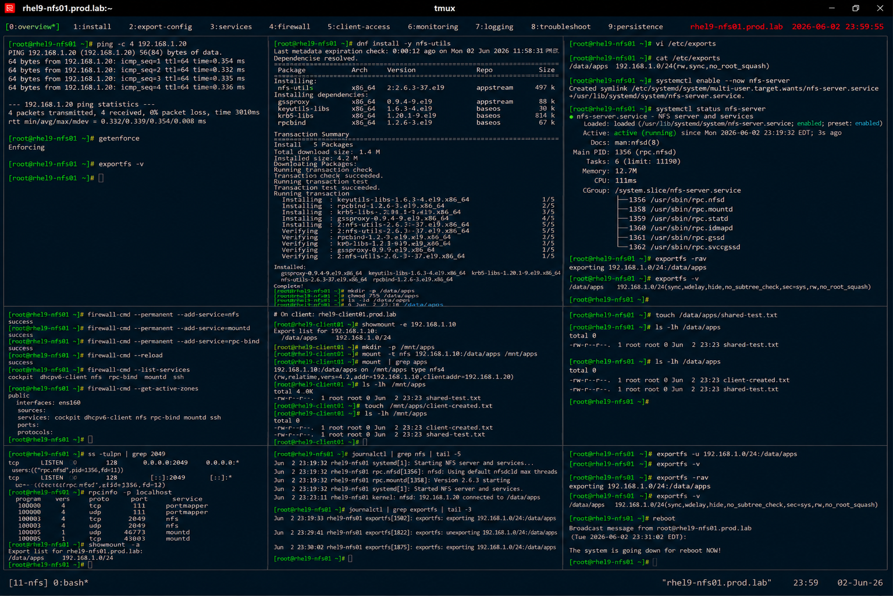

# NFS Server Configuration

## Overview

This lab demonstrates enterprise Linux NFS server configuration on RHEL 9 systems.

The workflow simulates production shared storage deployment involving NFS exports, client access configuration, firewall integration, and enterprise distributed storage management.

---

# Objective

This exercise covers:

- NFS server installation
- export configuration
- client access management
- firewall configuration
- persistent shared storage
- NFS monitoring
- enterprise storage administration practices

---

# Environment Information

| Item | Details |
|---|---|
| Operating System | RHEL 9.6 |
| Hostname | rhel9-nfs01.prod.lab |
| NFS Export Path | /data/apps |
| NFS Clients | 192.168.1.0/24 |
| SELinux | Enforcing |

---

# NFS Server Overview

NFS servers provide:

- centralized shared storage
- distributed application data
- enterprise collaboration
- remote filesystem access
- scalable storage integration

---

# Initial Validation

## Verify Network Connectivity

```bash
ping -c 4 192.168.1.20
```

Expected output:

```text
0% packet loss
```

---

## Verify SELinux Status

```bash
getenforce
```

Expected output:

```text
Enforcing
```

---

## Verify Existing Exports

```bash
exportfs -v
```

Expected output:

```text
(no exports)
```

---

# Install NFS Services

## Install nfs-utils Package

```bash
dnf install -y nfs-utils
```

Expected output:

```text
Complete!
```

---

## Verify Installed Package

```bash
rpm -q nfs-utils
```

Expected output:

```text
nfs-utils
```

---

# Configure Shared Storage

## Create Export Directory

```bash
mkdir -p /data/apps
```

---

## Configure Directory Permissions

```bash
chmod 755 /data/apps
```

---

## Verify Export Directory

```bash
ls -ld /data/apps
```

Expected output:

```text
drwxr-xr-x
```

---

# Configure NFS Export

## Edit exports File

```bash
vi /etc/exports
```

Add:

```text
/data/apps 192.168.1.0/24(rw,sync,no_root_squash)
```

---

## Verify exports Configuration

```bash
cat /etc/exports
```

Expected output:

```text
/data/apps
```

---

# Enable NFS Services

## Enable and Start NFS Server

```bash
systemctl enable --now nfs-server
```

Expected output:

```text
Created symlink
```

---

## Verify NFS Service Status

```bash
systemctl status nfs-server
```

Expected output:

```text
active (running)
```

---

## Reload Export Table

```bash
exportfs -rav
```

Expected output:

```text
exporting
```

---

## Verify Active Exports

```bash
exportfs -v
```

Expected output:

```text
/data/apps
```

---

# Configure Firewall Access

## Allow NFS Services

```bash
firewall-cmd --permanent --add-service=nfs
firewall-cmd --permanent --add-service=mountd
firewall-cmd --permanent --add-service=rpc-bind
```

---

## Reload Firewall Rules

```bash
firewall-cmd --reload
```

Expected output:

```text
success
```

---

## Verify Firewall Services

```bash
firewall-cmd --list-services
```

Expected output:

```text
nfs mountd rpc-bind
```

---

# Client Access Validation

## Verify Export Discovery

From client system:

```bash
showmount -e 192.168.1.10
```

Expected output:

```text
/data/apps
```

---

## Mount Export from Client

```bash
mount -t nfs \
192.168.1.10:/data/apps \
/mnt/apps
```

---

## Verify Mounted Share

```bash
mount | grep apps
```

Expected output:

```text
/data/apps
```

---

# File Sharing Validation

## Create Shared File

```bash
touch /data/apps/shared-test.txt
```

---

## Verify Client Access

From client:

```bash
ls -lh /mnt/apps
```

Expected output:

```text
shared-test.txt
```

---

## Create Client File

From client:

```bash
touch /mnt/apps/client-created.txt
```

---

## Verify Server Visibility

```bash
ls -lh /data/apps
```

Expected output:

```text
client-created.txt
```

---

# Monitoring Validation

## Verify Open NFS Ports

```bash
ss -tulpn | grep 2049
```

Expected output:

```text
2049
```

---

## Verify RPC Services

```bash
rpcinfo -p localhost
```

Expected output:

```text
nfs
mountd
```

---

## Verify Mounted Shares

```bash
showmount -a
```

Expected output:

```text
/mnt/apps
```

---

# Logging Validation

## Verify NFS Logs

```bash
journalctl | grep nfs
```

Expected output:

```text
NFS
```

---

## Verify Export Activity

```bash
journalctl | grep exportfs
```

Expected output:

```text
exporting
```

---

# Troubleshooting Validation

## Simulate Export Removal

```bash
exportfs -u 192.168.1.0/24:/data/apps
```

---

## Verify Export Removal

```bash
exportfs -v
```

Expected output:

```text
(no exports)
```

---

## Restore Export

```bash
exportfs -rav
```

---

## Verify Export Recovery

```bash
exportfs -v
```

Expected output:

```text
/data/apps
```

---

# Persistence Validation

## Reboot Validation

```bash
reboot
```

After reboot:

```bash
exportfs -v
```

Expected output:

```text
/data/apps
```

NFS exports remain persistent after reboot.

---

# Security Validation

## Verify SELinux Enforcement

```bash
getenforce
```

Expected output:

```text
Enforcing
```

---

## Verify Active Firewall Zones

```bash
firewall-cmd --get-active-zones
```

Expected output:

```text
public
```

---

# Operational Recommendations

## Restrict Export Access Carefully

Enterprise systems should:

- limit export subnets
- avoid unnecessary no_root_squash usage
- document export permissions
- monitor client access

---

## Monitor Shared Storage Health

Enterprise monitoring should validate:

- export availability
- client mount failures
- storage usage
- NFS service interruptions

---

## Protect Shared Data

Recommended practices:

- use backups
- enforce SELinux policies
- monitor storage permissions
- audit file access

---

# Operational Notes

- NFS centralizes enterprise shared storage
- firewall configuration is critical for client access
- export permissions control client capabilities
- RPC services support NFS communication
- enterprise environments require continuous storage monitoring

---

# Expected Outcome

After completing this lab:

- NFS server configuration is operational
- exports are validated
- client connectivity is verified
- monitoring and troubleshooting are configured
- enterprise storage administration practices are applied

---

# Screenshot Reference


