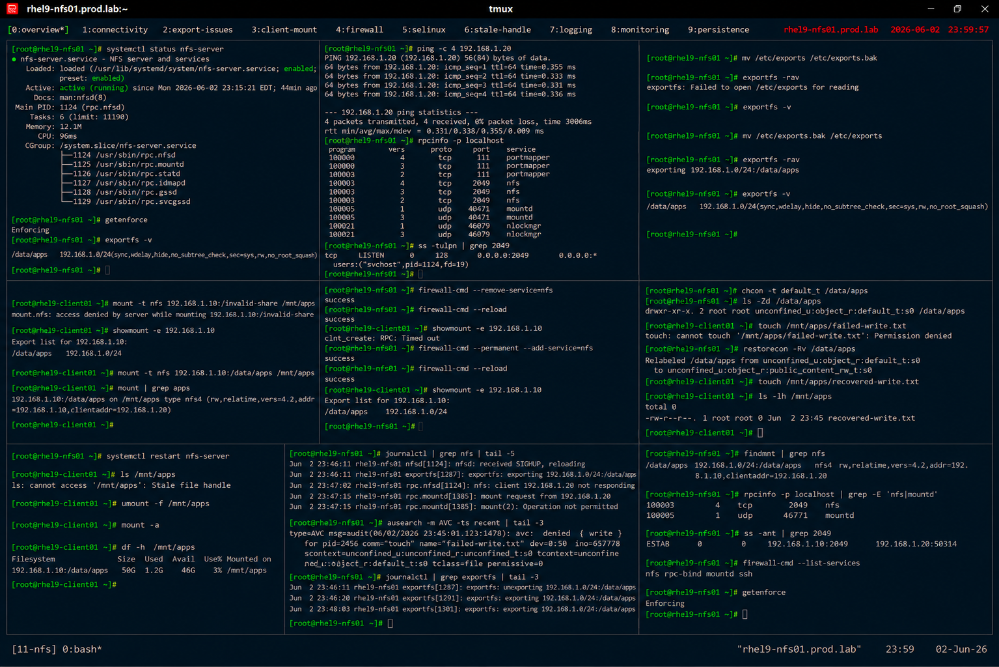

# NFS Troubleshooting and Recovery

## Overview

This lab demonstrates enterprise Linux NFS troubleshooting and recovery procedures on RHEL 9 systems.

The workflow simulates production storage incidents involving mount failures, export issues, firewall restrictions, SELinux denials, stale file handles, and enterprise storage recovery practices.

---

# Objective

This exercise covers:

- NFS troubleshooting
- export diagnostics
- client connectivity validation
- SELinux troubleshooting
- stale mount recovery
- logging and monitoring
- enterprise storage incident response practices

---

# Environment Information

| Item | Details |
|---|---|
| Operating System | RHEL 9.6 |
| Hostname | rhel9-nfs01.prod.lab |
| NFS Export | /data/apps |
| NFS Client | rhel9-client01.prod.lab |
| SELinux | Enforcing |

---

# Troubleshooting Overview

NFS troubleshooting commonly involves:

- network connectivity failures
- export misconfigurations
- firewall restrictions
- SELinux denials
- stale file handles
- RPC communication failures

---

# Initial Validation

## Verify NFS Service Status

```bash
systemctl status nfs-server
```

Expected output:

```text
active (running)
```

---

## Verify SELinux Status

```bash
getenforce
```

Expected output:

```text
Enforcing
```

---

## Verify Existing Exports

```bash
exportfs -v
```

Expected output:

```text
/data/apps
```

---

# Connectivity Troubleshooting

## Verify Client Reachability

```bash
ping -c 4 192.168.1.20
```

Expected output:

```text
0% packet loss
```

---

## Verify RPC Services

```bash
rpcinfo -p localhost
```

Expected output:

```text
nfs
mountd
```

---

## Verify Open NFS Ports

```bash
ss -tulpn | grep 2049
```

Expected output:

```text
2049
```

---

# Export Troubleshooting

## Simulate Broken Export

```bash
mv /etc/exports /etc/exports.bak
```

---

## Reload Export Table

```bash
exportfs -rav
```

Expected output:

```text
Failed
```

---

## Verify Missing Exports

```bash
exportfs -v
```

Expected output:

```text
(no exports)
```

---

## Restore Export Configuration

```bash
mv /etc/exports.bak /etc/exports
```

---

## Reload Exports

```bash
exportfs -rav
```

Expected output:

```text
exporting
```

---

## Verify Export Recovery

```bash
exportfs -v
```

Expected output:

```text
/data/apps
```

---

# Client Mount Troubleshooting

## Simulate Mount Failure

On client:

```bash
mount -t nfs \
192.168.1.10:/invalid-share \
/mnt/apps
```

Expected output:

```text
access denied
```

---

## Verify Correct Export

```bash
showmount -e 192.168.1.10
```

Expected output:

```text
/data/apps
```

---

## Restore Valid Mount

```bash
mount -t nfs \
192.168.1.10:/data/apps \
/mnt/apps
```

---

## Verify Mounted Filesystem

```bash
mount | grep apps
```

Expected output:

```text
/data/apps
```

---

# Firewall Troubleshooting

## Simulate Firewall Restriction

```bash
firewall-cmd --remove-service=nfs
```

---

## Reload Firewall Rules

```bash
firewall-cmd --reload
```

---

## Verify Blocked Access

From client:

```bash
showmount -e 192.168.1.10
```

Expected output:

```text
Connection timed out
```

---

## Restore Firewall Access

```bash
firewall-cmd --permanent --add-service=nfs
firewall-cmd --reload
```

---

## Verify Connectivity Recovery

```bash
showmount -e 192.168.1.10
```

Expected output:

```text
/data/apps
```

---

# SELinux Troubleshooting

## Simulate Incorrect Label

```bash
chcon -t default_t /data/apps
```

---

## Verify Broken Context

```bash
ls -Zd /data/apps
```

Expected output:

```text
default_t
```

---

## Test Client Write Failure

From client:

```bash
touch /mnt/apps/failed-write.txt
```

Expected output:

```text
Permission denied
```

---

## Restore Correct Context

```bash
restorecon -Rv /data/apps
```

---

## Verify Recovery Access

```bash
touch /mnt/apps/recovered-write.txt
```

Expected output:

```text
(no errors)
```

---

# Stale File Handle Recovery

## Simulate Stale Mount

```bash
systemctl restart nfs-server
```

---

## Verify Client Errors

From client:

```bash
ls /mnt/apps
```

Expected output:

```text
Stale file handle
```

---

## Unmount Stale Filesystem

```bash
umount -f /mnt/apps
```

---

## Remount Filesystem

```bash
mount -a
```

---

## Verify Recovery Mount

```bash
df -h /mnt/apps
```

Expected output:

```text
Filesystem
```

---

# Logging Validation

## Verify NFS Logs

```bash
journalctl | grep nfs
```

Expected output:

```text
NFS
```

---

## Verify SELinux Denials

```bash
ausearch -m AVC
```

Expected output:

```text
avc: denied
```

---

## Verify Export Activity

```bash
journalctl | grep exportfs
```

Expected output:

```text
exporting
```

---

# Monitoring Validation

## Verify Mounted Shares

```bash
findmnt | grep nfs
```

Expected output:

```text
nfs
```

---

## Verify RPC Services

```bash
rpcinfo -p localhost
```

Expected output:

```text
mountd
```

---

## Verify Active Connections

```bash
ss -ant | grep 2049
```

Expected output:

```text
ESTAB
```

---

# Persistence Validation

## Reboot Validation

```bash
reboot
```

After reboot:

```bash
exportfs -v
```

Expected output:

```text
/data/apps
```

NFS exports and services remain persistent after reboot.

---

# Security Validation

## Verify Firewall Services

```bash
firewall-cmd --list-services
```

Expected output:

```text
nfs
```

---

## Verify SELinux Enforcement

```bash
getenforce
```

Expected output:

```text
Enforcing
```

---

# Operational Recommendations

## Troubleshoot NFS Systematically

Recommended workflow:

1. verify network connectivity
2. validate exports
3. inspect firewall rules
4. review SELinux logs
5. verify client mounts

---

## Monitor Shared Storage Continuously

Enterprise monitoring should validate:

- export failures
- client disconnects
- stale file handles
- SELinux denials
- storage interruptions

---

## Maintain Recovery Procedures

Recommended practices:

- document export recovery
- standardize firewall policies
- audit SELinux labels
- validate recovery testing regularly

---

# Operational Notes

- NFS troubleshooting requires layered validation
- firewall restrictions commonly impact exports
- SELinux labeling errors may block client access
- stale mounts require forced recovery procedures
- enterprise environments require documented storage incident response

---

# Expected Outcome

After completing this lab:

- NFS troubleshooting workflows are operational
- export recovery is validated
- firewall and SELinux diagnostics are verified
- stale mount recovery is configured
- enterprise storage incident response practices are applied

---

# Screenshot Reference


