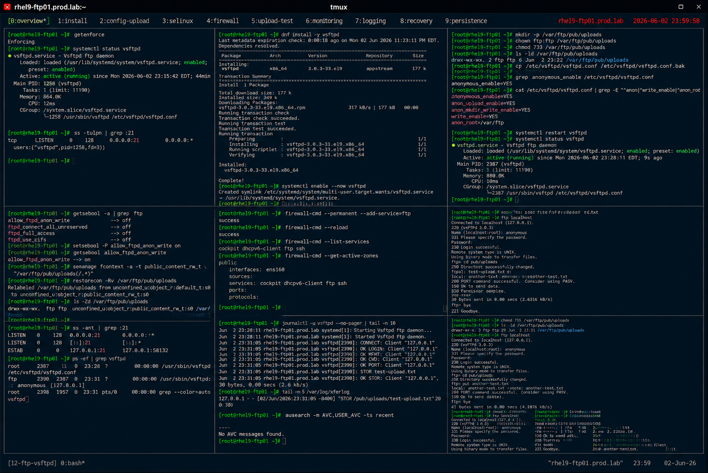

# Anonymous FTP Upload Configuration

## Overview

This lab demonstrates enterprise Linux anonymous FTP upload configuration using vsftpd on RHEL 9 systems.

The workflow simulates production public upload scenarios involving anonymous access control, upload permissions, SELinux integration, firewall configuration, and enterprise file transfer security practices.

---

# Objective

This exercise covers:

- anonymous FTP configuration
- upload directory permissions
- SELinux FTP integration
- firewall configuration
- upload validation
- FTP monitoring
- enterprise public file transfer practices

---

# Environment Information

| Item | Details |
|---|---|
| Operating System | RHEL 9.6 |
| Hostname | rhel9-ftp01.prod.lab |
| FTP Service | vsftpd |
| Upload Directory | /var/ftp/pub/uploads |
| SELinux | Enforcing |

---

# FTP Anonymous Upload Overview

Anonymous FTP uploads provide:

- public file submission
- shared upload workflows
- external partner uploads
- centralized transfer management
- enterprise inbound file handling

---

# Initial Validation

## Verify SELinux Status

```bash
getenforce
```

Expected output:

```text
Enforcing
```

---

## Verify vsftpd Service

```bash
systemctl status vsftpd
```

Expected output:

```text
active (running)
```

---

## Verify FTP Listening Port

```bash
ss -tulpn | grep :21
```

Expected output:

```text
:21
```

---

# Install FTP Service

## Install vsftpd Package

```bash
dnf install -y vsftpd
```

Expected output:

```text
Complete!
```

---

## Enable FTP Service

```bash
systemctl enable --now vsftpd
```

---

## Verify FTP Service Status

```bash
systemctl status vsftpd
```

Expected output:

```text
active (running)
```

---

# Configure Upload Directory

## Create Upload Path

```bash
mkdir -p /var/ftp/pub/uploads
```

---

## Configure Directory Ownership

```bash
chown ftp:ftp /var/ftp/pub/uploads
```

---

## Configure Upload Permissions

```bash
chmod 733 /var/ftp/pub/uploads
```

---

## Verify Upload Directory

```bash
ls -ld /var/ftp/pub/uploads
```

Expected output:

```text
drwx-wx-wx
```

---

# Configure vsftpd

## Backup FTP Configuration

```bash
cp /etc/vsftpd/vsftpd.conf \
/etc/vsftpd/vsftpd.conf.bak
```

---

## Edit vsftpd Configuration

```bash
vi /etc/vsftpd/vsftpd.conf
```

Configure:

```ini
anonymous_enable=YES
anon_upload_enable=YES
anon_mkdir_write_enable=YES
write_enable=YES
anon_root=/var/ftp
```

---

## Verify FTP Configuration

```bash
grep anonymous_enable /etc/vsftpd/vsftpd.conf
```

Expected output:

```text
anonymous_enable=YES
```

---

# Configure SELinux for FTP Uploads

## Verify FTP SELinux Booleans

```bash
getsebool -a | grep ftp
```

Expected output:

```text
allow_ftpd_anon_write
```

---

## Enable Anonymous FTP Uploads

```bash
setsebool -P allow_ftpd_anon_write on
```

---

## Configure SELinux Context

```bash
semanage fcontext -a -t public_content_rw_t \
"/var/ftp/pub/uploads(/.*)?"
```

---

## Apply SELinux Labels

```bash
restorecon -Rv /var/ftp/pub/uploads
```

Expected output:

```text
Relabeled
```

---

## Verify SELinux Context

```bash
ls -Zd /var/ftp/pub/uploads
```

Expected output:

```text
public_content_rw_t
```

---

# Configure Firewall Access

## Allow FTP Service

```bash
firewall-cmd --permanent --add-service=ftp
```

---

## Reload Firewall Rules

```bash
firewall-cmd --reload
```

Expected output:

```text
success
```

---

## Verify Firewall Services

```bash
firewall-cmd --list-services
```

Expected output:

```text
ftp
```

---

# Restart FTP Service

## Restart vsftpd

```bash
systemctl restart vsftpd
```

---

## Verify Service Status

```bash
systemctl status vsftpd
```

Expected output:

```text
active (running)
```

---

# Anonymous Upload Validation

## Connect Using FTP Client

```bash
ftp localhost
```

Login:

```text
Name: anonymous
Password: anonymous@
```

---

## Navigate to Upload Directory

```bash
cd pub/uploads
```

---

## Upload Test File

```bash
put test-upload.txt
```

Expected output:

```text
Transfer complete
```

---

## Verify Uploaded File

```bash
ls -lh /var/ftp/pub/uploads
```

Expected output:

```text
test-upload.txt
```

---

# Monitoring Validation

## Verify Open FTP Connections

```bash
ss -ant | grep :21
```

Expected output:

```text
ESTAB
```

---

## Verify vsftpd Processes

```bash
ps -ef | grep vsftpd
```

Expected output:

```text
vsftpd
```

---

# Logging Validation

## Verify FTP Logs

```bash
journalctl -u vsftpd
```

Expected output:

```text
OK LOGIN
```

---

## Verify Transfer Logs

```bash
cat /var/log/xferlog
```

Expected output:

```text
test-upload.txt
```

---

## Verify SELinux Audit Logs

```bash
ausearch -m AVC
```

Expected output:

```text
(no denials)
```

---

# Recovery Validation

## Simulate Incorrect Permissions

```bash
chmod 755 /var/ftp/pub/uploads
```

---

## Verify Upload Failure

Attempt upload again.

Expected output:

```text
Permission denied
```

---

## Restore Upload Permissions

```bash
chmod 733 /var/ftp/pub/uploads
```

---

## Verify Upload Recovery

Retry upload.

Expected output:

```text
Transfer complete
```

---

# Persistence Validation

## Reboot Validation

```bash
reboot
```

After reboot:

```bash
systemctl status vsftpd
```

Expected output:

```text
active (running)
```

FTP upload configuration remains persistent after reboot.

---

# Security Validation

## Verify SELinux Enforcement

```bash
getenforce
```

Expected output:

```text
Enforcing
```

---

## Verify Active Firewall Zones

```bash
firewall-cmd --get-active-zones
```

Expected output:

```text
public
```

---

# Operational Recommendations

## Restrict Anonymous Upload Areas

Enterprise systems should:

- isolate upload directories
- prevent unrestricted browsing
- monitor uploaded content
- enforce storage quotas

---

## Monitor Public Upload Activity

Enterprise monitoring should validate:

- unusual upload patterns
- excessive storage consumption
- unauthorized content
- FTP service interruptions

---

## Prefer Secure Transfer Alternatives

Recommended alternatives:

- SFTP
- SCP
- HTTPS uploads

Anonymous FTP should only be used where required.

---

# Operational Notes

- anonymous FTP uploads require careful permission management
- SELinux labeling is critical for upload functionality
- firewall configuration controls external access
- public upload areas require continuous monitoring
- enterprise environments should audit uploaded content regularly

---

# Expected Outcome

After completing this lab:

- anonymous FTP uploads are operational
- SELinux integration is validated
- upload recovery procedures are configured
- FTP monitoring is verified
- enterprise public file transfer practices are applied

---

# Screenshot Reference


