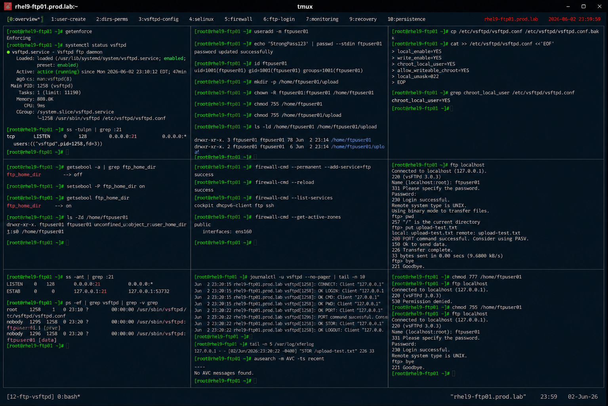

# Local User Chroot Configuration in vsftpd

## Overview

This lab demonstrates enterprise Linux local user isolation using chroot environments in vsftpd on RHEL 9 systems.

The workflow simulates production secure FTP deployments involving local user restrictions, directory isolation, SELinux integration, firewall configuration, and enterprise file transfer security practices.

---

# Objective

This exercise covers:

- local FTP user configuration
- chroot jail implementation
- secure user isolation
- SELinux FTP integration
- FTP access validation
- logging and monitoring
- enterprise secure FTP practices

---

# Environment Information

| Item | Details |
|---|---|
| Operating System | RHEL 9.6 |
| Hostname | rhel9-ftp01.prod.lab |
| FTP Service | vsftpd |
| FTP User | ftpuser01 |
| SELinux | Enforcing |

---

# Chroot FTP Overview

Chroot isolation provides:

- restricted filesystem access
- user directory containment
- secure file transfer environments
- reduced lateral movement risk
- enterprise FTP security controls

---

# Initial Validation

## Verify SELinux Status

```bash
getenforce
```

Expected output:

```text
Enforcing
```

---

## Verify vsftpd Service

```bash
systemctl status vsftpd
```

Expected output:

```text
active (running)
```

---

## Verify FTP Listening Port

```bash
ss -tulpn | grep :21
```

Expected output:

```text
:21
```

---

# Create Local FTP User

## Create FTP User Account

```bash
useradd -m ftpuser01
```

---

## Configure User Password

```bash
passwd ftpuser01
```

Expected output:

```text
password updated successfully
```

---

## Verify User Account

```bash
id ftpuser01
```

Expected output:

```text
uid=
```

---

# Configure FTP Directories

## Create FTP Upload Directory

```bash
mkdir -p /home/ftpuser01/upload
```

---

## Configure Ownership

```bash
chown ftpuser01:ftpuser01 \
/home/ftpuser01/upload
```

---

## Configure Home Directory Permissions

```bash
chmod 755 /home/ftpuser01
chmod 755 /home/ftpuser01/upload
```

---

## Verify Directory Permissions

```bash
ls -ld /home/ftpuser01
ls -ld /home/ftpuser01/upload
```

Expected output:

```text
drwxr-xr-x
```

---

# Configure vsftpd

## Backup FTP Configuration

```bash
cp /etc/vsftpd/vsftpd.conf \
/etc/vsftpd/vsftpd.conf.bak
```

---

## Edit vsftpd Configuration

```bash
vi /etc/vsftpd/vsftpd.conf
```

Configure:

```ini
local_enable=YES
write_enable=YES
chroot_local_user=YES
allow_writeable_chroot=YES
local_umask=022
```

---

## Verify Chroot Configuration

```bash
grep chroot_local_user \
/etc/vsftpd/vsftpd.conf
```

Expected output:

```text
chroot_local_user=YES
```

---

# Configure SELinux for FTP Home Access

## Verify FTP SELinux Booleans

```bash
getsebool -a | grep ftp_home_dir
```

Expected output:

```text
ftp_home_dir
```

---

## Enable FTP Home Directory Access

```bash
setsebool -P ftp_home_dir on
```

---

## Verify Updated Boolean

```bash
getsebool ftp_home_dir
```

Expected output:

```text
on
```

---

## Verify SELinux Contexts

```bash
ls -Zd /home/ftpuser01
```

Expected output:

```text
user_home_dir_t
```

---

# Configure Firewall Access

## Allow FTP Service

```bash
firewall-cmd --permanent --add-service=ftp
```

---

## Reload Firewall Rules

```bash
firewall-cmd --reload
```

Expected output:

```text
success
```

---

## Verify Firewall Services

```bash
firewall-cmd --list-services
```

Expected output:

```text
ftp
```

---

# Restart FTP Service

## Restart vsftpd

```bash
systemctl restart vsftpd
```

---

## Verify Service Status

```bash
systemctl status vsftpd
```

Expected output:

```text
active (running)
```

---

# FTP Login Validation

## Connect Using FTP Client

```bash
ftp localhost
```

Login:

```text
Name: ftpuser01
Password:
```

---

## Verify Restricted Directory

```bash
pwd
```

Expected output:

```text
/
```

User is restricted to the chroot environment.

---

## Upload Test File

```bash
put upload-test.txt
```

Expected output:

```text
Transfer complete
```

---

## Verify Uploaded File

```bash
ls -lh /home/ftpuser01
```

Expected output:

```text
upload-test.txt
```

---

# Chroot Isolation Validation

## Attempt Directory Traversal

```bash
cd ..
```

Expected output:

```text
/
```

User cannot escape the chroot jail.

---

## Verify Restricted Access

```bash
ls /
```

Expected output:

```text
local chroot contents only
```

---

# Monitoring Validation

## Verify Open FTP Sessions

```bash
ss -ant | grep :21
```

Expected output:

```text
ESTAB
```

---

## Verify vsftpd Processes

```bash
ps -ef | grep vsftpd
```

Expected output:

```text
vsftpd
```

---

# Logging Validation

## Verify FTP Login Logs

```bash
journalctl -u vsftpd
```

Expected output:

```text
OK LOGIN
```

---

## Verify Transfer Logs

```bash
cat /var/log/xferlog
```

Expected output:

```text
upload-test.txt
```

---

## Verify SELinux Audit Logs

```bash
ausearch -m AVC
```

Expected output:

```text
(no denials)
```

---

# Recovery Validation

## Simulate Incorrect Permissions

```bash
chmod 777 /home/ftpuser01
```

---

## Verify FTP Login Failure

Attempt FTP login again.

Expected output:

```text
500 OOPS
```

---

## Restore Secure Permissions

```bash
chmod 755 /home/ftpuser01
```

---

## Verify Login Recovery

Retry FTP login.

Expected output:

```text
Login successful
```

---

# Persistence Validation

## Reboot Validation

```bash
reboot
```

After reboot:

```bash
systemctl status vsftpd
```

Expected output:

```text
active (running)
```

FTP chroot configuration remains persistent after reboot.

---

# Security Validation

## Verify SELinux Enforcement

```bash
getenforce
```

Expected output:

```text
Enforcing
```

---

## Verify Active Firewall Zones

```bash
firewall-cmd --get-active-zones
```

Expected output:

```text
public
```

---

# Operational Recommendations

## Use Chroot Isolation for Local FTP Users

Enterprise systems should:

- isolate user environments
- restrict unnecessary filesystem access
- audit FTP activity
- use dedicated upload directories

---

## Prefer Secure Alternatives Where Possible

Recommended alternatives:

- SFTP
- SCP
- HTTPS-based uploads

Traditional FTP should only be used where necessary.

---

## Monitor FTP User Activity

Enterprise monitoring should validate:

- unusual login attempts
- unauthorized uploads
- failed authentication events
- storage consumption trends

---

# Operational Notes

- chroot jails improve FTP user isolation
- SELinux policies affect FTP home access
- directory permissions directly impact login success
- firewall configuration controls external connectivity
- enterprise environments require continuous FTP auditing

---

# Expected Outcome

After completing this lab:

- FTP chroot isolation is operational
- local user restrictions are validated
- SELinux integration is configured
- FTP monitoring is verified
- enterprise secure FTP practices are applied

---

# Screenshot Reference


