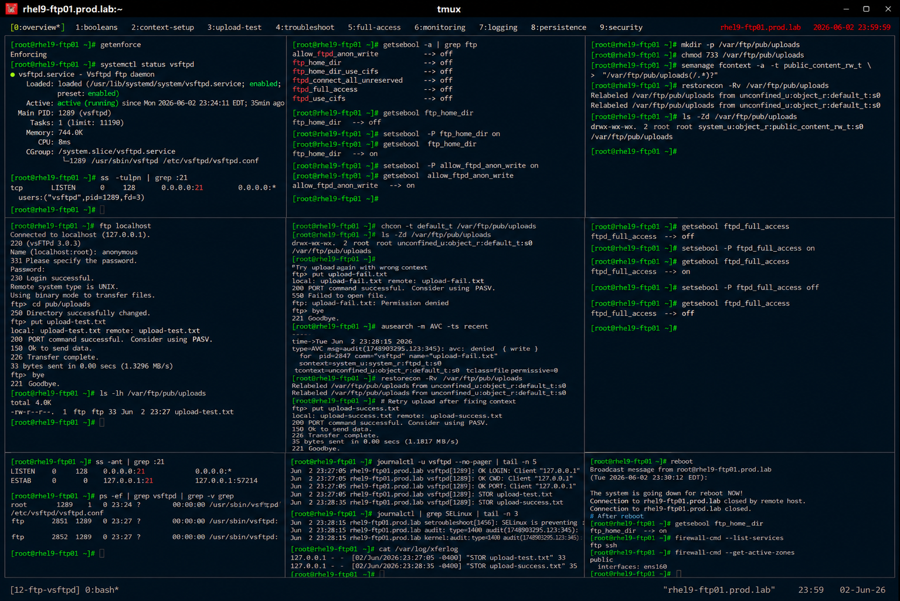

# SELinux FTP Booleans and Security Controls

## Overview

This lab demonstrates enterprise Linux SELinux FTP policy management using vsftpd on RHEL 9 systems.

The workflow simulates production FTP security administration involving SELinux booleans, policy enforcement, secure FTP access, troubleshooting, and enterprise file transfer protection practices.

---

# Objective

This exercise covers:

- SELinux FTP booleans
- FTP security policy management
- SELinux access troubleshooting
- secure FTP operations
- audit log analysis
- FTP monitoring
- enterprise security enforcement practices

---

# Environment Information

| Item | Details |
|---|---|
| Operating System | RHEL 9.6 |
| Hostname | rhel9-ftp01.prod.lab |
| FTP Service | vsftpd |
| SELinux Mode | Enforcing |
| Firewall Service | firewalld |

---

# SELinux FTP Overview

SELinux FTP policies provide:

- mandatory access control
- secure FTP restrictions
- upload permission management
- service isolation
- enterprise policy enforcement

---

# Initial Validation

## Verify SELinux Status

```bash
getenforce
```

Expected output:

```text
Enforcing
```

---

## Verify vsftpd Service

```bash
systemctl status vsftpd
```

Expected output:

```text
active (running)
```

---

## Verify FTP Listening Port

```bash
ss -tulpn | grep :21
```

Expected output:

```text
:21
```

---

# Inspect FTP SELinux Booleans

## List FTP-Related SELinux Booleans

```bash
getsebool -a | grep ftp
```

Expected output:

```text
ftp_home_dir
allow_ftpd_anon_write
ftpd_full_access
```

---

## Verify Current FTP Boolean State

```bash
getsebool ftp_home_dir
```

Expected output:

```text
off
```

---

# Configure FTP Home Directory Access

## Enable FTP Home Directory Access

```bash
setsebool -P ftp_home_dir on
```

---

## Verify Updated Boolean

```bash
getsebool ftp_home_dir
```

Expected output:

```text
on
```

---

# Configure Anonymous FTP Upload Access

## Enable Anonymous Upload Policy

```bash
setsebool -P allow_ftpd_anon_write on
```

---

## Verify Updated Boolean

```bash
getsebool allow_ftpd_anon_write
```

Expected output:

```text
on
```

---

# Configure FTP Test Environment

## Create FTP Upload Directory

```bash
mkdir -p /var/ftp/pub/uploads
```

---

## Configure Upload Permissions

```bash
chmod 733 /var/ftp/pub/uploads
```

---

## Configure SELinux Context

```bash
semanage fcontext -a -t public_content_rw_t \
"/var/ftp/pub/uploads(/.*)?"
```

---

## Apply SELinux Labels

```bash
restorecon -Rv /var/ftp/pub/uploads
```

Expected output:

```text
Relabeled
```

---

## Verify SELinux Context

```bash
ls -Zd /var/ftp/pub/uploads
```

Expected output:

```text
public_content_rw_t
```

---

# FTP Access Validation

## Upload Test File

Using FTP client:

```bash
put upload-test.txt
```

Expected output:

```text
Transfer complete
```

---

## Verify Uploaded File

```bash
ls -lh /var/ftp/pub/uploads
```

Expected output:

```text
upload-test.txt
```

---

# SELinux Troubleshooting

## Simulate Incorrect SELinux Label

```bash
chcon -t default_t /var/ftp/pub/uploads
```

---

## Verify Broken Context

```bash
ls -Zd /var/ftp/pub/uploads
```

Expected output:

```text
default_t
```

---

## Attempt FTP Upload

Retry upload.

Expected output:

```text
Permission denied
```

---

## Verify SELinux Audit Logs

```bash
ausearch -m AVC
```

Expected output:

```text
avc: denied
```

---

## Restore Correct SELinux Context

```bash
restorecon -Rv /var/ftp/pub/uploads
```

---

## Verify Upload Recovery

Retry upload.

Expected output:

```text
Transfer complete
```

---

# Full FTP Access Validation

## Verify Current Full Access Policy

```bash
getsebool ftpd_full_access
```

Expected output:

```text
off
```

---

## Temporarily Enable Full FTP Access

```bash
setsebool -P ftpd_full_access on
```

---

## Verify Updated Policy

```bash
getsebool ftpd_full_access
```

Expected output:

```text
on
```

---

## Disable Excessive Access

```bash
setsebool -P ftpd_full_access off
```

---

## Verify Restricted Policy

```bash
getsebool ftpd_full_access
```

Expected output:

```text
off
```

---

# Monitoring Validation

## Verify Open FTP Connections

```bash
ss -ant | grep :21
```

Expected output:

```text
ESTAB
```

---

## Verify vsftpd Processes

```bash
ps -ef | grep vsftpd
```

Expected output:

```text
vsftpd
```

---

# Logging Validation

## Verify FTP Service Logs

```bash
journalctl -u vsftpd
```

Expected output:

```text
OK LOGIN
```

---

## Verify SELinux Logs

```bash
journalctl | grep SELinux
```

Expected output:

```text
SELinux
```

---

## Verify FTP Transfer Logs

```bash
cat /var/log/xferlog
```

Expected output:

```text
upload-test.txt
```

---

# Persistence Validation

## Reboot Validation

```bash
reboot
```

After reboot:

```bash
getsebool ftp_home_dir
```

Expected output:

```text
on
```

SELinux FTP policies remain persistent after reboot.

---

# Security Validation

## Verify Firewall Services

```bash
firewall-cmd --list-services
```

Expected output:

```text
ftp
```

---

## Verify Active Firewall Zones

```bash
firewall-cmd --get-active-zones
```

Expected output:

```text
public
```

---

# Operational Recommendations

## Use Minimal SELinux Permissions

Enterprise systems should:

- avoid unnecessary full FTP access
- prefer targeted SELinux booleans
- audit SELinux policy changes
- enforce least privilege

---

## Monitor SELinux Denials Regularly

Enterprise monitoring should validate:

- repeated FTP denials
- unauthorized upload attempts
- unexpected policy changes
- abnormal transfer activity

---

## Maintain SELinux Enforcement

Recommended practices:

- avoid disabling SELinux
- standardize labeling procedures
- validate policy persistence
- audit transfer workflows

---

# Operational Notes

- SELinux booleans directly affect FTP functionality
- incorrect labels commonly cause FTP upload failures
- audit logs improve troubleshooting visibility
- full FTP access policies should be avoided when possible
- enterprise environments require continuous policy validation

---

# Expected Outcome

After completing this lab:

- SELinux FTP policies are operational
- FTP upload controls are validated
- SELinux troubleshooting is configured
- FTP monitoring is verified
- enterprise security enforcement practices are applied

---

# Screenshot Reference


