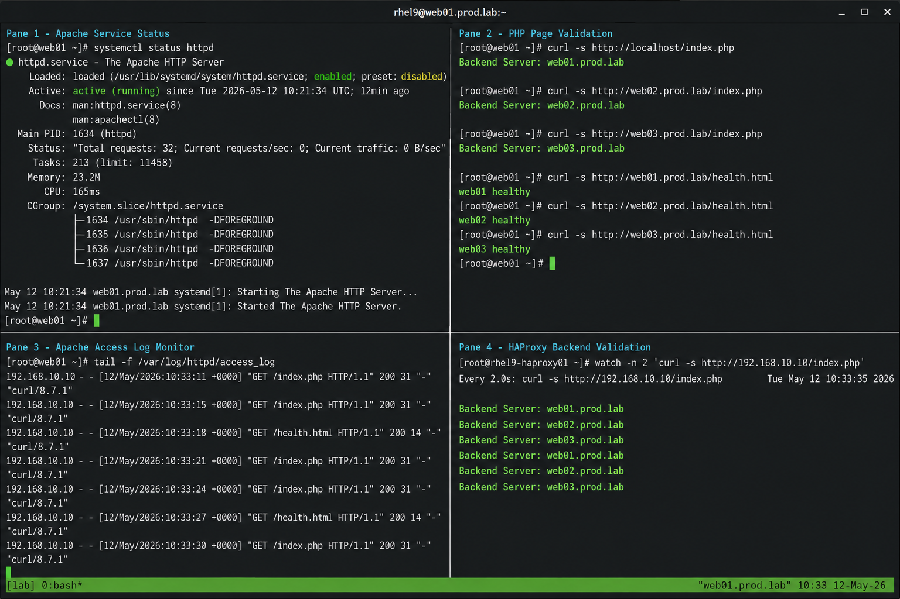

# Backend Apache + PHP Setup

## Overview

This lab configures Apache HTTP Server and PHP on backend servers used behind an HAProxy load balancer. The backend servers will serve PHP content, respond to health checks, and participate in load-balanced traffic operations.

The environment follows enterprise Linux operational practices using RHEL 9.6 with SELinux enforcing and firewalld enabled.

---

# Objective

In this lab you will:

- Install Apache HTTP Server
- Install PHP packages
- Configure backend PHP pages
- Configure firewalld access
- Configure HAProxy health checks
- Validate backend connectivity
- Verify backend readiness for HAProxy

---

# Environment Information

| Hostname | Role | IP Address |
|---|---|---|
| rhel9-haproxy01.prod.lab | HAProxy Load Balancer | 192.168.10.10 |
| web01.prod.lab | Apache Backend Server | 192.168.10.101 |
| web02.prod.lab | Apache Backend Server | 192.168.10.102 |
| web03.prod.lab | Apache Backend Server | 192.168.10.103 |

Environment details:

- Operating System: RHEL 9.6
- SELinux: Enforcing
- firewalld: Enabled
- Apache Service: httpd
- Backend Service Port: 80/TCP

---

# Initial Validation

Verify hostname configuration.

```bash
hostnamectl
```

Expected output:

```text
 Static hostname: web01.prod.lab
```

---

Verify network connectivity from HAProxy server.

```bash
ping -c 4 web01.prod.lab
ping -c 4 web02.prod.lab
ping -c 4 web03.prod.lab
```

Expected output:

```text
64 bytes from 192.168.10.101
64 bytes from 192.168.10.102
64 bytes from 192.168.10.103
```

---

Verify SELinux status.

```bash
getenforce
```

Expected output:

```text
Enforcing
```

---

Verify firewalld service state.

```bash
systemctl status firewalld
```

Expected output:

```text
active (running)
```

---

# Install Apache

Run on all backend servers.

```bash
sudo dnf install httpd -y
```

Enable and start Apache:

```bash
sudo systemctl enable --now httpd
```

Verify service:

```bash
sudo systemctl status httpd
```

Expected output:

```text
Active: active (running)
```

---

Verify listening ports.

```bash
ss -tulpn | grep :80
```

Expected output:

```text
LISTEN 0      511                *:80
```

---

# Configure Firewall

Allow HTTP traffic:

```bash
sudo firewall-cmd --permanent --add-service=http
```

```bash
sudo firewall-cmd --reload
```

Verify:

```bash
sudo firewall-cmd --list-services
```

Expected output:

```text
cockpit dhcpv6-client http ssh
```

---

# Install PHP

Install PHP packages:

```bash
sudo dnf install php php-cli php-common -y
```

Verify PHP:

```bash
php -v
```

Expected output:

```text
PHP 8.x
```

Restart Apache:

```bash
sudo systemctl restart httpd
```

---

# Create Backend Test Pages

On `web01.prod.lab`:

```bash
sudo tee /var/www/html/index.php <<EOF
<?php
echo "Backend Server: web01.prod.lab";
?>
EOF
```

---

On `web02.prod.lab`:

```bash
sudo tee /var/www/html/index.php <<EOF
<?php
echo "Backend Server: web02.prod.lab";
?>
EOF
```

---

On `web03.prod.lab`:

```bash
sudo tee /var/www/html/index.php <<EOF
<?php
echo "Backend Server: web03.prod.lab";
?>
EOF
```

---

Set permissions:

```bash
sudo chown apache:apache /var/www/html/index.php
```

```bash
sudo chmod 644 /var/www/html/index.php
```

---

# Verify PHP Pages

```bash
curl http://web01.prod.lab/index.php
```

```bash
curl http://web02.prod.lab/index.php
```

```bash
curl http://web03.prod.lab/index.php
```

Expected output:

```text
Backend Server: web01.prod.lab
Backend Server: web02.prod.lab
Backend Server: web03.prod.lab
```

---

# Create HAProxy Health Check Page

On `web01.prod.lab`:

```bash
echo "web01 healthy" | sudo tee /var/www/html/health.html
```

---

On `web02.prod.lab`:

```bash
echo "web02 healthy" | sudo tee /var/www/html/health.html
```

---

On `web03.prod.lab`:

```bash
echo "web03 healthy" | sudo tee /var/www/html/health.html
```

---

Verify health check pages.

```bash
curl http://localhost/health.html
```

Expected output:

```text
web01 healthy
```

---

# Example HAProxy Backend Configuration

```haproxy
backend apache_backend
    balance roundrobin
    option httpchk GET /health.html

    server web01 192.168.10.101:80 check
    server web02 192.168.10.102:80 check
    server web03 192.168.10.103:80 check
```

---

# Monitoring Validation

Verify Apache service status.

```bash
systemctl status httpd
```

---

Monitor active HTTP connections.

```bash
ss -antp | grep :80
```

---

Verify Apache processes.

```bash
ps -ef | grep httpd
```

Expected output:

```text
root     1250
apache   1251
apache   1252
```

---

# Logging Validation

Monitor Apache access logs.

```bash
sudo tail -f /var/log/httpd/access_log
```

Expected output:

```text
192.168.10.10 - - [12/May/2026]
```

---

Monitor Apache error logs.

```bash
sudo tail -f /var/log/httpd/error_log
```

---

Review Apache service logs.

```bash
sudo journalctl -u httpd
```

---

# Validate Load Balancing

Run multiple requests against HAProxy:

```bash
curl http://192.168.10.10/index.php
```

Expected alternating responses:

```text
Backend Server: web01.prod.lab
Backend Server: web02.prod.lab
Backend Server: web03.prod.lab
```

---

# Troubleshooting

Check Apache status:

```bash
sudo systemctl status httpd
```

---

Check Apache logs:

```bash
sudo journalctl -xeu httpd
```

---

Verify listening port:

```bash
ss -tulpn | grep :80
```

---

Check SELinux mode:

```bash
getenforce
```

---

Restore SELinux context if required:

```bash
sudo restorecon -Rv /var/www/html
```

---

Verify backend connectivity.

```bash
nc -zv web01.prod.lab 80
```

```bash
nc -zv web02.prod.lab 80
```

```bash
nc -zv web03.prod.lab 80
```

Expected output:

```text
Connection succeeded
```

---

# Persistence Validation

Reboot one backend server.

```bash
sudo reboot
```

---

Verify Apache service persistence after reboot.

```bash
systemctl status httpd
```

Expected output:

```text
enabled
active (running)
```

---

# Security Validation

Verify SELinux remains enforcing.

```bash
getenforce
```

Expected output:

```text
Enforcing
```

---

Verify firewall services.

```bash
sudo firewall-cmd --list-services
```

---

Verify Apache file permissions.

```bash
ls -l /var/www/html
```

Expected output:

```text
-rw-r--r-- apache apache
```

---

# Operational Recommendations

- Keep SELinux enabled in enforcing mode
- Regularly patch Apache and PHP packages
- Monitor backend health checks continuously
- Use HTTPS in production deployments
- Centralize Apache logging
- Restrict unnecessary services
- Validate backend connectivity after maintenance

---

# Operational Notes

Backend servers should remain independently operational even if one node becomes unavailable. HAProxy health checks automatically remove failed backend nodes from load balancing rotation.

When troubleshooting backend failures validate:

- Apache service state
- Network connectivity
- Firewall configuration
- SELinux contexts
- Health check page availability
- Port accessibility

---

# Expected Outcome

After completing this lab:

- Apache is operational on all backend servers
- PHP pages are served correctly
- firewalld allows HTTP traffic
- SELinux remains enforcing
- Health check pages are reachable
- Backend nodes are ready for HAProxy integration
- Monitoring and logging operations function correctly

---


