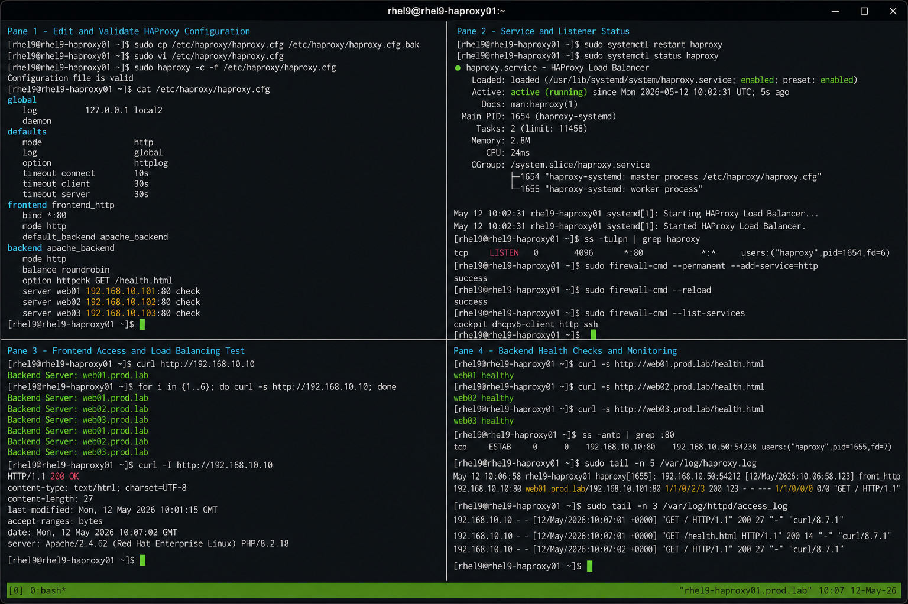

# HAProxy Configuration

## Overview

This lab configures HAProxy on a RHEL 9.6 server for enterprise HTTP load balancing operations. The HAProxy node will distribute requests across multiple Apache backend servers while performing health checks and frontend traffic handling.

The environment follows enterprise Linux operational practices using SELinux enforcing and firewalld enabled.

---

# Objective

In this lab you will:

- Configure HAProxy frontend listeners
- Configure backend server pools
- Configure backend health checks
- Configure load balancing methods
- Validate frontend accessibility
- Validate backend communication
- Monitor HAProxy operations
- Validate persistence and security settings

---

# Environment Information

| Hostname | Role | IP Address |
|---|---|---|
| rhel9-haproxy01.prod.lab | HAProxy Load Balancer | 192.168.10.10 |
| web01.prod.lab | Apache Backend Server | 192.168.10.101 |
| web02.prod.lab | Apache Backend Server | 192.168.10.102 |
| web03.prod.lab | Apache Backend Server | 192.168.10.103 |

Environment details:

- Operating System: RHEL 9.6
- SELinux: Enforcing
- firewalld: Enabled
- HAProxy Version: 2.x
- Frontend Port: 80/TCP

---

# Initial Validation

Verify hostname configuration.

```bash
hostnamectl
```

Expected output:

```text
 Static hostname: rhel9-haproxy01.prod.lab
```

---

Verify HAProxy installation.

```bash
rpm -q haproxy
```

Expected output:

```text
haproxy-2.x
```

---

Verify backend connectivity.

```bash
ping -c 4 web01.prod.lab
```

```bash
ping -c 4 web02.prod.lab
```

```bash
ping -c 4 web03.prod.lab
```

Expected output:

```text
64 bytes from 192.168.10.101
64 bytes from 192.168.10.102
64 bytes from 192.168.10.103
```

---

Verify SELinux mode.

```bash
getenforce
```

Expected output:

```text
Enforcing
```

---

# Backup Existing Configuration

Create a backup of the HAProxy configuration file.

```bash
sudo cp /etc/haproxy/haproxy.cfg /etc/haproxy/haproxy.cfg.bak
```

---

Verify backup creation.

```bash
ls -l /etc/haproxy/
```

Expected output:

```text
haproxy.cfg
haproxy.cfg.bak
```

---

# Configure HAProxy Frontend

Edit the HAProxy configuration file.

```bash
sudo vi /etc/haproxy/haproxy.cfg
```

---

Configure frontend listener settings.

```haproxy
frontend frontend_http
    bind *:80
    mode http
    default_backend apache_backend
```

---

# Configure Backend Pool

Configure backend server definitions.

```haproxy
backend apache_backend
    mode http
    balance roundrobin
    option httpchk GET /health.html

    server web01 192.168.10.101:80 check
    server web02 192.168.10.102:80 check
    server web03 192.168.10.103:80 check
```

---

Configure global and defaults sections.

```haproxy
global
    log         127.0.0.1 local2
    daemon

defaults
    mode                    http
    log                     global
    option                  httplog
    timeout connect         10s
    timeout client          30s
    timeout server          30s
```

---

# Validate Configuration Syntax

Verify configuration syntax before applying changes.

```bash
sudo haproxy -c -f /etc/haproxy/haproxy.cfg
```

Expected output:

```text
Configuration file is valid
```

---

# Restart HAProxy Service

Restart HAProxy service.

```bash
sudo systemctl restart haproxy
```

---

Verify service state.

```bash
sudo systemctl status haproxy
```

Expected output:

```text
Active: active (running)
```

---

Verify frontend listener ports.

```bash
ss -tulpn | grep haproxy
```

Expected output:

```text
LISTEN 0      4096          *:80
```

---

# Configure Firewall Access

Allow HTTP traffic through firewalld.

```bash
sudo firewall-cmd --permanent --add-service=http
```

```bash
sudo firewall-cmd --reload
```

---

Verify firewall configuration.

```bash
sudo firewall-cmd --list-services
```

Expected output:

```text
cockpit dhcpv6-client http ssh
```

---

# Validate Frontend Connectivity

Test frontend listener locally.

```bash
curl http://localhost
```

Expected output:

```text
Backend Server: web01.prod.lab
```

---

Test frontend listener remotely.

```bash
curl http://192.168.10.10
```

Expected output:

```text
Backend Server: web01.prod.lab
```

---

# Validate Load Balancing

Run multiple requests against HAProxy.

```bash
for i in {1..6}; do curl -s http://192.168.10.10; done
```

Expected output:

```text
Backend Server: web01.prod.lab
Backend Server: web02.prod.lab
Backend Server: web03.prod.lab
```

---

Validate HTTP response headers.

```bash
curl -I http://192.168.10.10
```

Expected output:

```text
HTTP/1.1 200 OK
```

---

# Validate Backend Health Checks

Verify backend health pages.

```bash
curl http://web01.prod.lab/health.html
```

```bash
curl http://web02.prod.lab/health.html
```

```bash
curl http://web03.prod.lab/health.html
```

Expected output:

```text
web01 healthy
web02 healthy
web03 healthy
```

---

Verify backend ports.

```bash
nc -zv web01.prod.lab 80
```

```bash
nc -zv web02.prod.lab 80
```

```bash
nc -zv web03.prod.lab 80
```

Expected output:

```text
Connection succeeded
```

---

# Monitoring Validation

Monitor HAProxy service state.

```bash
systemctl status haproxy
```

---

Monitor active frontend connections.

```bash
ss -antp | grep :80
```

---

Monitor HAProxy processes.

```bash
ps -ef | grep haproxy
```

Expected output:

```text
haproxy  1320
haproxy  1321
```

---

Watch live backend responses.

```bash
watch -n 2 'curl -s http://192.168.10.10'
```

Expected output:

```text
Backend Server: web01.prod.lab
Backend Server: web02.prod.lab
Backend Server: web03.prod.lab
```

---

# Logging Validation

Monitor HAProxy logs.

```bash
sudo tail -f /var/log/haproxy.log
```

Expected output:

```text
Connect from 192.168.10.10
```

---

Review HAProxy journal logs.

```bash
sudo journalctl -u haproxy
```

---

Monitor backend Apache logs.

```bash
sudo tail -f /var/log/httpd/access_log
```

Expected output:

```text
192.168.10.10 - - [12/May/2026]
```

---

# Troubleshooting

Validate configuration syntax again after changes.

```bash
sudo haproxy -c -f /etc/haproxy/haproxy.cfg
```

---

Restart HAProxy service.

```bash
sudo systemctl restart haproxy
```

---

Verify frontend listener ports.

```bash
ss -tulpn | grep :80
```

---

Verify backend server accessibility.

```bash
curl http://web01.prod.lab
```

```bash
curl http://web02.prod.lab
```

```bash
curl http://web03.prod.lab
```

---

Verify firewall rules.

```bash
sudo firewall-cmd --list-services
```

---

Verify SELinux mode.

```bash
getenforce
```

Expected output:

```text
Enforcing
```

---

# Persistence Validation

Reboot the HAProxy server.

```bash
sudo reboot
```

---

Verify HAProxy service persistence.

```bash
systemctl status haproxy
```

Expected output:

```text
enabled
active (running)
```

---

Verify frontend accessibility after reboot.

```bash
curl http://192.168.10.10
```

Expected output:

```text
Backend Server: web01.prod.lab
```

---

# Security Validation

Verify only required services are exposed.

```bash
sudo firewall-cmd --list-services
```

---

Verify HAProxy configuration permissions.

```bash
ls -l /etc/haproxy/haproxy.cfg
```

Expected output:

```text
-rw-r----- root root
```

---

Verify SELinux remains enforcing.

```bash
getenforce
```

Expected output:

```text
Enforcing
```

---

# Operational Recommendations

- Validate configuration syntax before reloads
- Monitor backend health continuously
- Maintain HAProxy configuration backups
- Restrict unnecessary network exposure
- Monitor frontend response times
- Centralize HAProxy logging
- Keep SELinux enforcing enabled
- Validate backend connectivity regularly

---

# Operational Notes

HAProxy distributes frontend traffic across backend application servers using the configured balancing algorithm. Backend health checks automatically remove failed servers from active rotation.

During troubleshooting validate:

- Frontend listener availability
- Backend health check responses
- Network connectivity
- Firewall configuration
- SELinux contexts
- HAProxy configuration syntax
- Backend server accessibility

---

# Expected Outcome

After completing this lab:

- HAProxy frontend configuration is operational
- Backend servers are reachable
- Load balancing functions correctly
- Backend health checks operate successfully
- Logging and monitoring operations function correctly
- firewalld allows required traffic
- SELinux remains enforcing
- HAProxy service persists after reboot

---


