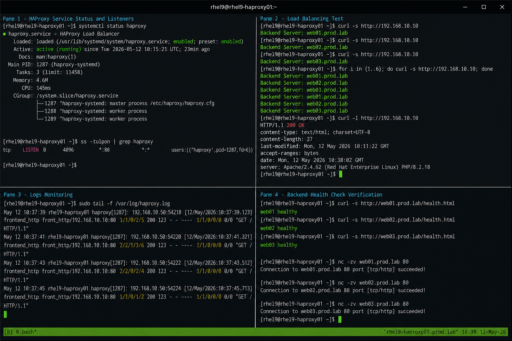

# HAProxy Validation

## Overview

This lab validates HAProxy load balancing functionality in an enterprise Linux environment. The validation process confirms backend availability, traffic distribution, health check functionality, service persistence, logging operations, and frontend accessibility.

The environment uses HAProxy running on RHEL 9.6 with Apache + PHP backend servers operating behind the load balancer.

---

# Objective

In this lab you will:

- Validate HAProxy service status
- Verify frontend listener availability
- Validate backend server health
- Test load balancing functionality
- Monitor HAProxy logs
- Validate persistence after reboot
- Verify firewall and SELinux operations
- Perform operational troubleshooting checks

---

# Environment Information

| Hostname | Role | IP Address |
|---|---|---|
| rhel9-haproxy01.prod.lab | HAProxy Load Balancer | 192.168.10.10 |
| web01.prod.lab | Apache Backend Server | 192.168.10.101 |
| web02.prod.lab | Apache Backend Server | 192.168.10.102 |
| web03.prod.lab | Apache Backend Server | 192.168.10.103 |

Environment details:

- Operating System: RHEL 9.6
- SELinux: Enforcing
- firewalld: Enabled
- HAProxy Version: 2.x
- Frontend Listener Port: 80/TCP

---

# Initial Validation

Verify hostname configuration.

```bash
hostnamectl
```

Expected output:

```text
 Static hostname: rhel9-haproxy01.prod.lab
```

---

Verify HAProxy service state.

```bash
sudo systemctl status haproxy
```

Expected output:

```text
Active: active (running)
```

---

Verify frontend listener ports.

```bash
ss -tulpn | grep haproxy
```

Expected output:

```text
LISTEN 0      4096          *:80
```

---

Verify backend connectivity from HAProxy node.

```bash
ping -c 4 web01.prod.lab
```

```bash
ping -c 4 web02.prod.lab
```

```bash
ping -c 4 web03.prod.lab
```

Expected output:

```text
64 bytes from 192.168.10.101
64 bytes from 192.168.10.102
64 bytes from 192.168.10.103
```

---

Verify SELinux mode.

```bash
getenforce
```

Expected output:

```text
Enforcing
```

---

# Validate HAProxy Configuration

Verify HAProxy configuration syntax.

```bash
sudo haproxy -c -f /etc/haproxy/haproxy.cfg
```

Expected output:

```text
Configuration file is valid
```

---

Review backend configuration.

```bash
sudo grep -A 10 backend /etc/haproxy/haproxy.cfg
```

Expected output:

```text
backend apache_backend
    balance roundrobin
```

---

Verify configured backend servers.

```bash
sudo grep server /etc/haproxy/haproxy.cfg
```

Expected output:

```text
server web01 192.168.10.101:80 check
server web02 192.168.10.102:80 check
server web03 192.168.10.103:80 check
```

---

# Validate Frontend Access

Test frontend accessibility from the HAProxy node.

```bash
curl http://192.168.10.10
```

Expected output:

```text
Backend Server: web01.prod.lab
```

---

Run multiple requests to validate load balancing.

```bash
for i in {1..6}; do curl -s http://192.168.10.10; done
```

Expected output:

```text
Backend Server: web01.prod.lab
Backend Server: web02.prod.lab
Backend Server: web03.prod.lab
```

---

Validate HTTP response headers.

```bash
curl -I http://192.168.10.10
```

Expected output:

```text
HTTP/1.1 200 OK
```

---

# Validate Backend Health Checks

Verify health check pages directly.

```bash
curl http://web01.prod.lab/health.html
```

```bash
curl http://web02.prod.lab/health.html
```

```bash
curl http://web03.prod.lab/health.html
```

Expected output:

```text
web01 healthy
web02 healthy
web03 healthy
```

---

Verify backend ports.

```bash
nc -zv web01.prod.lab 80
```

```bash
nc -zv web02.prod.lab 80
```

```bash
nc -zv web03.prod.lab 80
```

Expected output:

```text
Connection succeeded
```

---

# Monitoring Validation

Monitor HAProxy service state.

```bash
systemctl status haproxy
```

---

Monitor active frontend connections.

```bash
ss -antp | grep :80
```

---

Monitor HAProxy processes.

```bash
ps -ef | grep haproxy
```

Expected output:

```text
haproxy  1320
haproxy  1321
```

---

Watch live backend responses.

```bash
watch -n 2 'curl -s http://192.168.10.10'
```

Expected output:

```text
Backend Server: web01.prod.lab
Backend Server: web02.prod.lab
Backend Server: web03.prod.lab
```

---

# Logging Validation

Monitor HAProxy logs.

```bash
sudo tail -f /var/log/haproxy.log
```

Expected output:

```text
Connect from 192.168.10.10
```

---

Review HAProxy journal logs.

```bash
sudo journalctl -u haproxy
```

---

Monitor Apache backend access logs.

```bash
sudo tail -f /var/log/httpd/access_log
```

Expected output:

```text
192.168.10.10 - - [12/May/2026]
```

---

# Troubleshooting

Validate HAProxy configuration again after changes.

```bash
sudo haproxy -c -f /etc/haproxy/haproxy.cfg
```

---

Restart HAProxy service.

```bash
sudo systemctl restart haproxy
```

---

Verify service state after restart.

```bash
sudo systemctl status haproxy
```

---

Verify frontend listener availability.

```bash
ss -tulpn | grep :80
```

---

Check firewall rules.

```bash
sudo firewall-cmd --list-services
```

Expected output:

```text
cockpit dhcpv6-client http ssh
```

---

Verify SELinux mode.

```bash
getenforce
```

Expected output:

```text
Enforcing
```

---

# Persistence Validation

Reboot the HAProxy server.

```bash
sudo reboot
```

---

Verify HAProxy service persistence after reboot.

```bash
systemctl status haproxy
```

Expected output:

```text
enabled
active (running)
```

---

Verify frontend accessibility after reboot.

```bash
curl http://192.168.10.10
```

Expected output:

```text
Backend Server: web01.prod.lab
```

---

# Security Validation

Verify only required services are exposed.

```bash
sudo firewall-cmd --list-services
```

---

Verify HAProxy configuration permissions.

```bash
ls -l /etc/haproxy/haproxy.cfg
```

Expected output:

```text
-rw-r----- root root
```

---

Verify SELinux mode remains enforcing.

```bash
getenforce
```

Expected output:

```text
Enforcing
```

---

# Operational Recommendations

- Keep SELinux enabled in enforcing mode
- Regularly validate backend health checks
- Monitor HAProxy logs continuously
- Use HTTPS termination in production
- Backup HAProxy configuration files
- Validate configuration syntax before reloads
- Restrict administrative SSH access
- Monitor backend response times

---

# Operational Notes

HAProxy automatically removes failed backend servers from active rotation when health checks fail. Backend nodes return to service automatically after successful recovery.

During operational troubleshooting validate:

- Frontend listener availability
- Backend health status
- Network connectivity
- Apache backend accessibility
- Firewall rules
- SELinux contexts
- HAProxy configuration syntax

---

# Expected Outcome

After completing this lab:

- HAProxy frontend listener is operational
- Backend servers are reachable
- Load balancing functions correctly
- Health checks validate backend availability
- Logging and monitoring operations function correctly
- firewalld allows required traffic
- SELinux remains enforcing
- HAProxy service persists after reboot

---


