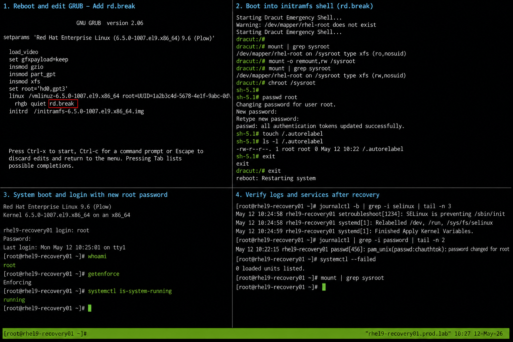

# Password Reset Using rd.break

## Overview

This lab demonstrates enterprise Linux root password recovery using the `rd.break` boot parameter on RHEL 9.6 systems. The process interrupts the boot sequence before the root filesystem fully mounts, allowing administrative recovery access from the initramfs environment.

The procedure is commonly used during operational recovery scenarios where root credentials are unavailable or administrative access is lost.

---

# Objective

In this lab you will:

- Interrupt the GRUB boot process
- Boot into emergency initramfs mode
- Remount the root filesystem
- Reset the root password
- Relabel SELinux contexts
- Reboot the system safely
- Validate post-recovery access
- Verify persistence after reboot

---

# Environment Information

| Hostname | Role | IP Address |
|---|---|---|
| rhel9-recovery01.prod.lab | Recovery Target Server | 192.168.20.10 |

Environment details:

- Operating System: RHEL 9.6
- SELinux: Enforcing
- Boot Mode: UEFI
- Filesystem: XFS
- Bootloader: GRUB2

---

# Initial Validation

Verify current hostname.

```bash
hostnamectl
```

Expected output:

```text
 Static hostname: rhel9-recovery01.prod.lab
```

---

Verify SELinux mode.

```bash
getenforce
```

Expected output:

```text
Enforcing
```

---

Verify current root filesystem mount.

```bash
mount | grep ' / '
```

Expected output:

```text
/dev/mapper/rhel-root on / type xfs
```

---

Verify current boot target.

```bash
systemctl get-default
```

Expected output:

```text
multi-user.target
```

---

# Reboot System into GRUB Menu

Reboot the system.

```bash
sudo reboot
```

---

At the GRUB menu:

- Highlight the active kernel entry
- Press `e` to edit boot parameters

---

Locate the kernel line beginning with:

```text
linux
```

---

Append the following parameter to the end of the line.

```text
rd.break
```

---

Boot using:

```text
Ctrl + x
```

or

```text
F10
```

---

# Enter Recovery Environment

After boot interruption the system enters the initramfs shell.

Expected prompt:

```text
switch_root:/#
```

---

Verify root filesystem state.

```bash
mount | grep sysroot
```

Expected output:

```text
/dev/mapper/rhel-root on /sysroot
```

---

# Remount Root Filesystem

Remount the root filesystem with write access.

```bash
mount -o remount,rw /sysroot
```

---

Change root into the mounted system.

```bash
chroot /sysroot
```

Expected prompt:

```text
sh-5.1#
```

---

# Reset Root Password

Reset the root password.

```bash
passwd root
```

Expected output:

```text
Changing password for user root.
```

---

Enter the new password when prompted.

Expected output:

```text
passwd: all authentication tokens updated successfully.
```

---

# Relabel SELinux Contexts

Create the SELinux autorelabel trigger file.

```bash
touch /.autorelabel
```

---

Verify the file exists.

```bash
ls -l /.autorelabel
```

Expected output:

```text
-rw-r--r--
```

---

# Exit Recovery Environment

Exit the chroot shell.

```bash
exit
```

---

Exit the initramfs shell.

```bash
exit
```

---

The system will reboot automatically.

---

# Validate Root Login

After reboot complete, log in using the new root password.

Verify current user.

```bash
whoami
```

Expected output:

```text
root
```

---

Verify SELinux relabel completed successfully.

```bash
getenforce
```

Expected output:

```text
Enforcing
```

---

Verify system boot state.

```bash
systemctl is-system-running
```

Expected output:

```text
running
```

---

# Monitoring Validation

Verify boot messages.

```bash
journalctl -b
```

---

Monitor authentication logs.

```bash
sudo journalctl | grep password
```

---

Verify filesystem mounts.

```bash
mount | grep sysroot
```

Expected output:

```text
No output
```

---

# Logging Validation

Review boot logs.

```bash
journalctl -b -0
```

---

Review SELinux relabel activity.

```bash
journalctl | grep autorelabel
```

---

Review authentication activity.

```bash
journalctl | grep passwd
```

---

# Troubleshooting

Verify GRUB entry editing.

```text
Press e at GRUB menu
```

---

If filesystem mounts read-only again:

```bash
mount -o remount,rw /sysroot
```

---

If password reset fails:

```bash
passwd root
```

---

If SELinux causes login issues:

```bash
touch /.autorelabel
```

---

Verify root filesystem integrity.

```bash
lsblk
```

---

Verify SELinux mode after reboot.

```bash
getenforce
```

Expected output:

```text
Enforcing
```

---

# Persistence Validation

Reboot the system again.

```bash
sudo reboot
```

---

Log in using the updated password.

Verify root access persists.

```bash
whoami
```

Expected output:

```text
root
```

---

Verify system services.

```bash
systemctl --failed
```

Expected output:

```text
0 loaded units listed
```

---

# Security Validation

Verify SELinux remains enforcing.

```bash
getenforce
```

Expected output:

```text
Enforcing
```

---

Verify password aging information.

```bash
chage -l root
```

---

Verify root account status.

```bash
passwd -S root
```

Expected output:

```text
root PS
```

---

# Operational Recommendations

- Maintain secure root password storage procedures
- Restrict physical console access
- Protect GRUB with passwords in production environments
- Monitor unauthorized reboot attempts
- Use centralized authentication where possible
- Validate SELinux relabel operations after recovery
- Document all password recovery events
- Test recovery procedures in lab environments regularly

---

# Operational Notes

The `rd.break` method interrupts the boot sequence before the normal system initialization process completes. This allows administrative recovery access from the initramfs environment.

During recovery operations validate:

- Filesystem mount state
- SELinux relabel requirements
- Root filesystem accessibility
- Password update completion
- Successful post-recovery login
- Service startup state after reboot

---

# Expected Outcome

After completing this lab:

- The root password is successfully reset
- The system boots normally
- SELinux relabel completes successfully
- Root login functions correctly
- System services operate normally
- Recovery persistence is verified
- System security state remains intact

---


