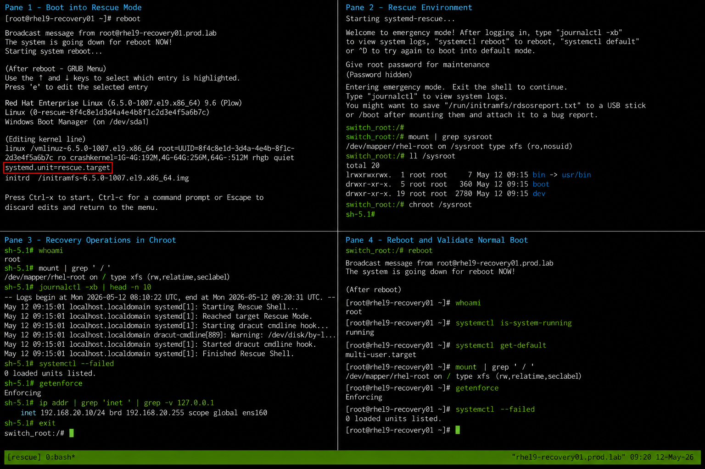

# Rescue Mode Recovery

## Overview

This lab demonstrates system recovery using Rescue Mode on RHEL 9.6 systems. Rescue Mode provides a maintenance environment for troubleshooting boot failures, repairing filesystems, recovering configuration issues, and restoring administrative access.

The procedure is commonly used during enterprise Linux operational recovery scenarios involving damaged services, filesystem inconsistencies, or failed boot processes.

---

# Objective

In this lab you will:

- Boot into Rescue Mode
- Access the rescue environment
- Mount the system filesystem
- Enter the installed system using chroot
- Perform recovery operations
- Validate filesystem accessibility
- Verify SELinux state
- Validate normal boot recovery

---

# Environment Information

| Hostname | Role | IP Address |
|---|---|---|
| rhel9-recovery01.prod.lab | Recovery Target Server | 192.168.20.10 |

Environment details:

- Operating System: RHEL 9.6
- SELinux: Enforcing
- Boot Mode: UEFI
- Filesystem: XFS
- Bootloader: GRUB2

---

# Initial Validation

Verify current hostname.

```bash
hostnamectl
```

Expected output:

```text
 Static hostname: rhel9-recovery01.prod.lab
```

---

Verify current SELinux mode.

```bash
getenforce
```

Expected output:

```text
Enforcing
```

---

Verify current boot target.

```bash
systemctl get-default
```

Expected output:

```text
multi-user.target
```

---

Verify root filesystem.

```bash
mount | grep ' / '
```

Expected output:

```text
/dev/mapper/rhel-root on / type xfs
```

---

# Boot into Rescue Mode

Reboot the system.

```bash
sudo reboot
```

---

At the GRUB menu:

- Select the active RHEL kernel entry
- Press `e` to edit boot parameters

---

Locate the kernel line beginning with:

```text
linux
```

---

Append the following parameter.

```text
systemd.unit=rescue.target
```

---

Boot using:

```text
Ctrl + x
```

or

```text
F10
```

---

# Enter Rescue Environment

The system will boot into rescue mode.

Expected prompt:

```text
Give root password for maintenance
```

---

Enter the root password.

Expected output:

```text
Entering emergency mode
```

---

Verify current target.

```bash
systemctl get-default
```

Expected output:

```text
multi-user.target
```

---

Verify current mode.

```bash
systemctl list-units --type=target
```

Expected output:

```text
rescue.target loaded active active Rescue Mode
```

---

# Verify Filesystem Accessibility

Verify mounted filesystems.

```bash
mount | grep sysroot
```

Expected output:

```text
/dev/mapper/rhel-root
```

---

Verify disk devices.

```bash
lsblk
```

Expected output:

```text
sda
├─sda1
├─sda2
```

---

Verify filesystem usage.

```bash
df -h
```

Expected output:

```text
/dev/mapper/rhel-root
```

---

# Enter Installed System

Enter the installed operating system environment.

```bash
chroot /sysroot
```

Expected prompt:

```text
sh-5.1#
```

---

Verify current root filesystem.

```bash
mount | grep ' / '
```

Expected output:

```text
/dev/mapper/rhel-root on /
```

---

# Perform Recovery Operations

Verify system logs.

```bash
journalctl -xb
```

---

Verify failed services.

```bash
systemctl --failed
```

Expected output:

```text
0 loaded units listed
```

---

Verify network configuration.

```bash
ip addr
```

---

Verify SELinux mode.

```bash
getenforce
```

Expected output:

```text
Enforcing
```

---

# Exit Rescue Environment

Exit the chroot shell.

```bash
exit
```

---

Reboot the system normally.

```bash
reboot
```

---

# Validate Normal Boot

Verify successful login after reboot.

```bash
whoami
```

Expected output:

```text
root
```

---

Verify normal system state.

```bash
systemctl is-system-running
```

Expected output:

```text
running
```

---

Verify current target.

```bash
systemctl get-default
```

Expected output:

```text
multi-user.target
```

---

# Monitoring Validation

Review boot logs.

```bash
journalctl -b
```

---

Monitor failed units.

```bash
systemctl --failed
```

Expected output:

```text
0 loaded units listed
```

---

Monitor active targets.

```bash
systemctl list-units --type=target
```

---

# Logging Validation

Review rescue boot logs.

```bash
journalctl -xb
```

---

Review authentication logs.

```bash
journalctl | grep login
```

---

Review SELinux activity.

```bash
journalctl | grep selinux
```

---

# Troubleshooting

If rescue mode does not start:

```text
Verify kernel boot parameter syntax
```

---

If filesystem mounts read-only:

```bash
mount -o remount,rw /
```

---

Verify root filesystem.

```bash
lsblk
```

---

Verify SELinux mode.

```bash
getenforce
```

Expected output:

```text
Enforcing
```

---

If system services fail after reboot:

```bash
systemctl --failed
```

---

# Persistence Validation

Reboot the system again.

```bash
sudo reboot
```

---

Verify successful normal boot.

```bash
systemctl is-system-running
```

Expected output:

```text
running
```

---

Verify rescue mode is no longer active.

```bash
systemctl list-units --type=target
```

Expected output:

```text
multi-user.target loaded active active Multi-User System
```

---

# Security Validation

Verify SELinux remains enforcing.

```bash
getenforce
```

Expected output:

```text
Enforcing
```

---

Verify root account accessibility.

```bash
passwd -S root
```

Expected output:

```text
root PS
```

---

Verify active firewall state.

```bash
systemctl status firewalld
```

Expected output:

```text
active (running)
```

---

# Operational Recommendations

- Test rescue procedures regularly in lab environments
- Maintain recent configuration backups
- Protect GRUB access in production systems
- Monitor filesystem integrity continuously
- Validate SELinux state after recovery
- Document recovery activities
- Restrict unauthorized console access
- Validate service recovery after maintenance

---

# Operational Notes

Rescue Mode provides a minimal operational environment for maintenance and troubleshooting operations while keeping the system partially operational.

During recovery operations validate:

- Filesystem accessibility
- SELinux status
- Systemd targets
- Service recovery state
- Bootloader integrity
- Network configuration
- Disk accessibility

---

# Expected Outcome

After completing this lab:

- Rescue Mode boots successfully
- Filesystems are accessible
- Recovery operations complete successfully
- SELinux remains enforcing
- System services recover correctly
- Normal boot operation is restored
- Recovery persistence is validated

---


