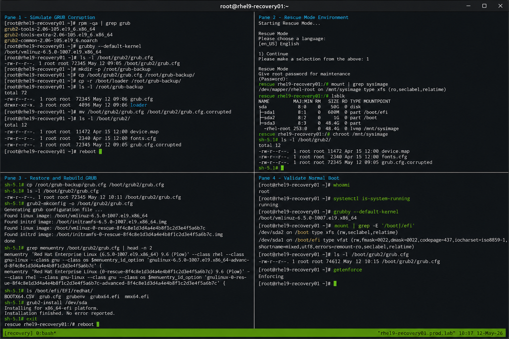

# Simulate GRUB Corruption

## Overview

This lab demonstrates controlled GRUB corruption and recovery operations on a RHEL 9.6 system. The exercise helps administrators understand enterprise Linux bootloader recovery procedures, troubleshooting methods, and operational validation workflows.

The lab intentionally modifies GRUB configuration components and validates recovery using standard enterprise recovery practices.

---

# Objective

In this lab you will:

- Identify GRUB configuration files
- Simulate GRUB configuration corruption
- Observe boot failure behavior
- Access rescue and recovery environments
- Restore GRUB configuration
- Rebuild GRUB configuration files
- Validate successful boot recovery
- Verify post-recovery system functionality

---

# Environment Information

| Hostname | Role | IP Address |
|---|---|---|
| rhel9-recovery01.prod.lab | Recovery Target Server | 192.168.20.10 |

Environment details:

- Operating System: RHEL 9.6
- SELinux: Enforcing
- Boot Mode: UEFI
- Filesystem: XFS
- Bootloader: GRUB2

---

# Initial Validation

Verify hostname configuration.

```bash
hostnamectl
```

Expected output:

```text
 Static hostname: rhel9-recovery01.prod.lab
```

---

Verify current bootloader packages.

```bash
rpm -qa | grep grub
```

Expected output:

```text
grub2-tools
grub2-common
```

---

Verify current boot entry.

```bash
grubby --default-kernel
```

Expected output:

```text
/boot/vmlinuz-6.x
```

---

Verify current GRUB configuration.

```bash
ls -l /boot/grub2/grub.cfg
```

Expected output:

```text
-rw-r--r--
```

---

Verify SELinux mode.

```bash
getenforce
```

Expected output:

```text
Enforcing
```

---

# Backup Existing GRUB Configuration

Create a backup directory.

```bash
sudo mkdir -p /root/grub-backup
```

---

Backup GRUB configuration files.

```bash
sudo cp /boot/grub2/grub.cfg /root/grub-backup/
```

```bash
sudo cp -r /boot/loader /root/grub-backup/
```

---

Verify backup files.

```bash
ls -l /root/grub-backup
```

Expected output:

```text
grub.cfg
loader/
```

---

# Simulate GRUB Corruption

Rename the GRUB configuration file.

```bash
sudo mv /boot/grub2/grub.cfg /boot/grub2/grub.cfg.corrupted
```

---

Verify corruption simulation.

```bash
ls -l /boot/grub2/
```

Expected output:

```text
grub.cfg.corrupted
```

---

# Reboot System

Reboot the server.

```bash
sudo reboot
```

---

Expected behavior:

```text
GRUB prompt
```

or

```text
Boot failure message
```

---

# Access Recovery Environment

Boot into rescue mode using installation media or recovery ISO.

Expected environment:

```text
Rescue Mode
```

---

Select:

```text
1) Continue
```

---

Verify mounted system path.

```bash
mount | grep sysimage
```

Expected output:

```text
/sysroot
```

---

# Enter Installed System

Change root into the installed system.

```bash
chroot /mnt/sysimage
```

Expected prompt:

```text
sh-5.1#
```

---

Verify current GRUB files.

```bash
ls -l /boot/grub2/
```

Expected output:

```text
grub.cfg.corrupted
```

---

# Restore GRUB Configuration

Restore the original GRUB configuration.

```bash
cp /root/grub-backup/grub.cfg /boot/grub2/grub.cfg
```

---

Verify restored file.

```bash
ls -l /boot/grub2/grub.cfg
```

Expected output:

```text
-rw-r--r--
```

---

# Rebuild GRUB Configuration

Generate a new GRUB configuration file.

```bash
grub2-mkconfig -o /boot/grub2/grub.cfg
```

Expected output:

```text
Found linux image
```

---

Verify boot entries.

```bash
grep menuentry /boot/grub2/grub.cfg
```

Expected output:

```text
menuentry 'Red Hat Enterprise Linux'
```

---

# Reinstall GRUB Components

Verify EFI directory.

```bash
ls /boot/efi/EFI/redhat
```

Expected output:

```text
grubx64.efi
```

---

Reinstall GRUB bootloader.

```bash
grub2-install /dev/sda
```

Expected output:

```text
Installation finished. No error reported.
```

---

# Exit Recovery Environment

Exit chroot.

```bash
exit
```

---

Reboot the server.

```bash
reboot
```

---

# Validate Normal Boot

Verify successful system login.

```bash
whoami
```

Expected output:

```text
root
```

---

Verify system operational state.

```bash
systemctl is-system-running
```

Expected output:

```text
running
```

---

Verify current default kernel.

```bash
grubby --default-kernel
```

Expected output:

```text
/boot/vmlinuz-6.x
```

---

# Monitoring Validation

Review boot logs.

```bash
journalctl -b
```

---

Monitor bootloader-related logs.

```bash
journalctl | grep grub
```

---

Verify mounted boot partitions.

```bash
mount | grep boot
```

Expected output:

```text
/boot
/boot/efi
```

---

# Logging Validation

Review rescue environment logs.

```bash
journalctl -xb
```

---

Review GRUB rebuild operations.

```bash
journalctl | grep grub2
```

---

Review boot recovery messages.

```bash
journalctl | grep EFI
```

---

# Troubleshooting

Verify GRUB configuration syntax.

```bash
grub2-script-check /boot/grub2/grub.cfg
```

---

Verify EFI directory contents.

```bash
ls -R /boot/efi/EFI/redhat
```

---

If boot entries are missing:

```bash
grub2-mkconfig -o /boot/grub2/grub.cfg
```

---

If bootloader installation fails:

```bash
grub2-install /dev/sda
```

---

Verify block devices.

```bash
lsblk
```

---

Verify SELinux state.

```bash
getenforce
```

Expected output:

```text
Enforcing
```

---

# Persistence Validation

Reboot the server again.

```bash
sudo reboot
```

---

Verify successful boot after reboot.

```bash
systemctl is-system-running
```

Expected output:

```text
running
```

---

Verify GRUB configuration persistence.

```bash
ls -l /boot/grub2/grub.cfg
```

Expected output:

```text
-rw-r--r--
```

---

# Security Validation

Verify SELinux remains enforcing.

```bash
getenforce
```

Expected output:

```text
Enforcing
```

---

Verify EFI partition mount.

```bash
mount | grep efi
```

Expected output:

```text
/boot/efi
```

---

Verify bootloader package integrity.

```bash
rpm -V grub2-tools
```

---

# Operational Recommendations

- Maintain regular bootloader backups
- Restrict unauthorized GRUB modifications
- Protect UEFI settings with passwords
- Maintain recovery media availability
- Test recovery procedures regularly
- Monitor filesystem integrity
- Document all recovery operations
- Validate bootloader state after maintenance

---

# Operational Notes

GRUB corruption can prevent systems from booting correctly. Recovery procedures typically involve rescue environments, bootloader restoration, and configuration rebuild operations.

During recovery operations validate:

- EFI partition accessibility
- GRUB configuration integrity
- Kernel entry availability
- Filesystem accessibility
- Successful bootloader installation
- SELinux operational state
- Post-recovery service functionality

---

# Expected Outcome

After completing this lab:

- GRUB corruption is successfully simulated
- Recovery environment access functions correctly
- GRUB configuration is restored
- Bootloader components are rebuilt successfully
- Normal boot operation is restored
- SELinux remains enforcing
- Recovery persistence is verified

---


