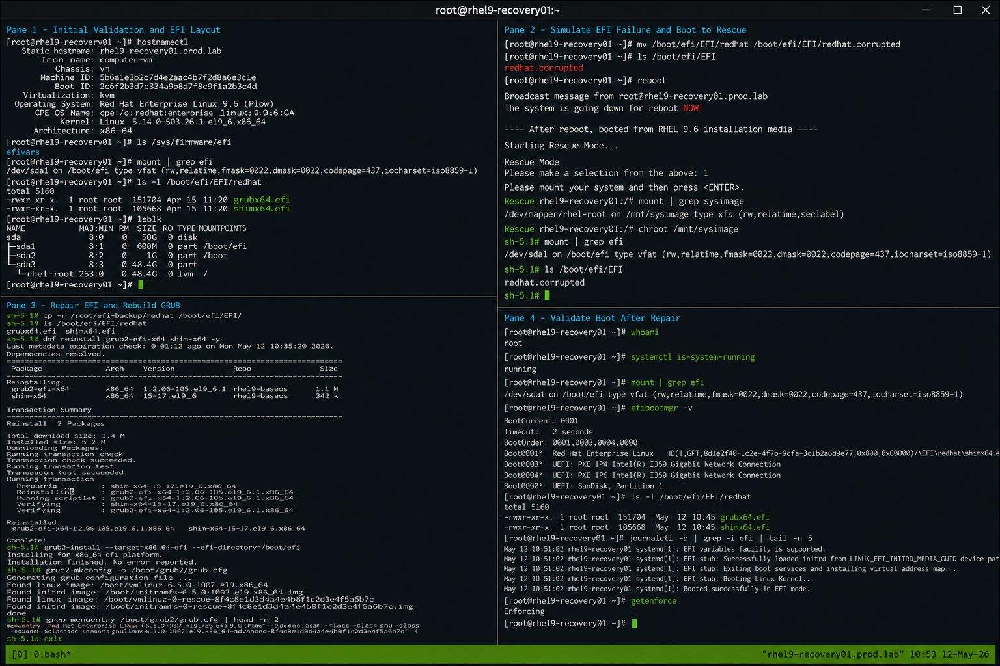

# UEFI Repair Steps

## Overview

This lab demonstrates enterprise Linux UEFI bootloader repair procedures on RHEL 9.6 systems. The exercise covers EFI partition validation, GRUB EFI component recovery, bootloader reinstallation, and operational verification after UEFI-related failures.

The workflow is commonly used during enterprise recovery operations involving damaged EFI entries, corrupted bootloader files, or failed UEFI boot sequences.

---

# Objective

In this lab you will:

- Identify EFI partition layout
- Verify UEFI boot environment
- Access rescue mode
- Mount EFI partitions
- Reinstall GRUB EFI components
- Rebuild GRUB configuration
- Validate UEFI boot entries
- Verify successful boot recovery

---

# Environment Information

| Hostname | Role | IP Address |
|---|---|---|
| rhel9-recovery01.prod.lab | Recovery Target Server | 192.168.20.10 |

Environment details:

- Operating System: RHEL 9.6
- SELinux: Enforcing
- Boot Mode: UEFI
- Filesystem: XFS
- Bootloader: GRUB2 EFI

---

# Initial Validation

Verify hostname configuration.

```bash
hostnamectl
```

Expected output:

```text
 Static hostname: rhel9-recovery01.prod.lab
```

---

Verify EFI directory availability.

```bash
ls /sys/firmware/efi
```

Expected output:

```text
efivars
```

---

Verify EFI partition mount.

```bash
mount | grep efi
```

Expected output:

```text
/boot/efi
```

---

Verify current EFI files.

```bash
ls -l /boot/efi/EFI/redhat
```

Expected output:

```text
grubx64.efi
shimx64.efi
```

---

Verify SELinux mode.

```bash
getenforce
```

Expected output:

```text
Enforcing
```

---

# Verify EFI Partition Layout

Display block devices.

```bash
lsblk
```

Expected output:

```text
sda
├─sda1   /boot/efi
├─sda2   /boot
```

---

Verify filesystem UUIDs.

```bash
blkid
```

Expected output:

```text
TYPE="vfat"
```

---

Verify mounted boot partitions.

```bash
df -h | grep boot
```

Expected output:

```text
/boot
/boot/efi
```

---

# Backup EFI Files

Create backup directory.

```bash
sudo mkdir -p /root/efi-backup
```

---

Backup EFI files.

```bash
sudo cp -r /boot/efi/EFI/redhat /root/efi-backup/
```

---

Verify backup files.

```bash
ls -R /root/efi-backup
```

Expected output:

```text
grubx64.efi
shimx64.efi
```

---

# Simulate EFI Bootloader Failure

Rename EFI directory.

```bash
sudo mv /boot/efi/EFI/redhat /boot/efi/EFI/redhat.corrupted
```

---

Verify EFI corruption simulation.

```bash
ls /boot/efi/EFI
```

Expected output:

```text
redhat.corrupted
```

---

# Reboot System

Reboot the server.

```bash
sudo reboot
```

---

Expected behavior:

```text
UEFI boot failure
```

or

```text
No bootable device
```

---

# Boot into Rescue Environment

Boot using RHEL installation media or rescue ISO.

Select:

```text
Troubleshooting
```

---

Then select:

```text
Rescue a Red Hat Enterprise Linux system
```

---

Select:

```text
1) Continue
```

---

Verify mounted system.

```bash
mount | grep sysimage
```

Expected output:

```text
/sysroot
```

---

# Enter Installed System

Enter the installed operating system environment.

```bash
chroot /mnt/sysimage
```

Expected prompt:

```text
sh-5.1#
```

---

Verify EFI mount.

```bash
mount | grep efi
```

Expected output:

```text
/boot/efi
```

---

# Restore EFI Directory

Restore the original EFI directory.

```bash
cp -r /root/efi-backup/redhat /boot/efi/EFI/
```

---

Verify restored EFI files.

```bash
ls -l /boot/efi/EFI/redhat
```

Expected output:

```text
grubx64.efi
shimx64.efi
```

---

# Reinstall GRUB EFI Components

Install GRUB EFI packages.

```bash
dnf reinstall grub2-efi-x64 shim-x64 -y
```

---

Reinstall GRUB bootloader.

```bash
grub2-install --target=x86_64-efi --efi-directory=/boot/efi
```

Expected output:

```text
Installation finished. No error reported.
```

---

# Rebuild GRUB Configuration

Generate a new GRUB configuration file.

```bash
grub2-mkconfig -o /boot/grub2/grub.cfg
```

Expected output:

```text
Found linux image
```

---

Verify boot menu entries.

```bash
grep menuentry /boot/grub2/grub.cfg
```

Expected output:

```text
menuentry 'Red Hat Enterprise Linux'
```

---

# Verify EFI Boot Entries

Display EFI boot entries.

```bash
efibootmgr -v
```

Expected output:

```text
Boot0001* Red Hat Enterprise Linux
```

---

Verify EFI partition contents.

```bash
tree /boot/efi/EFI
```

Expected output:

```text
EFI
└── redhat
```

---

# Exit Recovery Environment

Exit the chroot shell.

```bash
exit
```

---

Reboot the server.

```bash
reboot
```

---

# Validate Normal Boot

Verify successful login.

```bash
whoami
```

Expected output:

```text
root
```

---

Verify system operational state.

```bash
systemctl is-system-running
```

Expected output:

```text
running
```

---

Verify EFI mount after recovery.

```bash
mount | grep efi
```

Expected output:

```text
/boot/efi
```

---

# Monitoring Validation

Review boot logs.

```bash
journalctl -b
```

---

Monitor EFI-related logs.

```bash
journalctl | grep EFI
```

---

Verify mounted partitions.

```bash
lsblk
```

Expected output:

```text
sda1 /boot/efi
```

---

# Logging Validation

Review GRUB rebuild logs.

```bash
journalctl | grep grub2
```

---

Review EFI boot manager logs.

```bash
journalctl | grep efiboot
```

---

Review rescue environment logs.

```bash
journalctl -xb
```

---

# Troubleshooting

Verify EFI partition mount.

```bash
mount | grep efi
```

---

If EFI directory is missing:

```bash
mkdir -p /boot/efi/EFI/redhat
```

---

If boot entries are missing:

```bash
efibootmgr --create
```

---

Verify EFI files.

```bash
ls -R /boot/efi/EFI
```

---

Verify GRUB configuration syntax.

```bash
grub2-script-check /boot/grub2/grub.cfg
```

---

Verify SELinux state.

```bash
getenforce
```

Expected output:

```text
Enforcing
```

---

# Persistence Validation

Reboot the server again.

```bash
sudo reboot
```

---

Verify successful boot after reboot.

```bash
systemctl is-system-running
```

Expected output:

```text
running
```

---

Verify EFI partition persistence.

```bash
mount | grep efi
```

Expected output:

```text
/boot/efi
```

---

# Security Validation

Verify SELinux remains enforcing.

```bash
getenforce
```

Expected output:

```text
Enforcing
```

---

Verify EFI package integrity.

```bash
rpm -V grub2-efi-x64
```

---

Verify bootloader entries.

```bash
efibootmgr -v
```

Expected output:

```text
Boot0001* Red Hat Enterprise Linux
```

---

# Operational Recommendations

- Maintain EFI partition backups
- Restrict unauthorized EFI modifications
- Protect UEFI firmware settings
- Maintain updated rescue media
- Validate EFI boot entries regularly
- Monitor filesystem integrity
- Test recovery workflows periodically
- Document all recovery operations

---

# Operational Notes

UEFI boot failures commonly involve corrupted EFI files, invalid boot entries, or damaged GRUB EFI components. Recovery typically involves rescue-mode access, EFI restoration, and bootloader rebuild operations.

During recovery operations validate:

- EFI partition accessibility
- GRUB EFI file integrity
- Boot entry availability
- Filesystem mount state
- Successful GRUB installation
- SELinux operational state
- Post-recovery boot functionality

---

# Expected Outcome

After completing this lab:

- EFI corruption is successfully simulated
- Rescue environment access functions correctly
- EFI files are restored successfully
- GRUB EFI components are rebuilt
- UEFI boot entries are operational
- Normal system boot is restored
- SELinux remains enforcing
- Recovery persistence is verified

---


