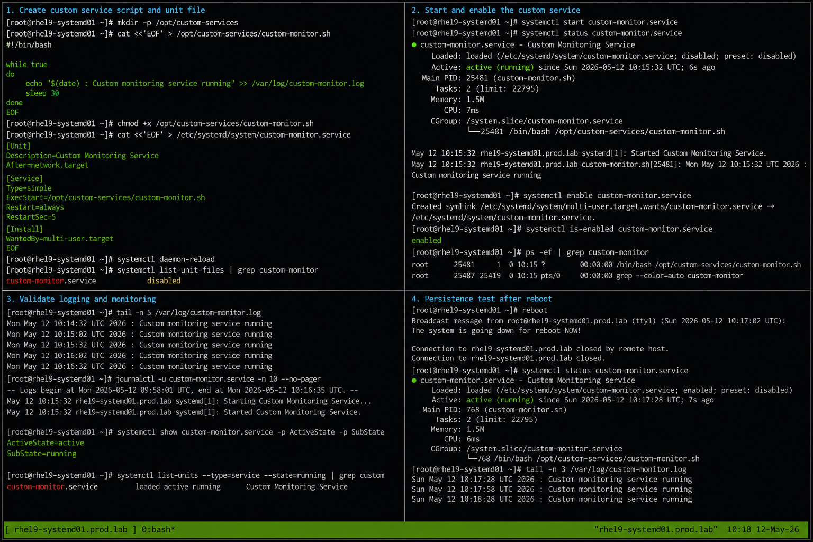

# Creating Custom systemd Unit

## Overview

This lab demonstrates how to create and manage a custom systemd service unit on RHEL 9.6 systems. The exercise covers creating custom service definitions, configuring service startup behavior, validating service management operations, and troubleshooting systemd unit issues.

The workflow follows enterprise Linux operational practices using systemd service management with SELinux enforcing and firewalld enabled.

---

# Objective

In this lab you will:

- Create a custom systemd service
- Configure service unit files
- Configure automatic startup behavior
- Start and stop custom services
- Validate service logging
- Monitor service processes
- Troubleshoot service failures
- Verify persistence after reboot

---

# Environment Information

| Hostname | Role | IP Address |
|---|---|---|
| rhel9-systemd01.prod.lab | systemd Management Server | 192.168.30.10 |

Environment details:

- Operating System: RHEL 9.6
- Init System: systemd
- SELinux: Enforcing
- firewalld: Enabled
- Service Type: Custom systemd Unit

---

# Initial Validation

Verify hostname configuration.

```bash
hostnamectl
```

Expected output:

```text
 Static hostname: rhel9-systemd01.prod.lab
```

---

Verify current init system.

```bash
ps -p 1
```

Expected output:

```text
systemd
```

---

Verify SELinux mode.

```bash
getenforce
```

Expected output:

```text
Enforcing
```

---

Verify current running services.

```bash
systemctl list-units --type=service
```

Expected output:

```text
loaded active running
```

---

# Create Custom Service Script

Create a custom script directory.

```bash
sudo mkdir -p /opt/custom-services
```

---

Create the custom service script.

```bash
sudo vi /opt/custom-services/custom-monitor.sh
```

---

Add the following content.

```bash
#!/bin/bash

while true
do
    echo "$(date) : Custom monitoring service running" >> /var/log/custom-monitor.log
    sleep 30
done
```

---

Set executable permissions.

```bash
sudo chmod +x /opt/custom-services/custom-monitor.sh
```

---

Verify permissions.

```bash
ls -l /opt/custom-services/
```

Expected output:

```text
-rwxr-xr-x
```

---

# Create systemd Unit File

Create the custom systemd service unit.

```bash
sudo vi /etc/systemd/system/custom-monitor.service
```

---

Add the following configuration.

```ini
[Unit]
Description=Custom Monitoring Service
After=network.target

[Service]
Type=simple
ExecStart=/opt/custom-services/custom-monitor.sh
Restart=always
RestartSec=5

[Install]
WantedBy=multi-user.target
```

---

# Reload systemd Configuration

Reload systemd daemon configuration.

```bash
sudo systemctl daemon-reload
```

---

Verify service availability.

```bash
systemctl list-unit-files | grep custom-monitor
```

Expected output:

```text
custom-monitor.service
```

---

# Start Custom Service

Start the custom service.

```bash
sudo systemctl start custom-monitor.service
```

---

Verify service status.

```bash
sudo systemctl status custom-monitor.service
```

Expected output:

```text
Active: active (running)
```

---

Verify process execution.

```bash
ps -ef | grep custom-monitor
```

Expected output:

```text
custom-monitor.sh
```

---

# Enable Service at Boot

Enable the service for automatic startup.

```bash
sudo systemctl enable custom-monitor.service
```

Expected output:

```text
Created symlink
```

---

Verify enablement state.

```bash
systemctl is-enabled custom-monitor.service
```

Expected output:

```text
enabled
```

---

# Validate Service Logging

Monitor the custom log file.

```bash
sudo tail -f /var/log/custom-monitor.log
```

Expected output:

```text
Custom monitoring service running
```

---

Review service journal logs.

```bash
sudo journalctl -u custom-monitor.service
```

Expected output:

```text
Started Custom Monitoring Service
```

---

# Monitoring Validation

Monitor service state.

```bash
systemctl status custom-monitor.service
```

---

Monitor service processes.

```bash
ps -ef | grep custom-monitor
```

---

Monitor service resource usage.

```bash
systemctl show custom-monitor.service
```

---

Monitor active systemd services.

```bash
systemctl list-units --type=service
```

---

# Logging Validation

Review service logs.

```bash
journalctl -u custom-monitor.service
```

---

Review recent log activity.

```bash
journalctl -u custom-monitor.service -n 20
```

---

Monitor live journal entries.

```bash
journalctl -fu custom-monitor.service
```

---

Verify custom application logs.

```bash
tail -f /var/log/custom-monitor.log
```

---

# Troubleshooting

Verify service configuration syntax.

```bash
systemd-analyze verify /etc/systemd/system/custom-monitor.service
```

---

Restart the custom service.

```bash
sudo systemctl restart custom-monitor.service
```

---

Verify service state after restart.

```bash
systemctl status custom-monitor.service
```

Expected output:

```text
active (running)
```

---

If the service fails verify executable permissions.

```bash
ls -l /opt/custom-services/custom-monitor.sh
```

---

Verify SELinux mode.

```bash
getenforce
```

Expected output:

```text
Enforcing
```

---

Reload systemd configuration after modifications.

```bash
sudo systemctl daemon-reload
```

---

# Persistence Validation

Reboot the server.

```bash
sudo reboot
```

---

Verify service startup after reboot.

```bash
systemctl status custom-monitor.service
```

Expected output:

```text
enabled
active (running)
```

---

Verify log generation continues.

```bash
tail /var/log/custom-monitor.log
```

Expected output:

```text
Custom monitoring service running
```

---

# Security Validation

Verify service file permissions.

```bash
ls -l /etc/systemd/system/custom-monitor.service
```

Expected output:

```text
-rw-r--r--
```

---

Verify script ownership.

```bash
ls -l /opt/custom-services/custom-monitor.sh
```

Expected output:

```text
root root
```

---

Verify SELinux remains enforcing.

```bash
getenforce
```

Expected output:

```text
Enforcing
```

---

# Operational Recommendations

- Store custom scripts in controlled directories
- Use systemd restart policies carefully
- Centralize service logging
- Monitor service resource usage
- Validate service configurations before deployment
- Restrict unauthorized service modifications
- Maintain backup copies of unit files
- Test service persistence after maintenance

---

# Operational Notes

Custom systemd units provide centralized service management for enterprise workloads. Unit files allow administrators to manage startup behavior, restart policies, dependencies, and logging operations consistently.

During troubleshooting validate:

- Unit file syntax
- Script permissions
- SELinux enforcement state
- Service logs
- Process state
- Restart policies
- Service dependencies

---

# Expected Outcome

After completing this lab:

- A custom systemd service is operational
- The service starts automatically at boot
- Logging functions correctly
- Service monitoring operates successfully
- Troubleshooting workflows function correctly
- SELinux remains enforcing
- Service persistence is verified

---


