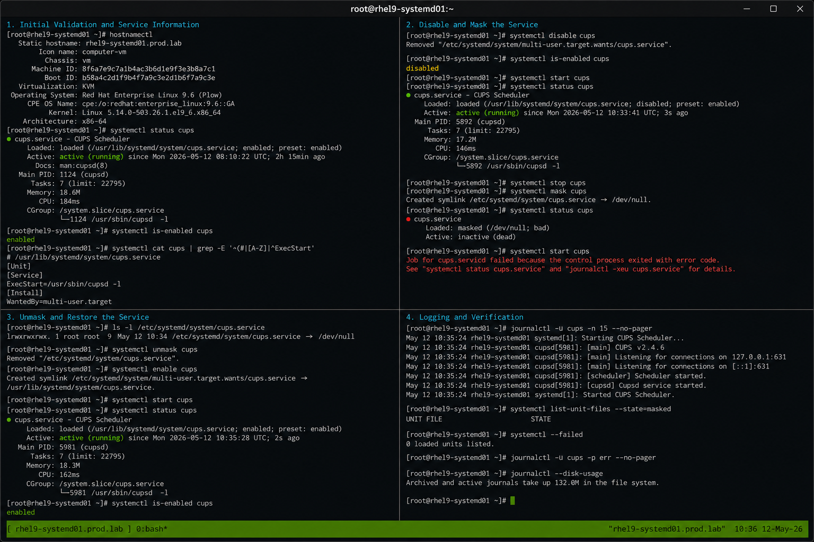

# Masking Services

## Overview

This lab demonstrates service masking operations using systemd on RHEL 9.6 systems. The exercise covers disabling service startup completely, validating masked service behavior, troubleshooting service states, and restoring services back to operational status.

The workflow follows enterprise Linux operational practices using systemd service management with SELinux enforcing and firewalld enabled.

---

# Objective

In this lab you will:

- Identify active services
- Disable and mask services
- Validate masked service behavior
- Compare disable vs mask operations
- Restore masked services
- Monitor service states
- Troubleshoot service startup issues
- Verify persistence after reboot

---

# Environment Information

| Hostname | Role | IP Address |
|---|---|---|
| rhel9-systemd01.prod.lab | systemd Management Server | 192.168.30.10 |

Environment details:

- Operating System: RHEL 9.6
- Init System: systemd
- SELinux: Enforcing
- firewalld: Enabled
- Service Management: systemctl

---

# Initial Validation

Verify hostname configuration.

```bash
hostnamectl
```

Expected output:

```text
 Static hostname: rhel9-systemd01.prod.lab
```

---

Verify current init system.

```bash
ps -p 1
```

Expected output:

```text
systemd
```

---

Verify SELinux mode.

```bash
getenforce
```

Expected output:

```text
Enforcing
```

---

Verify current service state.

```bash
systemctl status cups
```

Expected output:

```text
Active: active (running)
```

---

# Identify Service Information

Verify service enablement state.

```bash
systemctl is-enabled cups
```

Expected output:

```text
enabled
```

---

Verify unit file location.

```bash
systemctl cat cups
```

Expected output:

```text
/usr/lib/systemd/system/cups.service
```

---

Verify current service dependencies.

```bash
systemctl list-dependencies cups
```

---

# Disable the Service

Disable automatic startup.

```bash
sudo systemctl disable cups
```

Expected output:

```text
Removed
```

---

Verify disablement state.

```bash
systemctl is-enabled cups
```

Expected output:

```text
disabled
```

---

Verify the service can still start manually.

```bash
sudo systemctl start cups
```

---

Verify service state.

```bash
systemctl status cups
```

Expected output:

```text
Active: active (running)
```

---

# Mask the Service

Stop the service.

```bash
sudo systemctl stop cups
```

---

Mask the service completely.

```bash
sudo systemctl mask cups
```

Expected output:

```text
Created symlink
```

---

Verify masked state.

```bash
systemctl status cups
```

Expected output:

```text
Loaded: masked
```

---

Verify service cannot start.

```bash
sudo systemctl start cups
```

Expected output:

```text
Failed to start cups.service: Unit is masked.
```

---

# Validate Masking Behavior

Verify unit file symlink.

```bash
ls -l /etc/systemd/system/cups.service
```

Expected output:

```text
/dev/null
```

---

Verify masked units.

```bash
systemctl list-unit-files --state=masked
```

Expected output:

```text
cups.service
```

---

Verify service startup failure logs.

```bash
journalctl -u cups
```

Expected output:

```text
Unit is masked
```

---

# Unmask and Restore Service

Unmask the service.

```bash
sudo systemctl unmask cups
```

Expected output:

```text
Removed
```

---

Enable the service again.

```bash
sudo systemctl enable cups
```

Expected output:

```text
Created symlink
```

---

Start the service.

```bash
sudo systemctl start cups
```

---

Verify restored service state.

```bash
systemctl status cups
```

Expected output:

```text
Active: active (running)
```

---

# Monitoring Validation

Monitor service state.

```bash
systemctl status cups
```

---

Monitor service unit properties.

```bash
systemctl show cups
```

---

Monitor failed services.

```bash
systemctl --failed
```

Expected output:

```text
0 loaded units listed
```

---

Monitor active services.

```bash
systemctl list-units --type=service
```

---

# Logging Validation

Review service logs.

```bash
journalctl -u cups
```

---

Review recent logs.

```bash
journalctl -u cups -n 20
```

---

Monitor live service logs.

```bash
journalctl -fu cups
```

---

Review systemd service events.

```bash
journalctl | grep cups
```

---

# Troubleshooting

Verify service masking state.

```bash
systemctl is-enabled cups
```

Expected output:

```text
masked
```

---

Verify unit symlink.

```bash
ls -l /etc/systemd/system/cups.service
```

---

Reload systemd configuration.

```bash
sudo systemctl daemon-reload
```

---

Restart service after unmasking.

```bash
sudo systemctl restart cups
```

---

Verify SELinux mode.

```bash
getenforce
```

Expected output:

```text
Enforcing
```

---

# Persistence Validation

Reboot the server.

```bash
sudo reboot
```

---

Verify service persistence after reboot.

```bash
systemctl status cups
```

Expected output:

```text
enabled
active (running)
```

---

Verify masking removal persists.

```bash
systemctl is-enabled cups
```

Expected output:

```text
enabled
```

---

# Security Validation

Verify service permissions.

```bash
systemctl cat cups
```

---

Verify masked symlink removal.

```bash
ls -l /etc/systemd/system/
```

Expected output:

```text
cups.service
```

---

Verify SELinux remains enforcing.

```bash
getenforce
```

Expected output:

```text
Enforcing
```

---

# Operational Recommendations

- Use masking carefully on production systems
- Document all service masking operations
- Validate dependencies before masking services
- Restrict unauthorized service modifications
- Monitor failed service startups
- Test masking workflows in lab environments
- Maintain service recovery procedures
- Validate service states after maintenance

---

# Operational Notes

Masking a service prevents it from being started manually or automatically by linking the service unit to `/dev/null`. This provides stronger protection than simply disabling a service.

During troubleshooting validate:

- Service masking state
- Unit symlink status
- Service dependencies
- Journal logs
- Service enablement state
- SELinux enforcement
- Service recovery operations

---

# Expected Outcome

After completing this lab:

- Service masking operations function correctly
- Masked services cannot start
- Service recovery workflows operate successfully
- Logging and monitoring function correctly
- Service persistence works correctly
- SELinux remains enforcing
- Operational troubleshooting workflows function properly

---


