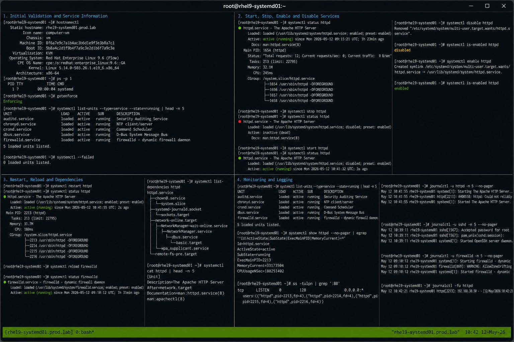

# systemctl Basics

## Overview

This lab demonstrates essential `systemctl` operations on RHEL 9.6 systems. The exercise covers managing systemd services, viewing service states, controlling startup behavior, monitoring active services, and troubleshooting service management operations using enterprise Linux workflows.

The lab follows realistic operational procedures using systemd with SELinux enforcing and firewalld enabled.

---

# Objective

In this lab you will:

- Start and stop services
- Enable and disable services
- View service states
- Reload and restart services
- Monitor active services
- Troubleshoot service issues
- Validate service persistence
- Verify operational service management workflows

---

# Environment Information

| Hostname | Role | IP Address |
|---|---|---|
| rhel9-systemd01.prod.lab | systemd Management Server | 192.168.30.10 |

Environment details:

- Operating System: RHEL 9.6
- Init System: systemd
- SELinux: Enforcing
- firewalld: Enabled
- Service Management Utility: systemctl

---

# Initial Validation

Verify hostname configuration.

```bash
hostnamectl
```

Expected output:

```text
 Static hostname: rhel9-systemd01.prod.lab
```

---

Verify init system.

```bash
ps -p 1
```

Expected output:

```text
systemd
```

---

Verify SELinux mode.

```bash
getenforce
```

Expected output:

```text
Enforcing
```

---

Verify current running services.

```bash
systemctl list-units --type=service
```

Expected output:

```text
loaded active running
```

---

# View Service Information

Check SSH service status.

```bash
systemctl status sshd
```

Expected output:

```text
Active: active (running)
```

---

Check firewalld service status.

```bash
systemctl status firewalld
```

Expected output:

```text
Active: active (running)
```

---

View all service unit files.

```bash
systemctl list-unit-files --type=service
```

---

View failed services.

```bash
systemctl --failed
```

Expected output:

```text
0 loaded units listed
```

---

# Start and Stop Services

Stop the Apache service.

```bash
sudo systemctl stop httpd
```

---

Verify service state.

```bash
systemctl status httpd
```

Expected output:

```text
inactive (dead)
```

---

Start the Apache service.

```bash
sudo systemctl start httpd
```

---

Verify active state.

```bash
systemctl status httpd
```

Expected output:

```text
active (running)
```

---

# Enable and Disable Services

Disable automatic startup.

```bash
sudo systemctl disable httpd
```

Expected output:

```text
Removed
```

---

Verify disablement state.

```bash
systemctl is-enabled httpd
```

Expected output:

```text
disabled
```

---

Enable service startup again.

```bash
sudo systemctl enable httpd
```

Expected output:

```text
Created symlink
```

---

Verify enablement state.

```bash
systemctl is-enabled httpd
```

Expected output:

```text
enabled
```

---

# Restart and Reload Services

Restart Apache service.

```bash
sudo systemctl restart httpd
```

---

Verify service state after restart.

```bash
systemctl status httpd
```

Expected output:

```text
active (running)
```

---

Reload firewalld configuration.

```bash
sudo systemctl reload firewalld
```

---

Verify reload operation.

```bash
systemctl status firewalld
```

Expected output:

```text
active (running)
```

---

# View Service Dependencies

Display service dependencies.

```bash
systemctl list-dependencies httpd
```

---

View reverse dependencies.

```bash
systemctl list-dependencies --reverse httpd
```

---

View service unit configuration.

```bash
systemctl cat httpd
```

Expected output:

```text
/usr/lib/systemd/system/httpd.service
```

---

# Monitor Service Operations

Monitor active services.

```bash
systemctl list-units --type=service --state=running
```

---

Monitor failed services.

```bash
systemctl --failed
```

Expected output:

```text
0 loaded units listed
```

---

Monitor service resource usage.

```bash
systemctl status httpd
```

Expected output:

```text
Memory:
CPU:
```

---

Monitor service properties.

```bash
systemctl show httpd
```

---

# Logging Validation

Review Apache logs.

```bash
journalctl -u httpd
```

Expected output:

```text
Started The Apache HTTP Server
```

---

Review SSH logs.

```bash
journalctl -u sshd
```

Expected output:

```text
Accepted password
```

---

Monitor live Apache logs.

```bash
journalctl -fu httpd
```

---

Review firewalld logs.

```bash
journalctl -u firewalld
```

---

# Troubleshooting

Verify service configuration.

```bash
systemctl cat httpd
```

---

Restart service after configuration changes.

```bash
sudo systemctl restart httpd
```

---

Reload systemd configuration.

```bash
sudo systemctl daemon-reload
```

---

Verify listening ports.

```bash
ss -tulpn | grep :80
```

Expected output:

```text
LISTEN
```

---

Verify SELinux mode.

```bash
getenforce
```

Expected output:

```text
Enforcing
```

---

Verify failed services.

```bash
systemctl --failed
```

Expected output:

```text
0 loaded units listed
```

---

# Persistence Validation

Reboot the server.

```bash
sudo reboot
```

---

Verify service persistence after reboot.

```bash
systemctl status httpd
```

Expected output:

```text
enabled
active (running)
```

---

Verify firewalld persistence.

```bash
systemctl status firewalld
```

Expected output:

```text
active (running)
```

---

# Security Validation

Verify SELinux remains enforcing.

```bash
getenforce
```

Expected output:

```text
Enforcing
```

---

Verify firewalld service state.

```bash
systemctl status firewalld
```

Expected output:

```text
active (running)
```

---

Verify service file permissions.

```bash
ls -l /usr/lib/systemd/system/httpd.service
```

Expected output:

```text
-rw-r--r--
```

---

# Operational Recommendations

- Monitor failed services regularly
- Use restart and reload operations carefully
- Validate service dependencies before changes
- Centralize service logs
- Restrict unauthorized service modifications
- Maintain configuration backups
- Test persistence after maintenance
- Validate service states after updates

---

# Operational Notes

The `systemctl` utility provides centralized management for systemd services and system states on enterprise Linux systems.

During troubleshooting validate:

- Service state
- Startup behavior
- Dependencies
- Journal logs
- Listening ports
- SELinux state
- Service persistence

---

# Expected Outcome

After completing this lab:

- Services can be started and stopped successfully
- Service enablement operations function correctly
- Logging and monitoring workflows operate properly
- Service troubleshooting functions correctly
- Service persistence works after reboot
- SELinux remains enforcing
- Operational service management workflows are validated

---


