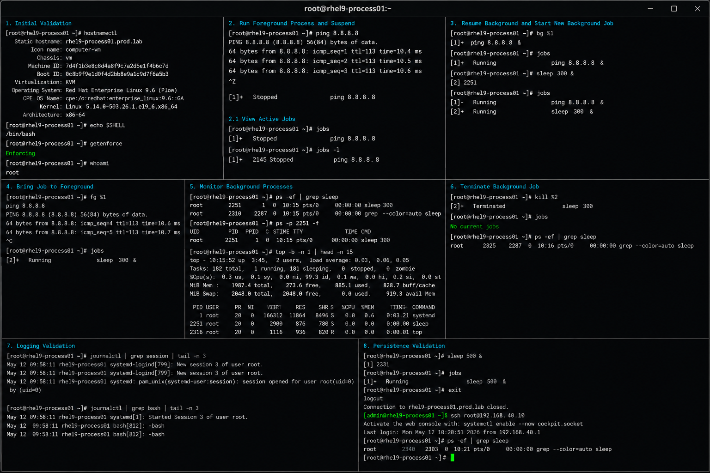

# Background Jobs

## Overview

This lab demonstrates Linux background job management on RHEL 9.6 systems. The exercise covers running foreground and background processes, managing suspended jobs, monitoring process execution, and controlling job states using enterprise Linux operational workflows.

The lab follows realistic enterprise Linux process management practices with SELinux enforcing and firewalld enabled.

---

# Objective

In this lab you will:

- Run processes in the background
- Suspend foreground processes
- Resume stopped jobs
- Manage active job states
- Monitor background process activity
- Validate process persistence
- Troubleshoot background jobs
- Verify operational process workflows

---

# Environment Information

| Hostname | Role | IP Address |
|---|---|---|
| rhel9-process01.prod.lab | Process Management Server | 192.168.40.10 |

Environment details:

- Operating System: RHEL 9.6
- Shell Environment: Bash
- SELinux: Enforcing
- firewalld: Enabled
- Process Management Utilities: jobs, bg, fg, ps

---

# Initial Validation

Verify hostname configuration.

```bash
hostnamectl
```

Expected output:

```text
 Static hostname: rhel9-process01.prod.lab
```

---

Verify current shell.

```bash
echo $SHELL
```

Expected output:

```text
/bin/bash
```

---

Verify SELinux mode.

```bash
getenforce
```

Expected output:

```text
Enforcing
```

---

Verify current logged-in user.

```bash
whoami
```

Expected output:

```text
root
```

---

# Run Foreground Process

Start a continuous ping process.

```bash
ping 8.8.8.8
```

Expected output:

```text
64 bytes from 8.8.8.8
```

---

Suspend the process using:

```text
Ctrl + Z
```

Expected output:

```text
Stopped
```

---

# View Active Jobs

Display active jobs.

```bash
jobs
```

Expected output:

```text
[1]+ Stopped ping 8.8.8.8
```

---

View job process IDs.

```bash
jobs -l
```

Expected output:

```text
[1]+ 2145 Stopped ping 8.8.8.8
```

---

# Resume Background Jobs

Resume the stopped process in the background.

```bash
bg %1
```

Expected output:

```text
[1]+ ping 8.8.8.8 &
```

---

Verify active jobs.

```bash
jobs
```

Expected output:

```text
[1]+ Running ping 8.8.8.8 &
```

---

# Run Process Directly in Background

Start a background sleep process.

```bash
sleep 300 &
```

Expected output:

```text
[2] 2251
```

---

Verify active background jobs.

```bash
jobs
```

Expected output:

```text
[1]- Running ping 8.8.8.8 &
[2]+ Running sleep 300 &
```

---

# Bring Background Job to Foreground

Bring the ping process back to foreground.

```bash
fg %1
```

Expected output:

```text
ping 8.8.8.8
```

---

Terminate the process using:

```text
Ctrl + C
```

---

Verify remaining jobs.

```bash
jobs
```

Expected output:

```text
[2]+ Running sleep 300 &
```

---

# Monitor Background Processes

View running processes.

```bash
ps -ef | grep sleep
```

Expected output:

```text
sleep 300
```

---

Monitor process activity.

```bash
top
```

Expected output:

```text
Tasks:
```

---

Monitor specific process IDs.

```bash
ps -p 2251 -f
```

Expected output:

```text
sleep 300
```

---

# Logging Validation

Review authentication logs.

```bash
journalctl | grep session
```

---

Review shell process activity.

```bash
journalctl | grep bash
```

---

Review recent system logs.

```bash
journalctl -n 20
```

Expected output:

```text
systemd
```

---

# Monitoring Validation

Monitor running jobs.

```bash
jobs
```

---

Monitor active processes.

```bash
ps -ef
```

---

Monitor system resource usage.

```bash
top
```

---

Monitor background job status.

```bash
jobs -l
```

---

# Terminate Background Jobs

Terminate the sleep process.

```bash
kill %2
```

---

Verify job removal.

```bash
jobs
```

Expected output:

```text
No current jobs
```

---

Verify process termination.

```bash
ps -ef | grep sleep
```

Expected output:

```text
No output
```

---

# Troubleshooting

Verify active jobs.

```bash
jobs
```

---

Verify process IDs.

```bash
jobs -l
```

---

If a process becomes unresponsive:

```bash
kill -9 PID
```

---

Verify process ownership.

```bash
ps -u root
```

---

Verify SELinux mode.

```bash
getenforce
```

Expected output:

```text
Enforcing
```

---

# Persistence Validation

Start a new background process.

```bash
sleep 500 &
```

---

Verify process exists.

```bash
jobs
```

Expected output:

```text
Running
```

---

Log out of the shell session.

```bash
exit
```

---

Log back in and verify process behavior.

```bash
ps -ef | grep sleep
```

Expected output:

```text
No output
```

---

# Security Validation

Verify running user processes.

```bash
ps -u root
```

---

Verify shell process ownership.

```bash
ps -ef | grep bash
```

---

Verify SELinux remains enforcing.

```bash
getenforce
```

Expected output:

```text
Enforcing
```

---

# Operational Recommendations

- Monitor long-running background jobs regularly
- Use screen or tmux for persistent sessions
- Validate process ownership before termination
- Monitor CPU and memory usage
- Avoid orphaned background processes
- Document operational maintenance jobs
- Use nohup when persistence is required
- Restrict unauthorized process execution

---

# Operational Notes

Background jobs allow administrators to manage long-running tasks without blocking the active shell session.

During troubleshooting validate:

- Job states
- Process ownership
- Process IDs
- Shell session state
- Resource consumption
- Process responsiveness
- SELinux operational state

---

# Expected Outcome

After completing this lab:

- Background job management functions correctly
- Foreground and background processes operate successfully
- Job suspension and resume workflows function properly
- Process monitoring operates correctly
- Process termination workflows function successfully
- SELinux remains enforcing
- Operational process management workflows are validated

---


