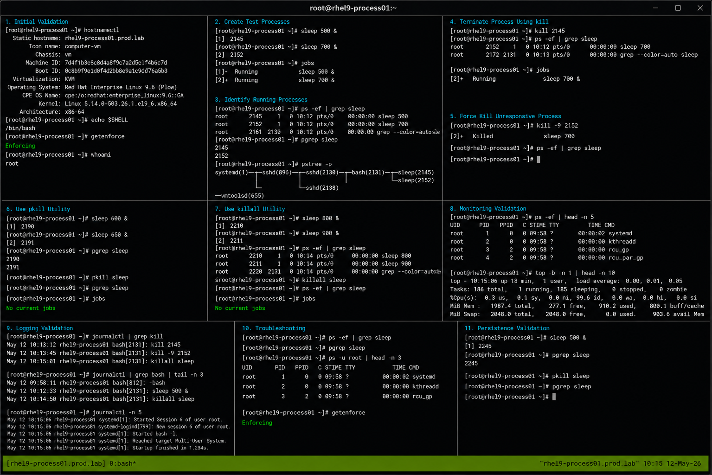

# Killing Processes

## Overview

This lab demonstrates Linux process termination and signal management workflows on RHEL 9.6 systems. The exercise covers identifying running processes, sending termination signals, forcefully stopping unresponsive tasks, monitoring process states, and validating operational recovery procedures.

The lab follows enterprise Linux operational practices using standard process management utilities with SELinux enforcing and firewalld enabled.

---

# Objective

In this lab you will:

- Identify active processes
- Send termination signals
- Forcefully kill unresponsive processes
- Manage processes using PID values
- Use pkill and killall utilities
- Monitor process states
- Troubleshoot stuck processes
- Validate process cleanup operations

---

# Environment Information

| Hostname | Role | IP Address |
|---|---|---|
| rhel9-process01.prod.lab | Process Management Server | 192.168.40.10 |

Environment details:

- Operating System: RHEL 9.6
- Shell Environment: Bash
- SELinux: Enforcing
- firewalld: Enabled
- Process Utilities: kill, pkill, killall

---

# Initial Validation

Verify hostname configuration.

```bash
hostnamectl
```

Expected output:

```text
 Static hostname: rhel9-process01.prod.lab
```

---

Verify current shell.

```bash
echo $SHELL
```

Expected output:

```text
/bin/bash
```

---

Verify SELinux mode.

```bash
getenforce
```

Expected output:

```text
Enforcing
```

---

Verify current logged-in user.

```bash
whoami
```

Expected output:

```text
root
```

---

# Create Test Processes

Start a sleep process in the background.

```bash
sleep 500 &
```

Expected output:

```text
[1] 2145
```

---

Start another background process.

```bash
sleep 700 &
```

Expected output:

```text
[2] 2152
```

---

Verify active jobs.

```bash
jobs
```

Expected output:

```text
Running
```

---

# Identify Running Processes

View running sleep processes.

```bash
ps -ef | grep sleep
```

Expected output:

```text
sleep 500
sleep 700
```

---

View process IDs only.

```bash
pgrep sleep
```

Expected output:

```text
2145
2152
```

---

View process tree.

```bash
pstree -p
```

Expected output:

```text
bash---sleep
```

---

# Terminate Process Using kill

Terminate the first process gracefully.

```bash
kill 2145
```

---

Verify process removal.

```bash
ps -ef | grep sleep
```

Expected output:

```text
sleep 700
```

---

Verify remaining jobs.

```bash
jobs
```

Expected output:

```text
[2]+ Running sleep 700 &
```

---

# Force Kill Unresponsive Process

Send SIGKILL signal.

```bash
kill -9 2152
```

Expected output:

```text
Killed
```

---

Verify process termination.

```bash
ps -ef | grep sleep
```

Expected output:

```text
No output
```

---

# Use pkill Utility

Start new test processes.

```bash
sleep 600 &
```

```bash
sleep 650 &
```

---

Verify active processes.

```bash
pgrep sleep
```

Expected output:

```text
PID values
```

---

Terminate all sleep processes.

```bash
pkill sleep
```

---

Verify cleanup.

```bash
pgrep sleep
```

Expected output:

```text
No output
```

---

# Use killall Utility

Start additional processes.

```bash
sleep 800 &
```

```bash
sleep 900 &
```

---

Verify processes.

```bash
ps -ef | grep sleep
```

---

Terminate all processes using killall.

```bash
killall sleep
```

---

Verify all processes stopped.

```bash
ps -ef | grep sleep
```

Expected output:

```text
No output
```

---

# Monitoring Validation

Monitor active processes.

```bash
ps -ef
```

---

Monitor resource usage.

```bash
top
```

Expected output:

```text
Tasks:
```

---

Monitor specific PIDs.

```bash
ps -p PID -f
```

---

Monitor process hierarchy.

```bash
pstree -p
```

---

# Logging Validation

Review process-related logs.

```bash
journalctl | grep kill
```

---

Review shell session activity.

```bash
journalctl | grep bash
```

---

Review recent system logs.

```bash
journalctl -n 20
```

Expected output:

```text
systemd
```

---

# Troubleshooting

Verify active processes.

```bash
ps -ef
```

---

Verify specific PID status.

```bash
ps -p PID
```

---

If process ignores SIGTERM:

```bash
kill -9 PID
```

---

Verify process ownership.

```bash
ps -u root
```

---

Verify SELinux mode.

```bash
getenforce
```

Expected output:

```text
Enforcing
```

---

# Persistence Validation

Start a background process.

```bash
sleep 500 &
```

---

Verify process exists.

```bash
pgrep sleep
```

Expected output:

```text
PID
```

---

Terminate the process.

```bash
pkill sleep
```

---

Verify cleanup persists.

```bash
pgrep sleep
```

Expected output:

```text
No output
```

---

# Security Validation

Verify running user processes.

```bash
ps -u root
```

---

Verify process ownership.

```bash
ps -ef | grep sleep
```

Expected output:

```text
No output
```

---

Verify SELinux remains enforcing.

```bash
getenforce
```

Expected output:

```text
Enforcing
```

---

# Operational Recommendations

- Use SIGTERM before SIGKILL whenever possible
- Monitor critical processes carefully
- Validate process ownership before termination
- Avoid killing production-critical services accidentally
- Monitor resource utilization regularly
- Document operational maintenance tasks
- Use process filters carefully with pkill and killall
- Validate cleanup operations after maintenance

---

# Operational Notes

Linux signals provide administrators with controlled methods for terminating or managing running processes.

Common operational signals:

- SIGTERM (15) for graceful termination
- SIGKILL (9) for forceful termination
- SIGSTOP for process suspension
- SIGCONT for process continuation

During troubleshooting validate:

- Process ownership
- Process responsiveness
- PID accuracy
- Resource utilization
- Service dependencies
- Process hierarchy
- SELinux operational state

---

# Expected Outcome

After completing this lab:

- Process identification workflows function correctly
- Signals terminate processes successfully
- Forceful process cleanup operates properly
- pkill and killall utilities function correctly
- Monitoring and troubleshooting workflows operate successfully
- SELinux remains enforcing
- Operational process management workflows are validated

---


