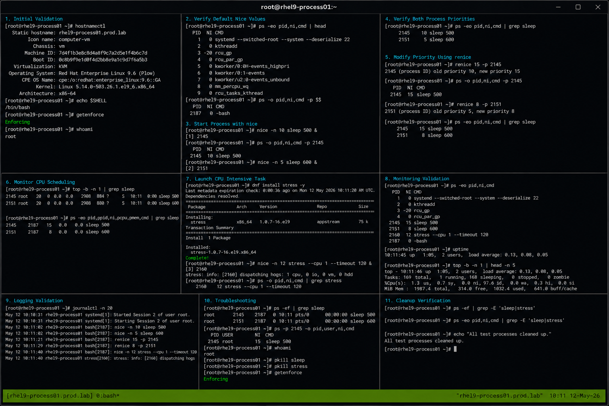

# nice renice

## Overview

This lab demonstrates Linux CPU scheduling priority management using `nice` and `renice` on RHEL 9.6 systems. The exercise covers launching processes with custom priorities, modifying running process priorities, monitoring CPU scheduling behavior, and validating operational workload management.

The workflow follows enterprise Linux operational practices using standard process scheduling utilities with SELinux enforcing and firewalld enabled.

---

# Objective

In this lab you will:

- Launch processes using custom nice values
- Modify running process priorities
- Monitor process scheduling behavior
- Compare CPU priority levels
- Validate renice operations
- Troubleshoot priority management issues
- Monitor CPU resource usage
- Verify operational process workflows

---

# Environment Information

| Hostname | Role | IP Address |
|---|---|---|
| rhel9-process01.prod.lab | Process Management Server | 192.168.40.10 |

Environment details:

- Operating System: RHEL 9.6
- Shell Environment: Bash
- SELinux: Enforcing
- firewalld: Enabled
- Scheduling Utilities: nice, renice

---

# Initial Validation

Verify hostname configuration.

```bash
hostnamectl
```

Expected output:

```text
 Static hostname: rhel9-process01.prod.lab
```

---

Verify current shell.

```bash
echo $SHELL
```

Expected output:

```text
/bin/bash
```

---

Verify SELinux mode.

```bash
getenforce
```

Expected output:

```text
Enforcing
```

---

Verify current logged-in user.

```bash
whoami
```

Expected output:

```text
root
```

---

# Verify Default Nice Values

View running process priorities.

```bash
ps -eo pid,ni,cmd | head
```

Expected output:

```text
PID  NI CMD
```

---

Verify shell priority.

```bash
ps -o pid,ni,cmd -p $$
```

Expected output:

```text
0
```

---

# Start Process with nice

Launch a process using a lower priority.

```bash
nice -n 10 sleep 500 &
```

Expected output:

```text
[1] 2145
```

---

Verify process nice value.

```bash
ps -o pid,ni,cmd -p 2145
```

Expected output:

```text
10
```

---

Launch another process with higher priority.

```bash
nice -n 5 sleep 600 &
```

Expected output:

```text
[2] 2151
```

---

Verify both process priorities.

```bash
ps -eo pid,ni,cmd | grep sleep
```

Expected output:

```text
10 sleep 500
5 sleep 600
```

---

# Modify Priority Using renice

Change process priority.

```bash
renice 15 -p 2145
```

Expected output:

```text
old priority 10, new priority 15
```

---

Verify updated priority.

```bash
ps -o pid,ni,cmd -p 2145
```

Expected output:

```text
15
```

---

Modify second process priority.

```bash
renice 8 -p 2151
```

Expected output:

```text
old priority 5, new priority 8
```

---

Verify updated priorities.

```bash
ps -eo pid,ni,cmd | grep sleep
```

Expected output:

```text
15 sleep 500
8 sleep 600
```

---

# Monitor CPU Scheduling

Monitor active processes.

```bash
top
```

Expected output:

```text
PR NI
```

---

View process scheduling details.

```bash
top -b -n 1 | grep sleep
```

Expected output:

```text
sleep
```

---

Monitor process resource usage.

```bash
ps -eo pid,ppid,ni,pcpu,pmem,cmd | grep sleep
```

Expected output:

```text
sleep
```

---

# Launch CPU Intensive Task

Install stress utility.

```bash
sudo dnf install stress -y
```

---

Launch CPU-intensive process.

```bash
nice -n 12 stress --cpu 1 --timeout 120 &
```

Expected output:

```text
stress:
```

---

Verify stress process priority.

```bash
ps -eo pid,ni,cmd | grep stress
```

Expected output:

```text
12 stress
```

---

# Monitoring Validation

Monitor active priorities.

```bash
ps -eo pid,ni,cmd
```

---

Monitor CPU usage.

```bash
top
```

---

Monitor scheduling statistics.

```bash
uptime
```

Expected output:

```text
load average
```

---

Monitor specific process IDs.

```bash
ps -p PID -o pid,ni,cmd
```

---

# Logging Validation

Review recent system logs.

```bash
journalctl -n 20
```

Expected output:

```text
systemd
```

---

Review shell activity logs.

```bash
journalctl | grep bash
```

---

Review process-related activity.

```bash
journalctl | grep stress
```

---

# Troubleshooting

Verify active processes.

```bash
ps -ef | grep sleep
```

---

Verify process priorities.

```bash
ps -eo pid,ni,cmd
```

---

If renice fails verify permissions.

```bash
whoami
```

Expected output:

```text
root
```

---

Terminate test processes.

```bash
pkill sleep
```

```bash
pkill stress
```

---

Verify SELinux mode.

```bash
getenforce
```

Expected output:

```text
Enforcing
```

---

# Persistence Validation

Launch a process with custom priority.

```bash
nice -n 7 sleep 400 &
```

---

Verify process priority.

```bash
ps -eo pid,ni,cmd | grep sleep
```

Expected output:

```text
7 sleep 400
```

---

Terminate the process.

```bash
pkill sleep
```

---

Verify cleanup.

```bash
ps -ef | grep sleep
```

Expected output:

```text
No output
```

---

# Security Validation

Verify running user processes.

```bash
ps -u root
```

---

Verify process ownership.

```bash
ps -eo user,pid,ni,cmd | grep sleep
```

Expected output:

```text
root
```

---

Verify SELinux remains enforcing.

```bash
getenforce
```

Expected output:

```text
Enforcing
```

---

# Operational Recommendations

- Use lower priorities for non-critical workloads
- Monitor CPU-intensive applications carefully
- Avoid unnecessary high-priority workloads
- Validate workload scheduling during maintenance
- Monitor load averages regularly
- Use renice cautiously on production systems
- Validate process ownership before modifications
- Document operational scheduling changes

---

# Operational Notes

Linux process scheduling priorities help administrators control CPU allocation across workloads.

Priority behavior:

- Lower nice value = higher scheduling priority
- Higher nice value = lower scheduling priority
- Default nice value = 0
- Root users can decrease nice values

During troubleshooting validate:

- Process priorities
- CPU usage
- Process ownership
- Scheduler responsiveness
- System load
- Resource utilization
- SELinux operational state

---

# Expected Outcome

After completing this lab:

- Processes launch with custom priorities successfully
- renice operations function correctly
- CPU scheduling workflows operate properly
- Monitoring and troubleshooting workflows function successfully
- Resource utilization monitoring works correctly
- SELinux remains enforcing
- Operational process scheduling workflows are validated

---


