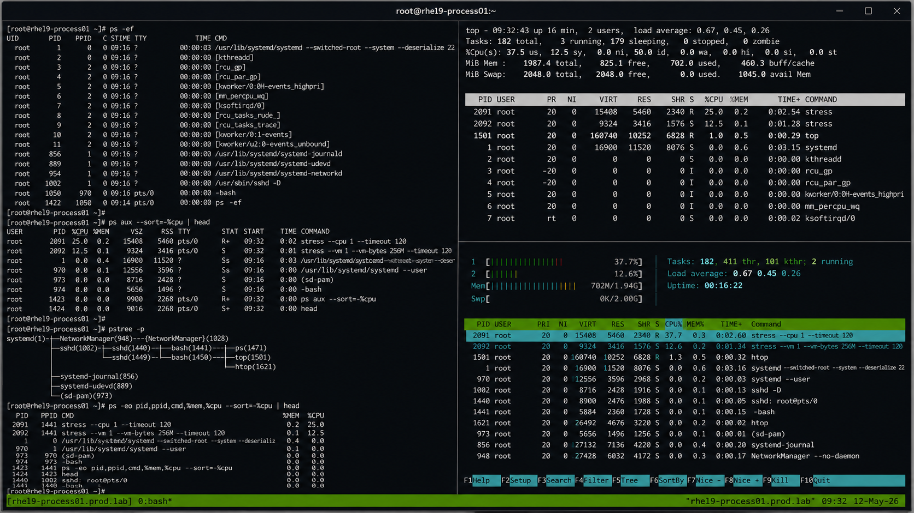

# ps top htop

## Overview

This lab demonstrates enterprise Linux process monitoring workflows using `ps`, `top`, and `htop` on RHEL 9.6 systems. The exercise covers viewing active processes, monitoring CPU and memory usage, filtering process information, and performing real-time system monitoring operations.

The workflow follows realistic enterprise Linux operational practices using standard process monitoring utilities with SELinux enforcing and firewalld enabled.

---

# Objective

In this lab you will:

- View active processes using ps
- Monitor processes using top
- Perform interactive monitoring using htop
- Filter process information
- Monitor CPU and memory utilization
- Troubleshoot resource-intensive workloads
- Validate operational monitoring workflows
- Verify process visibility and control

---

# Environment Information

| Hostname | Role | IP Address |
|---|---|---|
| rhel9-process01.prod.lab | Process Management Server | 192.168.40.10 |

Environment details:

- Operating System: RHEL 9.6
- Shell Environment: Bash
- SELinux: Enforcing
- firewalld: Enabled
- Monitoring Utilities: ps, top, htop

---

# Initial Validation

Verify hostname configuration.

```bash
hostnamectl
```

Expected output:

```text
 Static hostname: rhel9-process01.prod.lab
```

---

Verify current shell.

```bash
echo $SHELL
```

Expected output:

```text
/bin/bash
```

---

Verify SELinux mode.

```bash
getenforce
```

Expected output:

```text
Enforcing
```

---

Verify current logged-in user.

```bash
whoami
```

Expected output:

```text
root
```

---

# Process Monitoring with ps

Display active processes.

```bash
ps -ef
```

Expected output:

```text
UID PID PPID
```

---

Display processes in user-oriented format.

```bash
ps aux
```

Expected output:

```text
USER PID %CPU %MEM
```

---

View process tree hierarchy.

```bash
pstree -p
```

Expected output:

```text
systemd
```

---

Filter specific processes.

```bash
ps -ef | grep sshd
```

Expected output:

```text
sshd
```

---

View process resource usage.

```bash
ps -eo pid,ppid,cmd,%mem,%cpu --sort=-%cpu | head
```

Expected output:

```text
%CPU
```

---

# Real-Time Monitoring with top

Launch top utility.

```bash
top
```

Expected output:

```text
Tasks:
```

---

View CPU utilization summary.

Expected output:

```text
%Cpu(s):
```

---

View memory utilization.

Expected output:

```text
MiB Mem :
```

---

Sort processes by memory usage.

Inside top:

```text
Shift + M
```

---

Sort processes by CPU usage.

Inside top:

```text
Shift + P
```

---

Terminate top using:

```text
q
```

---

# Install and Launch htop

Install htop utility.

```bash
sudo dnf install htop -y
```

---

Launch htop.

```bash
htop
```

Expected output:

```text
CPU
MEM
Tasks
```

---

Navigate process list using arrow keys.

Expected behavior:

```text
Interactive process navigation
```

---

Search for processes.

Inside htop:

```text
F3
```

---

Terminate htop using:

```text
F10
```

---

# Create Monitoring Workload

Launch CPU-intensive process.

```bash
stress --cpu 1 --timeout 120 &
```

Expected output:

```text
stress:
```

---

Launch memory-intensive process.

```bash
stress --vm 1 --vm-bytes 256M --timeout 120 &
```

---

Verify running stress processes.

```bash
ps -ef | grep stress
```

Expected output:

```text
stress
```

---

# Monitor Workloads

Monitor CPU-intensive process.

```bash
top -b -n 1 | grep stress
```

Expected output:

```text
stress
```

---

Monitor memory usage.

```bash
free -h
```

Expected output:

```text
Mem:
```

---

Monitor load averages.

```bash
uptime
```

Expected output:

```text
load average
```

---

Monitor process statistics.

```bash
vmstat 2 5
```

Expected output:

```text
procs
```

---

# Monitoring Validation

Monitor active processes.

```bash
ps aux --sort=-%cpu | head
```

---

Monitor memory-heavy processes.

```bash
ps aux --sort=-%mem | head
```

---

Monitor system uptime.

```bash
uptime
```

---

Monitor process hierarchy.

```bash
pstree -p
```

---

# Logging Validation

Review recent system logs.

```bash
journalctl -n 20
```

Expected output:

```text
systemd
```

---

Review process-related logs.

```bash
journalctl | grep stress
```

---

Review shell activity logs.

```bash
journalctl | grep bash
```

---

# Troubleshooting

Verify running processes.

```bash
ps -ef
```

---

Verify resource usage.

```bash
top -b -n 1 | head
```

---

If htop is unavailable:

```bash
sudo dnf install epel-release -y
```

---

Verify stress process execution.

```bash
pgrep stress
```

Expected output:

```text
PID
```

---

Terminate stress processes.

```bash
pkill stress
```

---

Verify SELinux mode.

```bash
getenforce
```

Expected output:

```text
Enforcing
```

---

# Persistence Validation

Launch a test process.

```bash
sleep 500 &
```

---

Verify process visibility.

```bash
ps -ef | grep sleep
```

Expected output:

```text
sleep
```

---

Terminate the process.

```bash
pkill sleep
```

---

Verify cleanup.

```bash
ps -ef | grep sleep
```

Expected output:

```text
No output
```

---

# Security Validation

Verify process ownership.

```bash
ps -eo user,pid,cmd | head
```

Expected output:

```text
root
```

---

Verify active root processes.

```bash
ps -u root
```

---

Verify SELinux remains enforcing.

```bash
getenforce
```

Expected output:

```text
Enforcing
```

---

# Operational Recommendations

- Monitor CPU and memory usage regularly
- Investigate abnormal process behavior immediately
- Use htop for interactive troubleshooting
- Monitor system load averages continuously
- Validate process ownership before termination
- Monitor resource-intensive workloads carefully
- Document operational troubleshooting activities
- Use process filtering to simplify monitoring

---

# Operational Notes

Linux process monitoring utilities provide visibility into system workload behavior and resource utilization.

Utility roles:

- ps for static process snapshots
- top for real-time monitoring
- htop for interactive process management

During troubleshooting validate:

- CPU utilization
- Memory usage
- Process ownership
- Resource-intensive workloads
- System load averages
- Process hierarchy
- SELinux operational state

---

# Expected Outcome

After completing this lab:

- Process monitoring workflows function correctly
- ps displays process information successfully
- top provides real-time monitoring
- htop enables interactive process management
- Resource-intensive workloads are visible
- Monitoring and troubleshooting workflows operate correctly
- SELinux remains enforcing

---


