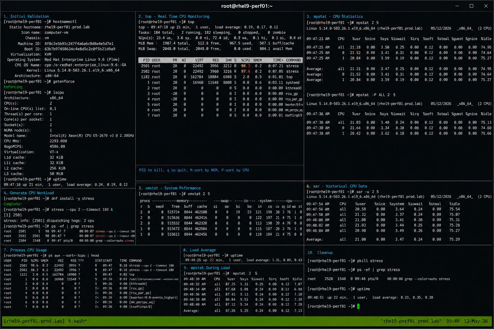

# CPU Usage Lab

## Overview

This lab demonstrates enterprise Linux CPU monitoring and performance analysis workflows on RHEL 9.6 systems. The exercise covers monitoring CPU utilization, identifying CPU-intensive workloads, analyzing load averages, and validating operational troubleshooting procedures using standard Linux performance tools.

The workflow follows realistic enterprise Linux operational practices using SELinux enforcing and firewalld enabled.

---

# Objective

In this lab you will:

- Monitor CPU utilization
- Analyze load averages
- Identify CPU-intensive processes
- Monitor real-time CPU activity
- Generate controlled CPU workloads
- Validate performance monitoring workflows
- Troubleshoot high CPU utilization
- Verify operational performance analysis

---

# Environment Information

| Hostname | Role | IP Address |
|---|---|---|
| rhel9-perf01.prod.lab | Performance Monitoring Server | 192.168.50.10 |

Environment details:

- Operating System: RHEL 9.6
- SELinux: Enforcing
- firewalld: Enabled
- Monitoring Utilities: top, mpstat, vmstat, sar
- Performance Package: sysstat

---

# Initial Validation

Verify hostname configuration.

```bash
hostnamectl
```

Expected output:

```text
 Static hostname: rhel9-perf01.prod.lab
```

---

Verify SELinux mode.

```bash
getenforce
```

Expected output:

```text
Enforcing
```

---

Verify current CPU information.

```bash
lscpu
```

Expected output:

```text
CPU(s):
```

---

Verify current system load.

```bash
uptime
```

Expected output:

```text
load average
```

---

# Install Performance Monitoring Tools

Install sysstat package.

```bash
sudo dnf install sysstat -y
```

Expected output:

```text
Complete!
```

---

Enable sysstat collection service.

```bash
sudo systemctl enable --now sysstat
```

---

Verify sysstat service state.

```bash
systemctl status sysstat
```

Expected output:

```text
active (running)
```

---

# Monitor CPU Usage with top

Launch top utility.

```bash
top
```

Expected output:

```text
%Cpu(s):
```

---

View CPU utilization summary.

Expected output:

```text
us sy id wa
```

---

Sort by CPU utilization.

Inside top:

```text
Shift + P
```

---

Exit top.

```text
q
```

---

# Monitor CPU Statistics with mpstat

View overall CPU statistics.

```bash
mpstat
```

Expected output:

```text
all
```

---

View per-CPU statistics.

```bash
mpstat -P ALL 2 5
```

Expected output:

```text
CPU
```

---

Monitor CPU interrupts.

```bash
mpstat -I SUM 2 5
```

Expected output:

```text
intr/s
```

---

# Generate CPU Workload

Install stress utility.

```bash
sudo dnf install stress -y
```

---

Generate CPU-intensive workload.

```bash
stress --cpu 2 --timeout 180 &
```

Expected output:

```text
stress:
```

---

Verify stress processes.

```bash
ps -ef | grep stress
```

Expected output:

```text
stress
```

---

# Monitor CPU During Load

Monitor CPU usage in real time.

```bash
top
```

Expected output:

```text
stress
```

---

Monitor CPU statistics.

```bash
mpstat 2 5
```

Expected output:

```text
%idle
```

---

Monitor virtual memory and CPU.

```bash
vmstat 2 5
```

Expected output:

```text
r b swpd
```

---

View load averages.

```bash
uptime
```

Expected output:

```text
load average
```

---

# Monitor Historical CPU Data

Collect CPU statistics using sar.

```bash
sar -u 2 5
```

Expected output:

```text
%user
```

---

View historical CPU activity.

```bash
sar -u
```

Expected output:

```text
Average
```

---

View CPU utilization report.

```bash
sar -P ALL 2 5
```

Expected output:

```text
CPU
```

---

# Monitoring Validation

Monitor active CPU-intensive processes.

```bash
ps aux --sort=-%cpu | head
```

Expected output:

```text
stress
```

---

Monitor system load.

```bash
uptime
```

---

Monitor CPU scheduling activity.

```bash
vmstat 1 5
```

---

Monitor process hierarchy.

```bash
pstree -p
```

---

# Logging Validation

Review sysstat service logs.

```bash
journalctl -u sysstat
```

Expected output:

```text
Started
```

---

Review recent system logs.

```bash
journalctl -n 20
```

Expected output:

```text
systemd
```

---

Review stress process logs.

```bash
journalctl | grep stress
```

---

# Troubleshooting

Verify sysstat service state.

```bash
systemctl status sysstat
```

---

Verify stress processes.

```bash
pgrep stress
```

Expected output:

```text
PID
```

---

Terminate stress workload.

```bash
pkill stress
```

---

Verify CPU returns to normal.

```bash
top
```

Expected output:

```text
idle
```

---

Verify SELinux mode.

```bash
getenforce
```

Expected output:

```text
Enforcing
```

---

# Persistence Validation

Verify sysstat service enablement.

```bash
systemctl is-enabled sysstat
```

Expected output:

```text
enabled
```

---

Reboot the server.

```bash
sudo reboot
```

---

Verify sysstat service after reboot.

```bash
systemctl status sysstat
```

Expected output:

```text
active (running)
```

---

Verify historical sar data remains available.

```bash
sar -u
```

Expected output:

```text
Average
```

---

# Security Validation

Verify SELinux remains enforcing.

```bash
getenforce
```

Expected output:

```text
Enforcing
```

---

Verify sysstat package integrity.

```bash
rpm -V sysstat
```

---

Verify running monitoring services.

```bash
systemctl list-units | grep sysstat
```

Expected output:

```text
sysstat
```

---

# Operational Recommendations

- Monitor CPU utilization regularly
- Investigate abnormal load averages immediately
- Use historical sar reports for trend analysis
- Monitor CPU-intensive workloads carefully
- Validate sysstat collection services regularly
- Monitor idle CPU percentages continuously
- Document operational performance incidents
- Use controlled workloads during testing

---

# Operational Notes

Linux CPU monitoring utilities provide visibility into workload behavior, scheduling activity, and system performance trends.

Utility roles:

- top for real-time monitoring
- mpstat for CPU statistics
- vmstat for scheduler and memory activity
- sar for historical performance reporting

During troubleshooting validate:

- CPU utilization
- Load averages
- Scheduling activity
- CPU-intensive workloads
- Historical performance trends
- Process resource consumption
- SELinux operational state

---

# Expected Outcome

After completing this lab:

- CPU monitoring workflows function correctly
- Real-time CPU analysis operates successfully
- Historical sar reporting functions properly
- CPU-intensive workloads are visible
- Troubleshooting workflows operate correctly
- sysstat persistence works after reboot
- SELinux remains enforcing

---


