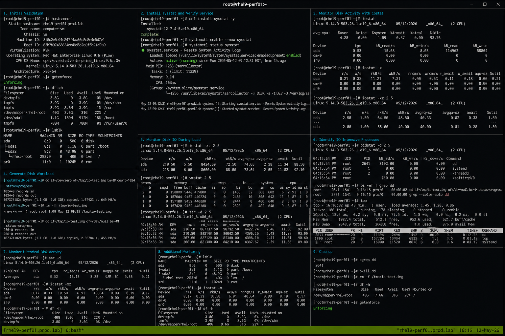

# Disk IO Lab

## Overview

This lab demonstrates enterprise Linux disk I/O monitoring and performance analysis workflows on RHEL 9.6 systems. The exercise covers monitoring disk throughput, analyzing I/O wait conditions, identifying disk-intensive workloads, and validating operational storage troubleshooting procedures.

The workflow follows realistic enterprise Linux operational practices using SELinux enforcing and firewalld enabled.

---

# Objective

In this lab you will:

- Monitor disk I/O activity
- Analyze disk throughput
- Identify I/O-intensive processes
- Monitor I/O wait conditions
- Generate controlled disk workloads
- Validate storage performance workflows
- Troubleshoot disk bottlenecks
- Verify operational storage monitoring

---

# Environment Information

| Hostname | Role | IP Address |
|---|---|---|
| rhel9-perf01.prod.lab | Performance Monitoring Server | 192.168.50.10 |

Environment details:

- Operating System: RHEL 9.6
- SELinux: Enforcing
- firewalld: Enabled
- Monitoring Utilities: iostat, vmstat, sar
- Performance Package: sysstat

---

# Initial Validation

Verify hostname configuration.

```bash
hostnamectl
```

Expected output:

```text
 Static hostname: rhel9-perf01.prod.lab
```

---

Verify SELinux mode.

```bash
getenforce
```

Expected output:

```text
Enforcing
```

---

Verify mounted filesystems.

```bash
df -h
```

Expected output:

```text
Filesystem
```

---

Verify block devices.

```bash
lsblk
```

Expected output:

```text
sda
```

---

# Install Performance Monitoring Tools

Install sysstat package.

```bash
sudo dnf install sysstat -y
```

Expected output:

```text
Complete!
```

---

Enable sysstat service.

```bash
sudo systemctl enable --now sysstat
```

---

Verify service state.

```bash
systemctl status sysstat
```

Expected output:

```text
active (running)
```

---

# Monitor Disk Activity with iostat

Display disk I/O statistics.

```bash
iostat
```

Expected output:

```text
Device
```

---

Display extended disk statistics.

```bash
iostat -x
```

Expected output:

```text
await
```

---

Monitor disk activity continuously.

```bash
iostat -xz 2 5
```

Expected output:

```text
%util
```

---

# Generate Disk Workload

Create a large test file.

```bash
dd if=/dev/zero of=/tmp/io-test.img bs=1M count=1024 status=progress
```

Expected output:

```text
1073741824 bytes copied
```

---

Verify file creation.

```bash
ls -lh /tmp/io-test.img
```

Expected output:

```text
1.0G
```

---

Generate additional disk activity.

```bash
dd if=/tmp/io-test.img of=/dev/null bs=4M status=progress
```

Expected output:

```text
copied
```

---

# Monitor Disk IO During Load

Monitor disk statistics.

```bash
iostat -xz 2 5
```

Expected output:

```text
r/s w/s
```

---

Monitor virtual memory and I/O wait.

```bash
vmstat 2 5
```

Expected output:

```text
wa
```

---

Monitor block devices.

```bash
sar -d 2 5
```

Expected output:

```text
DEV
```

---

Monitor disk utilization.

```bash
dstat -d
```

Expected output:

```text
read writ
```

---

# Identify IO Intensive Processes

View process I/O statistics.

```bash
pidstat -d 2 5
```

Expected output:

```text
kB_rd/s
```

---

Monitor running dd processes.

```bash
ps -ef | grep dd
```

Expected output:

```text
dd if=
```

---

Monitor process resource usage.

```bash
top
```

Expected output:

```text
wa
```

---

# Monitor Historical Disk Activity

View historical disk reports.

```bash
sar -d
```

Expected output:

```text
Average
```

---

View device utilization reports.

```bash
iostat -xz
```

Expected output:

```text
%util
```

---

View filesystem usage.

```bash
df -h
```

Expected output:

```text
Use%
```

---

# Monitoring Validation

Monitor active disk processes.

```bash
ps aux | grep dd
```

---

Monitor block devices.

```bash
lsblk
```

---

Monitor disk utilization.

```bash
iostat -x
```

---

Monitor filesystem capacity.

```bash
df -h
```

---

# Logging Validation

Review sysstat service logs.

```bash
journalctl -u sysstat
```

Expected output:

```text
Started
```

---

Review recent system logs.

```bash
journalctl -n 20
```

Expected output:

```text
systemd
```

---

Review storage-related logs.

```bash
journalctl | grep sd
```

---

# Troubleshooting

Verify sysstat service state.

```bash
systemctl status sysstat
```

---

Verify active disk processes.

```bash
pgrep dd
```

Expected output:

```text
PID
```

---

Terminate active disk workload if required.

```bash
pkill dd
```

---

Remove test files.

```bash
rm -f /tmp/io-test.img
```

---

Verify available disk space.

```bash
df -h
```

Expected output:

```text
Avail
```

---

Verify SELinux mode.

```bash
getenforce
```

Expected output:

```text
Enforcing
```

---

# Persistence Validation

Verify sysstat service enablement.

```bash
systemctl is-enabled sysstat
```

Expected output:

```text
enabled
```

---

Reboot the server.

```bash
sudo reboot
```

---

Verify sysstat service after reboot.

```bash
systemctl status sysstat
```

Expected output:

```text
active (running)
```

---

Verify historical disk data availability.

```bash
sar -d
```

Expected output:

```text
Average
```

---

# Security Validation

Verify SELinux remains enforcing.

```bash
getenforce
```

Expected output:

```text
Enforcing
```

---

Verify monitoring package integrity.

```bash
rpm -V sysstat
```

---

Verify mounted filesystem permissions.

```bash
mount | grep xfs
```

Expected output:

```text
rw
```

---

# Operational Recommendations

- Monitor disk utilization regularly
- Investigate high I/O wait immediately
- Monitor storage latency trends
- Remove temporary workload files after testing
- Validate filesystem capacity continuously
- Use historical sar reports for analysis
- Monitor disk-intensive workloads carefully
- Document operational storage incidents

---

# Operational Notes

Linux disk I/O monitoring utilities provide visibility into storage performance, throughput, and latency behavior.

Utility roles:

- iostat for disk statistics
- vmstat for I/O wait monitoring
- pidstat for process I/O activity
- sar for historical reporting

During troubleshooting validate:

- Disk utilization
- I/O wait percentages
- Storage throughput
- Disk-intensive workloads
- Filesystem capacity
- Historical storage trends
- SELinux operational state

---

# Expected Outcome

After completing this lab:

- Disk I/O monitoring workflows function correctly
- Storage workload analysis operates successfully
- Historical disk reporting functions properly
- Disk-intensive workloads are visible
- Troubleshooting workflows operate correctly
- sysstat persistence works after reboot
- SELinux remains enforcing

---


