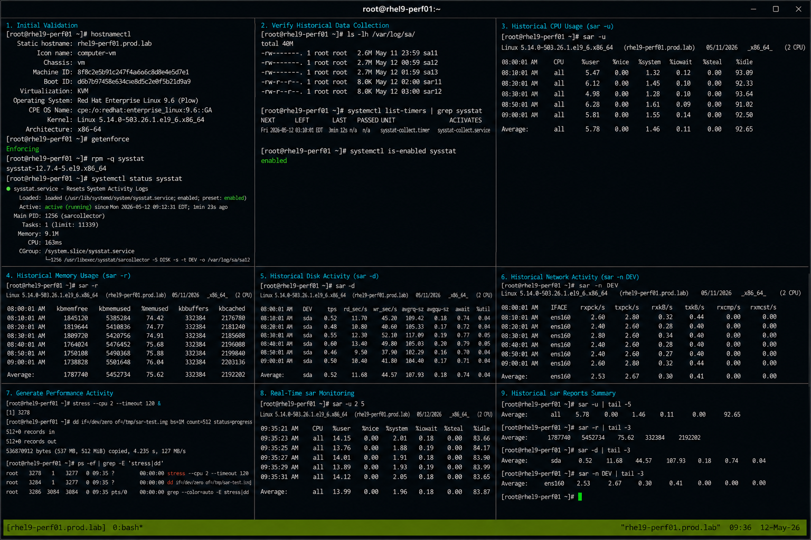

# Historical sar

## Overview

This lab demonstrates historical system performance analysis using `sar` on RHEL 9.6 systems. The exercise covers collecting historical CPU, memory, disk, and network statistics, reviewing archived performance reports, and validating enterprise Linux performance troubleshooting workflows.

The workflow follows realistic enterprise Linux operational practices using SELinux enforcing and firewalld enabled.

---

# Objective

In this lab you will:

- Configure historical performance collection
- Analyze CPU performance history
- Review memory utilization trends
- Monitor disk activity history
- Analyze network statistics
- Validate sysstat data collection
- Troubleshoot performance issues
- Verify operational reporting workflows

---

# Environment Information

| Hostname | Role | IP Address |
|---|---|---|
| rhel9-perf01.prod.lab | Performance Monitoring Server | 192.168.50.10 |

Environment details:

- Operating System: RHEL 9.6
- SELinux: Enforcing
- firewalld: Enabled
- Monitoring Utility: sar
- Performance Package: sysstat

---

# Initial Validation

Verify hostname configuration.

```bash
hostnamectl
```

Expected output:

```text
 Static hostname: rhel9-perf01.prod.lab
```

---

Verify SELinux mode.

```bash
getenforce
```

Expected output:

```text
Enforcing
```

---

Verify sysstat package installation.

```bash
rpm -q sysstat
```

Expected output:

```text
sysstat
```

---

Verify sysstat service state.

```bash
systemctl status sysstat
```

Expected output:

```text
active (running)
```

---

# Verify Historical Data Collection

Verify sar data directory.

```bash
ls -lh /var/log/sa/
```

Expected output:

```text
sa12
sar12
```

---

Verify collection timers.

```bash
systemctl list-timers | grep sysstat
```

Expected output:

```text
sysstat-collect.timer
```

---

Verify sysstat enablement.

```bash
systemctl is-enabled sysstat
```

Expected output:

```text
enabled
```

---

# Analyze Historical CPU Usage

View CPU usage report.

```bash
sar -u
```

Expected output:

```text
Average
```

---

View CPU usage for specific intervals.

```bash
sar -u 2 5
```

Expected output:

```text
%user
```

---

View per-CPU historical activity.

```bash
sar -P ALL
```

Expected output:

```text
CPU
```

---

View load averages.

```bash
sar -q
```

Expected output:

```text
runq-sz
```

---

# Analyze Historical Memory Usage

View memory utilization.

```bash
sar -r
```

Expected output:

```text
kbmemfree
```

---

View swap activity.

```bash
sar -S
```

Expected output:

```text
kbswpused
```

---

View paging statistics.

```bash
sar -B
```

Expected output:

```text
pgpgin/s
```

---

# Analyze Historical Disk Activity

View disk activity report.

```bash
sar -d
```

Expected output:

```text
DEV
```

---

View block device statistics.

```bash
sar -b
```

Expected output:

```text
tps
```

---

View filesystem utilization.

```bash
df -h
```

Expected output:

```text
Use%
```

---

# Analyze Historical Network Activity

View network interface statistics.

```bash
sar -n DEV
```

Expected output:

```text
IFACE
```

---

View TCP statistics.

```bash
sar -n TCP
```

Expected output:

```text
active/s
```

---

View socket statistics.

```bash
sar -n SOCK
```

Expected output:

```text
totsck
```

---

# Generate Performance Activity

Generate CPU workload.

```bash
stress --cpu 2 --timeout 120 &
```

---

Generate disk workload.

```bash
dd if=/dev/zero of=/tmp/sar-test.img bs=1M count=512 status=progress
```

Expected output:

```text
copied
```

---

Verify workload processes.

```bash
ps -ef | grep -E 'stress|dd'
```

Expected output:

```text
stress
dd
```

---

# Monitor Real-Time sar Activity

Monitor CPU activity live.

```bash
sar -u 2 5
```

---

Monitor memory activity live.

```bash
sar -r 2 5
```

---

Monitor disk activity live.

```bash
sar -d 2 5
```

---

Monitor network activity live.

```bash
sar -n DEV 2 5
```

---

# Monitoring Validation

Monitor sysstat timers.

```bash
systemctl list-timers | grep sysstat
```

---

Monitor sar process activity.

```bash
ps -ef | grep sadc
```

Expected output:

```text
sadc
```

---

Monitor performance logs.

```bash
ls -lh /var/log/sa/
```

---

Monitor active workloads.

```bash
top
```

Expected output:

```text
stress
```

---

# Logging Validation

Review sysstat logs.

```bash
journalctl -u sysstat
```

Expected output:

```text
Started
```

---

Review recent system logs.

```bash
journalctl -n 20
```

Expected output:

```text
systemd
```

---

Review sar collection activity.

```bash
journalctl | grep sadc
```

---

# Troubleshooting

Verify sysstat service state.

```bash
systemctl status sysstat
```

---

Verify timer activity.

```bash
systemctl list-timers
```

---

Restart sysstat service.

```bash
sudo systemctl restart sysstat
```

---

Verify sar data generation.

```bash
ls -lh /var/log/sa/
```

---

Remove temporary workload file.

```bash
rm -f /tmp/sar-test.img
```

---

Terminate stress workload.

```bash
pkill stress
```

---

Verify SELinux mode.

```bash
getenforce
```

Expected output:

```text
Enforcing
```

---

# Persistence Validation

Reboot the server.

```bash
sudo reboot
```

---

Verify sysstat service after reboot.

```bash
systemctl status sysstat
```

Expected output:

```text
active (running)
```

---

Verify historical sar data remains available.

```bash
sar -u
```

Expected output:

```text
Average
```

---

Verify timer persistence.

```bash
systemctl list-timers | grep sysstat
```

Expected output:

```text
sysstat-collect.timer
```

---

# Security Validation

Verify SELinux remains enforcing.

```bash
getenforce
```

Expected output:

```text
Enforcing
```

---

Verify sysstat package integrity.

```bash
rpm -V sysstat
```

---

Verify sar log permissions.

```bash
ls -ld /var/log/sa
```

Expected output:

```text
drwxr-xr-x
```

---

# Operational Recommendations

- Retain historical sar reports for trend analysis
- Monitor abnormal CPU and memory spikes
- Review disk and network activity regularly
- Validate sysstat timers continuously
- Monitor storage utilization trends
- Archive performance reports when required
- Document operational performance incidents
- Use historical reports during troubleshooting

---

# Operational Notes

The sar utility provides historical performance visibility across CPU, memory, disk, and network resources on enterprise Linux systems.

Utility roles:

- CPU utilization analysis
- Memory trend analysis
- Disk performance reporting
- Network activity monitoring
- Historical troubleshooting workflows

During troubleshooting validate:

- sysstat service state
- Historical data availability
- Timer activity
- Resource utilization trends
- Performance spikes
- Workload behavior
- SELinux operational state

---

# Expected Outcome

After completing this lab:

- Historical sar reporting functions correctly
- CPU, memory, disk, and network reports are available
- sysstat collection services operate successfully
- Historical troubleshooting workflows function properly
- Performance trend analysis operates correctly
- sysstat persistence works after reboot
- SELinux remains enforcing

---


