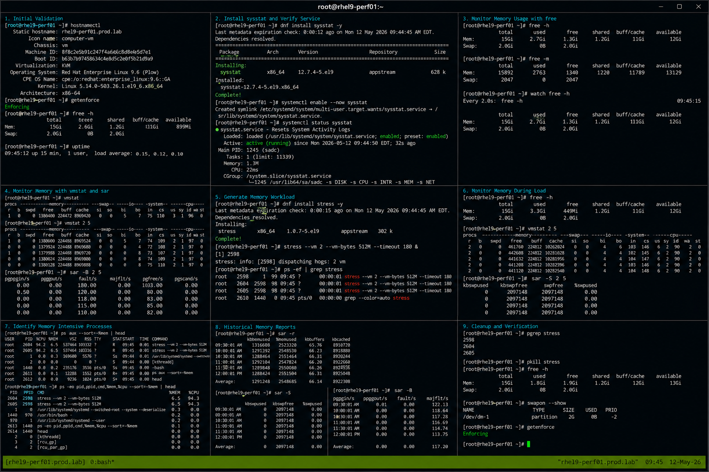

# Memory Usage Lab

## Overview

This lab demonstrates enterprise Linux memory monitoring and performance analysis workflows on RHEL 9.6 systems. The exercise covers monitoring memory utilization, identifying memory-intensive workloads, analyzing swap activity, and validating operational troubleshooting procedures using standard Linux performance tools.

The workflow follows realistic enterprise Linux operational practices using SELinux enforcing and firewalld enabled.

---

# Objective

In this lab you will:

- Monitor memory utilization
- Analyze swap usage
- Identify memory-intensive processes
- Monitor real-time memory activity
- Generate controlled memory workloads
- Validate memory monitoring workflows
- Troubleshoot memory bottlenecks
- Verify operational performance analysis

---

# Environment Information

| Hostname | Role | IP Address |
|---|---|---|
| rhel9-perf01.prod.lab | Performance Monitoring Server | 192.168.50.10 |

Environment details:

- Operating System: RHEL 9.6
- SELinux: Enforcing
- firewalld: Enabled
- Monitoring Utilities: free, vmstat, sar, top
- Performance Package: sysstat

---

# Initial Validation

Verify hostname configuration.

```bash
hostnamectl
```

Expected output:

```text
 Static hostname: rhel9-perf01.prod.lab
```

---

Verify SELinux mode.

```bash
getenforce
```

Expected output:

```text
Enforcing
```

---

Verify current memory information.

```bash
free -h
```

Expected output:

```text
Mem:
Swap:
```

---

Verify system uptime.

```bash
uptime
```

Expected output:

```text
load average
```

---

# Install Performance Monitoring Tools

Install sysstat package.

```bash
sudo dnf install sysstat -y
```

Expected output:

```text
Complete!
```

---

Enable sysstat collection service.

```bash
sudo systemctl enable --now sysstat
```

---

Verify service state.

```bash
systemctl status sysstat
```

Expected output:

```text
active (running)
```

---

# Monitor Memory Usage with free

Display memory utilization.

```bash
free -h
```

Expected output:

```text
used free shared buff/cache
```

---

Display memory in megabytes.

```bash
free -m
```

Expected output:

```text
Mem:
```

---

Display memory repeatedly.

```bash
watch free -h
```

Expected output:

```text
buff/cache
```

---

Stop watch utility.

```text
Ctrl + C
```

---

# Monitor Memory with vmstat

View virtual memory statistics.

```bash
vmstat
```

Expected output:

```text
procs memory swap io system cpu
```

---

Monitor memory continuously.

```bash
vmstat 2 5
```

Expected output:

```text
si so
```

---

Monitor paging activity.

```bash
sar -B 2 5
```

Expected output:

```text
pgpgin/s
```

---

# Generate Memory Workload

Install stress utility.

```bash
sudo dnf install stress -y
```

---

Generate memory-intensive workload.

```bash
stress --vm 2 --vm-bytes 512M --timeout 180 &
```

Expected output:

```text
stress:
```

---

Verify stress processes.

```bash
ps -ef | grep stress
```

Expected output:

```text
stress
```

---

# Monitor Memory During Load

Monitor memory utilization.

```bash
free -h
```

Expected output:

```text
used
```

---

Monitor memory activity.

```bash
vmstat 2 5
```

Expected output:

```text
free
```

---

Monitor swap utilization.

```bash
sar -S 2 5
```

Expected output:

```text
kbswpused
```

---

Monitor memory-intensive processes.

```bash
top
```

Expected output:

```text
%MEM
```

---

# Identify Memory Intensive Processes

View processes sorted by memory usage.

```bash
ps aux --sort=-%mem | head
```

Expected output:

```text
stress
```

---

View detailed process resource usage.

```bash
ps -eo pid,ppid,cmd,%mem,%cpu --sort=-%mem | head
```

Expected output:

```text
%MEM
```

---

Monitor process hierarchy.

```bash
pstree -p
```

Expected output:

```text
stress
```

---

# Monitor Historical Memory Data

View historical memory reports.

```bash
sar -r
```

Expected output:

```text
kbmemfree
```

---

View swap reports.

```bash
sar -S
```

Expected output:

```text
kbswpused
```

---

View paging statistics.

```bash
sar -B
```

Expected output:

```text
pgfault/s
```

---

# Monitoring Validation

Monitor active workloads.

```bash
top
```

Expected output:

```text
stress
```

---

Monitor memory usage.

```bash
free -h
```

---

Monitor swap activity.

```bash
vmstat 2 5
```

---

Monitor process resource usage.

```bash
ps aux --sort=-%mem | head
```

---

# Logging Validation

Review sysstat service logs.

```bash
journalctl -u sysstat
```

Expected output:

```text
Started
```

---

Review recent system logs.

```bash
journalctl -n 20
```

Expected output:

```text
systemd
```

---

Review stress process logs.

```bash
journalctl | grep stress
```

---

# Troubleshooting

Verify sysstat service state.

```bash
systemctl status sysstat
```

---

Verify stress processes.

```bash
pgrep stress
```

Expected output:

```text
PID
```

---

Terminate stress workload.

```bash
pkill stress
```

---

Verify memory returns to normal.

```bash
free -h
```

Expected output:

```text
free
```

---

Verify swap usage.

```bash
swapon --show
```

Expected output:

```text
NAME
```

---

Verify SELinux mode.

```bash
getenforce
```

Expected output:

```text
Enforcing
```

---

# Persistence Validation

Verify sysstat service enablement.

```bash
systemctl is-enabled sysstat
```

Expected output:

```text
enabled
```

---

Reboot the server.

```bash
sudo reboot
```

---

Verify sysstat service after reboot.

```bash
systemctl status sysstat
```

Expected output:

```text
active (running)
```

---

Verify historical memory data remains available.

```bash
sar -r
```

Expected output:

```text
Average
```

---

# Security Validation

Verify SELinux remains enforcing.

```bash
getenforce
```

Expected output:

```text
Enforcing
```

---

Verify sysstat package integrity.

```bash
rpm -V sysstat
```

---

Verify active swap devices.

```bash
swapon --show
```

Expected output:

```text
/dev/dm-1
```

---

# Operational Recommendations

- Monitor memory utilization regularly
- Investigate swap activity immediately
- Monitor memory-intensive workloads carefully
- Use historical sar reports for trend analysis
- Validate sysstat collection services regularly
- Monitor paging activity continuously
- Document operational memory incidents
- Use controlled workloads during testing

---

# Operational Notes

Linux memory monitoring utilities provide visibility into RAM utilization, paging activity, and swap behavior across enterprise workloads.

Utility roles:

- free for memory visibility
- vmstat for paging activity
- sar for historical reporting
- top for real-time monitoring

During troubleshooting validate:

- Memory utilization
- Swap activity
- Paging statistics
- Memory-intensive workloads
- Historical trends
- Process resource consumption
- SELinux operational state

---

# Expected Outcome

After completing this lab:

- Memory monitoring workflows function correctly
- Real-time memory analysis operates successfully
- Historical sar reporting functions properly
- Memory-intensive workloads are visible
- Troubleshooting workflows operate correctly
- sysstat persistence works after reboot
- SELinux remains enforcing

---


