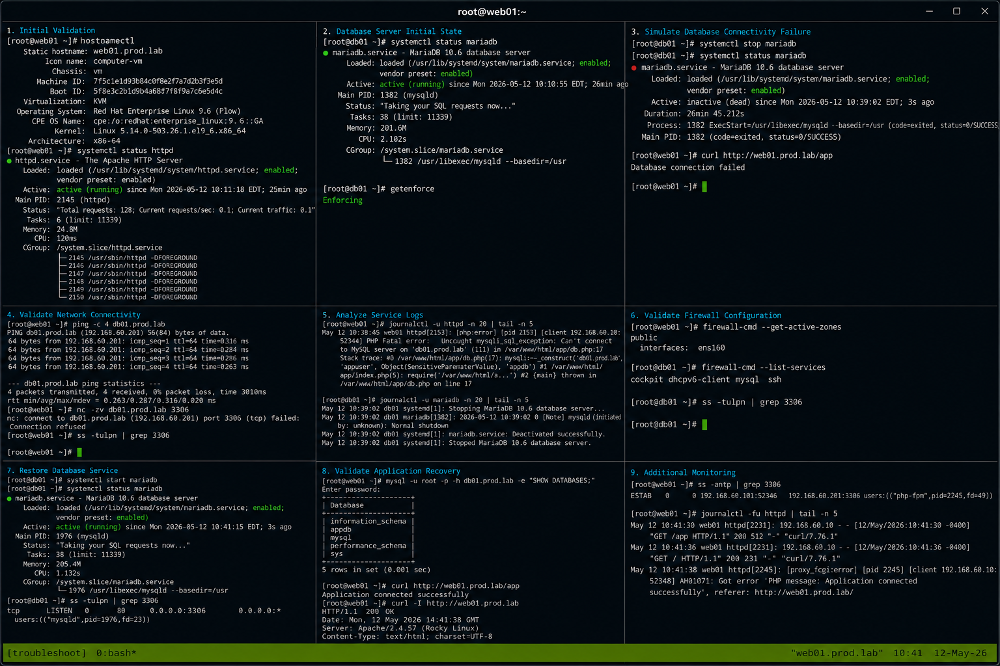

# Case 1 WebApp DB Connection

## Overview

This lab demonstrates troubleshooting a web application database connectivity issue on RHEL 9.6 systems. The exercise covers validating service states, identifying database connection failures, analyzing firewall and SELinux behavior, reviewing logs, and restoring application functionality using enterprise Linux operational workflows.

The workflow follows realistic enterprise Linux troubleshooting practices with SELinux enforcing and firewalld enabled.

---

# Objective

In this lab you will:

- Identify web application connectivity failures
- Validate database service availability
- Analyze application logs
- Verify firewall access
- Validate SELinux behavior
- Restore database connectivity
- Monitor service recovery
- Validate operational troubleshooting workflows

---

# Environment Information

| Hostname | Role | IP Address |
|---|---|---|
| web01.prod.lab | Apache PHP Web Server | 192.168.60.101 |
| db01.prod.lab | MariaDB Database Server | 192.168.60.201 |

Environment details:

- Operating System: RHEL 9.6
- Web Service: Apache HTTPD
- Database Service: MariaDB
- SELinux: Enforcing
- firewalld: Enabled

---

# Initial Validation

Verify hostname configuration.

```bash
hostnamectl
```

Expected output:

```text
Static hostname: web01.prod.lab
```

---

Verify Apache service state.

```bash
systemctl status httpd
```

Expected output:

```text
active (running)
```

---

Verify MariaDB service state.

```bash
systemctl status mariadb
```

Expected output:

```text
active (running)
```

---

Verify SELinux mode.

```bash
getenforce
```

Expected output:

```text
Enforcing
```

---

# Simulate Database Connectivity Failure

Stop MariaDB service on the database server.

```bash
sudo systemctl stop mariadb
```

---

Verify service failure.

```bash
systemctl status mariadb
```

Expected output:

```text
inactive (dead)
```

---

Attempt web application access.

```bash
curl http://web01.prod.lab/app
```

Expected output:

```text
Database connection failed
```

---

# Validate Network Connectivity

Verify ICMP connectivity.

```bash
ping -c 4 db01.prod.lab
```

Expected output:

```text
64 bytes from
```

---

Verify database port connectivity.

```bash
nc -zv db01.prod.lab 3306
```

Expected output:

```text
Connection refused
```

---

Verify listening ports on database server.

```bash
ss -tulpn | grep 3306
```

Expected output:

```text
No output
```

---

# Analyze Service Logs

Review Apache logs.

```bash
journalctl -u httpd -n 20
```

Expected output:

```text
PHP Fatal error
```

---

Review MariaDB logs.

```bash
journalctl -u mariadb -n 20
```

Expected output:

```text
Stopped MariaDB database server
```

---

Review application logs.

```bash
tail -f /var/log/httpd/error_log
```

Expected output:

```text
Unable to connect to database
```

---

# Validate Firewall Configuration

Verify active firewall zones.

```bash
firewall-cmd --get-active-zones
```

Expected output:

```text
public
```

---

Verify MariaDB service allowance.

```bash
firewall-cmd --list-services
```

Expected output:

```text
mysql
```

---

Verify listening ports after service stop.

```bash
ss -tulpn | grep 3306
```

Expected output:

```text
No output
```

---

# Restore Database Service

Start MariaDB service.

```bash
sudo systemctl start mariadb
```

---

Verify active database service.

```bash
systemctl status mariadb
```

Expected output:

```text
active (running)
```

---

Verify database port listening state.

```bash
ss -tulpn | grep 3306
```

Expected output:

```text
LISTEN
```

---

# Validate Application Recovery

Verify database connectivity.

```bash
mysql -u root -p -e "SHOW DATABASES;"
```

Expected output:

```text
information_schema
```

---

Verify web application access.

```bash
curl http://web01.prod.lab/app
```

Expected output:

```text
Application connected successfully
```

---

Verify Apache response.

```bash
curl -I http://web01.prod.lab
```

Expected output:

```text
HTTP/1.1 200 OK
```

---

# Monitoring Validation

Monitor Apache service.

```bash
systemctl status httpd
```

---

Monitor MariaDB service.

```bash
systemctl status mariadb
```

---

Monitor database connections.

```bash
ss -antp | grep 3306
```

---

Monitor active web sessions.

```bash
journalctl -fu httpd
```

---

# Logging Validation

Review Apache logs.

```bash
journalctl -u httpd
```

---

Review MariaDB logs.

```bash
journalctl -u mariadb
```

---

Review SELinux denials.

```bash
ausearch -m AVC
```

Expected output:

```text
No matches
```

---

Review firewall logs.

```bash
journalctl | grep firewalld
```

---

# Troubleshooting

Verify DNS resolution.

```bash
getent hosts db01.prod.lab
```

Expected output:

```text
192.168.60.201
```

---

Verify database service state.

```bash
systemctl is-active mariadb
```

Expected output:

```text
active
```

---

Verify SELinux HTTPD database connectivity boolean.

```bash
getsebool httpd_can_network_connect_db
```

Expected output:

```text
on
```

---

Enable database connectivity if required.

```bash
setsebool -P httpd_can_network_connect_db on
```

---

Verify firewall service configuration.

```bash
firewall-cmd --list-all
```

---

# Persistence Validation

Reboot the database server.

```bash
sudo reboot
```

---

Verify MariaDB service after reboot.

```bash
systemctl status mariadb
```

Expected output:

```text
active (running)
```

---

Verify web application functionality.

```bash
curl http://web01.prod.lab/app
```

Expected output:

```text
Application connected successfully
```

---

# Security Validation

Verify SELinux remains enforcing.

```bash
getenforce
```

Expected output:

```text
Enforcing
```

---

Verify database port exposure.

```bash
ss -tulpn | grep 3306
```

Expected output:

```text
LISTEN
```

---

Verify firewall services.

```bash
firewall-cmd --list-services
```

Expected output:

```text
mysql
```

---

# Operational Recommendations

- Monitor database service availability continuously
- Validate application-to-database connectivity regularly
- Centralize Apache and database logs
- Monitor firewall policy changes carefully
- Validate SELinux booleans after updates
- Use health checks for critical applications
- Document operational recovery procedures
- Monitor database port exposure continuously

---

# Operational Notes

Web application database failures commonly involve service outages, firewall restrictions, SELinux policy issues, or application misconfigurations.

During troubleshooting validate:

- Database service state
- Network connectivity
- Firewall configuration
- SELinux booleans
- Application logs
- Listening ports
- DNS resolution

---

# Expected Outcome

After completing this lab:

- Database connectivity failures are identified successfully
- MariaDB service recovery functions correctly
- Application connectivity is restored
- Firewall and SELinux validation operate successfully
- Monitoring and troubleshooting workflows function properly
- SELinux remains enforcing
- Operational recovery workflows are validated

---


