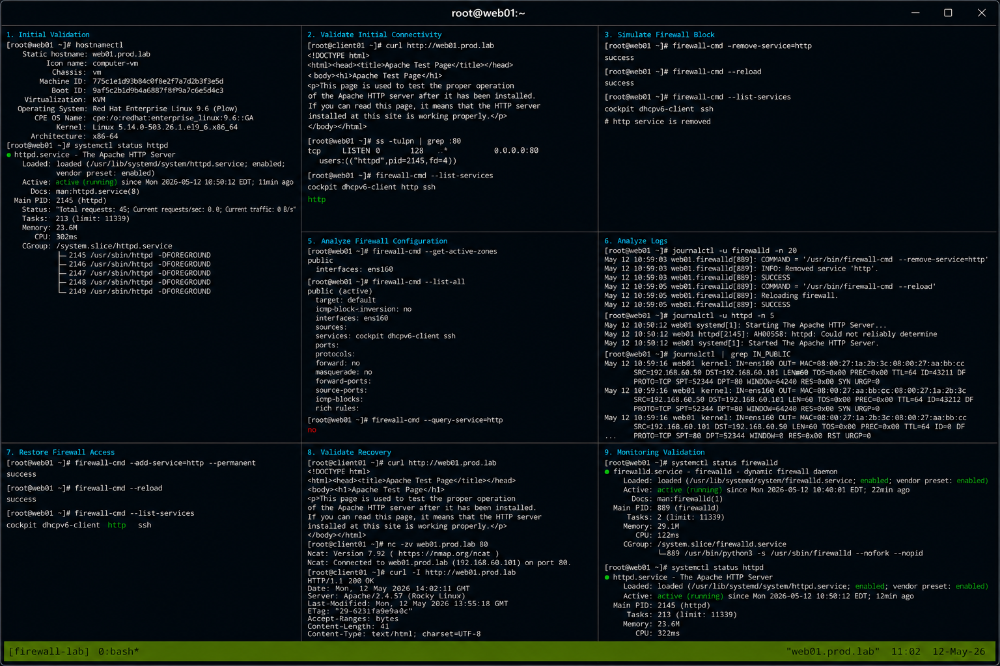

# Case 2 Firewall Block

## Overview

This lab demonstrates troubleshooting firewall-related connectivity failures on RHEL 9.6 systems. The exercise covers identifying blocked services, validating firewall policies, analyzing network connectivity, reviewing logs, and restoring service access using enterprise Linux operational workflows.

The workflow follows realistic enterprise Linux troubleshooting practices with SELinux enforcing and firewalld enabled.

---

# Objective

In this lab you will:

- Identify firewall-related connectivity failures
- Validate service listening ports
- Analyze firewalld configuration
- Test network connectivity
- Review firewall logs
- Restore blocked network access
- Monitor service recovery
- Validate operational troubleshooting workflows

---

# Environment Information

| Hostname | Role | IP Address |
|---|---|---|
| web01.prod.lab | Apache Web Server | 192.168.60.101 |
| client01.prod.lab | Client Validation Node | 192.168.60.50 |

Environment details:

- Operating System: RHEL 9.6
- Web Service: Apache HTTPD
- SELinux: Enforcing
- firewalld: Enabled

---

# Initial Validation

Verify hostname configuration.

```bash
hostnamectl
```

Expected output:

```text
Static hostname: web01.prod.lab
```

---

Verify Apache service state.

```bash
systemctl status httpd
```

Expected output:

```text
active (running)
```

---

Verify SELinux mode.

```bash
getenforce
```

Expected output:

```text
Enforcing
```

---

Verify firewall service state.

```bash
systemctl status firewalld
```

Expected output:

```text
active (running)
```

---

# Validate Initial Connectivity

Verify HTTP access from client node.

```bash
curl http://web01.prod.lab
```

Expected output:

```text
Apache Test Page
```

---

Verify listening ports.

```bash
ss -tulpn | grep :80
```

Expected output:

```text
LISTEN
```

---

Verify active firewall services.

```bash
firewall-cmd --list-services
```

Expected output:

```text
http
```

---

# Simulate Firewall Block

Remove HTTP service from firewall configuration.

```bash
sudo firewall-cmd --remove-service=http
```

Expected output:

```text
success
```

---

Reload firewall configuration.

```bash
sudo firewall-cmd --reload
```

Expected output:

```text
success
```

---

Verify HTTP service removal.

```bash
firewall-cmd --list-services
```

Expected output:

```text
No http service
```

---

# Validate Connectivity Failure

Attempt HTTP access from client node.

```bash
curl http://web01.prod.lab
```

Expected output:

```text
Connection timed out
```

---

Verify TCP connectivity.

```bash
nc -zv web01.prod.lab 80
```

Expected output:

```text
timed out
```

---

Verify service is still listening locally.

```bash
ss -tulpn | grep :80
```

Expected output:

```text
LISTEN
```

---

# Analyze Firewall Configuration

Verify active firewall zones.

```bash
firewall-cmd --get-active-zones
```

Expected output:

```text
public
```

---

Display active firewall configuration.

```bash
firewall-cmd --list-all
```

Expected output:

```text
services:
```

---

Verify blocked HTTP access.

```bash
firewall-cmd --query-service=http
```

Expected output:

```text
no
```

---

# Analyze Logs

Review firewalld logs.

```bash
journalctl -u firewalld -n 20
```

Expected output:

```text
Removed service
```

---

Review Apache logs.

```bash
journalctl -u httpd -n 20
```

Expected output:

```text
Started The Apache HTTP Server
```

---

Review system logs.

```bash
journalctl | grep firewalld
```

Expected output:

```text
IN_PUBLIC_DROP
```

---

# Restore Firewall Access

Add HTTP service back to firewall.

```bash
sudo firewall-cmd --add-service=http --permanent
```

Expected output:

```text
success
```

---

Reload firewall configuration.

```bash
sudo firewall-cmd --reload
```

Expected output:

```text
success
```

---

Verify HTTP service availability.

```bash
firewall-cmd --list-services
```

Expected output:

```text
http
```

---

# Validate Recovery

Verify HTTP connectivity from client node.

```bash
curl http://web01.prod.lab
```

Expected output:

```text
Apache Test Page
```

---

Verify TCP connectivity.

```bash
nc -zv web01.prod.lab 80
```

Expected output:

```text
succeeded
```

---

Verify Apache response headers.

```bash
curl -I http://web01.prod.lab
```

Expected output:

```text
HTTP/1.1 200 OK
```

---

# Monitoring Validation

Monitor firewall service.

```bash
systemctl status firewalld
```

---

Monitor Apache service.

```bash
systemctl status httpd
```

---

Monitor active listening ports.

```bash
ss -tulpn
```

---

Monitor HTTP access logs.

```bash
journalctl -fu httpd
```

---

# Logging Validation

Review firewall logs.

```bash
journalctl -u firewalld
```

---

Review Apache logs.

```bash
journalctl -u httpd
```

---

Review SELinux denials.

```bash
ausearch -m AVC
```

Expected output:

```text
No matches
```

---

Review network-related logs.

```bash
journalctl | grep IN_PUBLIC
```

---

# Troubleshooting

Verify Apache listening state.

```bash
ss -tulpn | grep :80
```

Expected output:

```text
LISTEN
```

---

Verify firewall zone assignment.

```bash
firewall-cmd --get-default-zone
```

Expected output:

```text
public
```

---

Verify firewall rule existence.

```bash
firewall-cmd --query-service=http
```

Expected output:

```text
yes
```

---

Verify SELinux HTTPD access.

```bash
getsebool -a | grep httpd
```

Expected output:

```text
httpd_can_network_connect
```

---

# Persistence Validation

Reboot the server.

```bash
sudo reboot
```

---

Verify firewalld service after reboot.

```bash
systemctl status firewalld
```

Expected output:

```text
active (running)
```

---

Verify HTTP service persistence.

```bash
firewall-cmd --list-services
```

Expected output:

```text
http
```

---

Verify web application accessibility.

```bash
curl http://web01.prod.lab
```

Expected output:

```text
Apache Test Page
```

---

# Security Validation

Verify SELinux remains enforcing.

```bash
getenforce
```

Expected output:

```text
Enforcing
```

---

Verify open firewall services.

```bash
firewall-cmd --list-services
```

Expected output:

```text
http
```

---

Verify exposed listening ports.

```bash
ss -tulpn
```

Expected output:

```text
:80
```

---

# Operational Recommendations

- Monitor firewall policy changes continuously
- Validate network access after rule modifications
- Centralize firewall and application logs
- Restrict unnecessary exposed services
- Validate SELinux state during troubleshooting
- Document operational firewall changes
- Use permanent rules carefully
- Monitor listening ports regularly

---

# Operational Notes

Firewall-related service failures commonly involve missing service rules, incorrect zones, blocked ports, or network policy misconfigurations.

During troubleshooting validate:

- Service listening state
- Firewall rules
- Active zones
- SELinux enforcement
- Network connectivity
- Application logs
- Port accessibility

---

# Expected Outcome

After completing this lab:

- Firewall-related connectivity failures are identified successfully
- HTTP access recovery functions correctly
- Firewall rule validation operates properly
- Monitoring and troubleshooting workflows function successfully
- Apache accessibility is restored
- SELinux remains enforcing
- Operational firewall recovery workflows are validated

---


