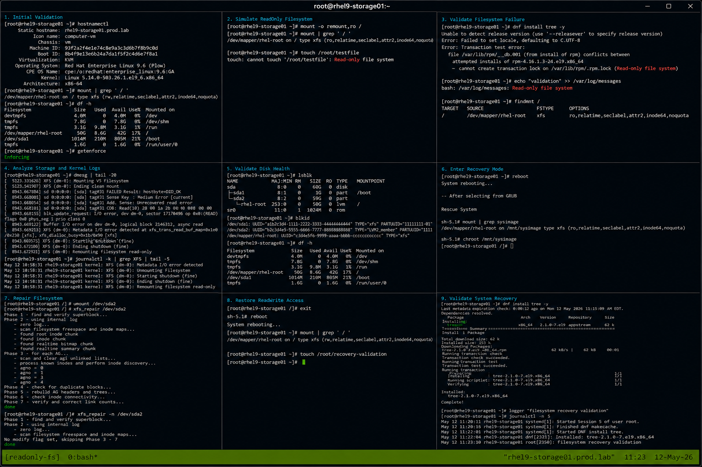

# Case 3 ReadOnly Filesystem

## Overview

This lab demonstrates troubleshooting a read-only filesystem issue on RHEL 9.6 systems. The exercise covers identifying filesystem errors, validating mount states, analyzing kernel and storage logs, performing filesystem recovery, and restoring normal read-write operations using enterprise Linux operational workflows.

The workflow follows realistic enterprise Linux troubleshooting practices with SELinux enforcing and firewalld enabled.

---

# Objective

In this lab you will:

- Identify read-only filesystem conditions
- Analyze mount and storage states
- Review filesystem-related logs
- Validate disk health
- Perform filesystem recovery
- Restore read-write access
- Monitor post-recovery stability
- Validate operational troubleshooting workflows

---

# Environment Information

| Hostname | Role | IP Address |
|---|---|---|
| rhel9-storage01.prod.lab | Storage Recovery Server | 192.168.60.150 |

Environment details:

- Operating System: RHEL 9.6
- Filesystem: XFS
- SELinux: Enforcing
- firewalld: Enabled
- Storage Device: /dev/sda2

---

# Initial Validation

Verify hostname configuration.

```bash
hostnamectl
```

Expected output:

```text
Static hostname: rhel9-storage01.prod.lab
```

---

Verify mounted filesystems.

```bash
mount | grep ' / '
```

Expected output:

```text
rw
```

---

Verify filesystem usage.

```bash
df -h
```

Expected output:

```text
Filesystem
```

---

Verify SELinux mode.

```bash
getenforce
```

Expected output:

```text
Enforcing
```

---

# Simulate ReadOnly Filesystem

Remount the root filesystem as read-only.

```bash
sudo mount -o remount,ro /
```

---

Verify mount state.

```bash
mount | grep ' / '
```

Expected output:

```text
ro
```

---

Attempt file creation.

```bash
touch /root/testfile
```

Expected output:

```text
Read-only file system
```

---

# Validate Filesystem Failure

Attempt package installation.

```bash
sudo dnf install tree -y
```

Expected output:

```text
Read-only file system
```

---

Attempt log file write.

```bash
echo "validation" >> /var/log/messages
```

Expected output:

```text
Read-only file system
```

---

Verify filesystem mount options.

```bash
findmnt /
```

Expected output:

```text
ro
```

---

# Analyze Storage and Kernel Logs

Review kernel messages.

```bash
dmesg | tail -20
```

Expected output:

```text
Remounting filesystem read-only
```

---

Review filesystem logs.

```bash
journalctl -k | grep XFS
```

Expected output:

```text
XFS
```

---

Review storage-related logs.

```bash
journalctl | grep sda
```

Expected output:

```text
I/O error
```

---

# Validate Disk Health

Verify block devices.

```bash
lsblk
```

Expected output:

```text
sda
```

---

Verify filesystem type.

```bash
blkid
```

Expected output:

```text
TYPE="xfs"
```

---

Check filesystem usage.

```bash
df -h
```

Expected output:

```text
Use%
```

---

# Enter Recovery Mode

Reboot into rescue mode.

```bash
sudo reboot
```

---

At GRUB menu select:

```text
Troubleshooting
```

---

Select:

```text
Rescue a Red Hat Enterprise Linux system
```

---

Verify mounted system path.

```bash
mount | grep sysimage
```

Expected output:

```text
/sysroot
```

---

# Repair Filesystem

Enter recovery shell.

```bash
chroot /mnt/sysimage
```

---

Unmount affected filesystem if required.

```bash
umount /dev/sda2
```

---

Repair XFS filesystem.

```bash
xfs_repair /dev/sda2
```

Expected output:

```text
done
```

---

Verify filesystem repair completion.

```bash
xfs_repair -n /dev/sda2
```

Expected output:

```text
No modify flag set
```

---

# Restore ReadWrite Access

Reboot the system normally.

```bash
reboot
```

---

Verify root filesystem mount state.

```bash
mount | grep ' / '
```

Expected output:

```text
rw
```

---

Verify file creation works.

```bash
touch /root/recovery-validation
```

Expected output:

```text
No output
```

---

# Validate System Recovery

Verify package installation.

```bash
sudo dnf install tree -y
```

Expected output:

```text
Complete!
```

---

Verify logging functionality.

```bash
logger "filesystem recovery validation"
```

---

Verify journal logs.

```bash
journalctl -n 10
```

Expected output:

```text
filesystem recovery validation
```

---

# Monitoring Validation

Monitor mounted filesystems.

```bash
mount
```

---

Monitor disk utilization.

```bash
df -h
```

---

Monitor kernel logs.

```bash
journalctl -k -f
```

---

Monitor storage devices.

```bash
lsblk
```

---

# Logging Validation

Review filesystem logs.

```bash
journalctl -k | grep XFS
```

---

Review storage errors.

```bash
journalctl | grep I/O
```

---

Review recent system logs.

```bash
journalctl -n 20
```

Expected output:

```text
systemd
```

---

# Troubleshooting

Verify root mount state.

```bash
findmnt /
```

Expected output:

```text
rw
```

---

Verify disk usage.

```bash
df -h
```

---

Verify XFS filesystem integrity.

```bash
xfs_repair -n /dev/sda2
```

---

Verify active storage devices.

```bash
lsblk
```

---

Verify SELinux mode.

```bash
getenforce
```

Expected output:

```text
Enforcing
```

---

# Persistence Validation

Reboot the server.

```bash
sudo reboot
```

---

Verify filesystem remains read-write.

```bash
mount | grep ' / '
```

Expected output:

```text
rw
```

---

Verify write operations persist.

```bash
touch /tmp/persistence-check
```

Expected output:

```text
No output
```

---

# Security Validation

Verify SELinux remains enforcing.

```bash
getenforce
```

Expected output:

```text
Enforcing
```

---

Verify filesystem mount options.

```bash
mount | grep ' / '
```

Expected output:

```text
rw
```

---

Verify storage device visibility.

```bash
lsblk
```

Expected output:

```text
sda
```

---

# Operational Recommendations

- Monitor filesystem errors continuously
- Investigate unexpected read-only remounts immediately
- Maintain filesystem backups regularly
- Monitor storage device health
- Review kernel storage errors frequently
- Test filesystem recovery procedures
- Document operational recovery workflows
- Validate filesystem integrity after incidents

---

# Operational Notes

Read-only filesystem events commonly occur due to filesystem corruption, storage failures, or kernel-detected I/O issues.

During troubleshooting validate:

- Filesystem mount state
- Kernel logs
- Storage health
- Filesystem integrity
- Disk utilization
- Recovery environment access
- SELinux operational state

---

# Expected Outcome

After completing this lab:

- Read-only filesystem conditions are identified successfully
- Filesystem recovery operations function correctly
- Read-write access is restored
- Logging and package operations recover successfully
- Monitoring and troubleshooting workflows operate properly
- SELinux remains enforcing
- Operational filesystem recovery workflows are validated

---


