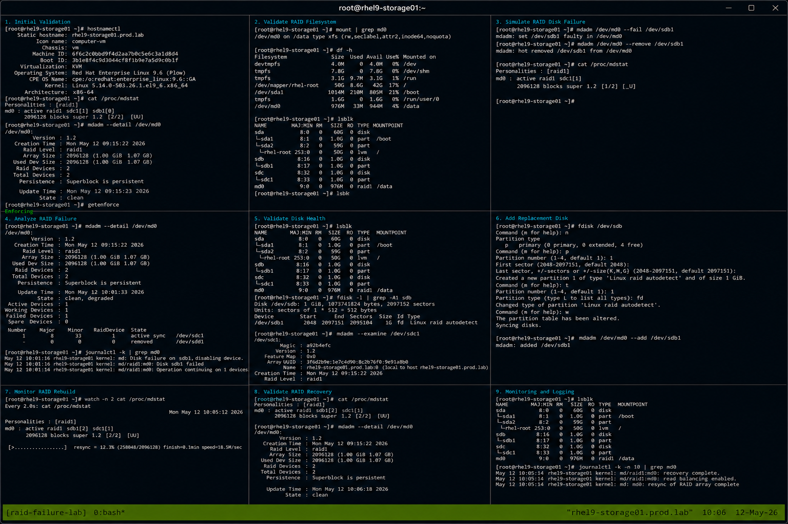

# Case 4 RAID Disk Failure

## Overview

This lab demonstrates troubleshooting and recovering from a RAID disk failure on RHEL 9.6 systems. The exercise covers identifying degraded RAID arrays, validating disk health, replacing failed disks, rebuilding RAID devices, and restoring operational storage functionality using enterprise Linux operational workflows.

The workflow follows realistic enterprise Linux troubleshooting practices with SELinux enforcing and firewalld enabled.

---

# Objective

In this lab you will:

- Identify degraded RAID arrays
- Analyze RAID device states
- Validate failed disk conditions
- Replace failed RAID disks
- Rebuild RAID arrays
- Monitor RAID synchronization
- Validate filesystem recovery
- Verify operational troubleshooting workflows

---

# Environment Information

| Hostname | Role | IP Address |
|---|---|---|
| rhel9-storage01.prod.lab | RAID Recovery Server | 192.168.60.150 |

Environment details:

- Operating System: RHEL 9.6
- RAID Utility: mdadm
- RAID Level: RAID1
- SELinux: Enforcing
- firewalld: Enabled

RAID layout:

| RAID Device | Member Disks |
|---|---|
| /dev/md0 | /dev/sdb1 /dev/sdc1 |

---

# Initial Validation

Verify hostname configuration.

```bash
hostnamectl
```

Expected output:

```text
Static hostname: rhel9-storage01.prod.lab
```

---

Verify RAID device status.

```bash
cat /proc/mdstat
```

Expected output:

```text
md0 : active raid1
```

---

Verify RAID details.

```bash
sudo mdadm --detail /dev/md0
```

Expected output:

```text
State : clean
```

---

Verify SELinux mode.

```bash
getenforce
```

Expected output:

```text
Enforcing
```

---

# Validate RAID Filesystem

Verify mounted RAID filesystem.

```bash
mount | grep md0
```

Expected output:

```text
/dev/md0
```

---

Verify filesystem usage.

```bash
df -h
```

Expected output:

```text
/dev/md0
```

---

Verify block devices.

```bash
lsblk
```

Expected output:

```text
md0
```

---

# Simulate RAID Disk Failure

Mark a RAID member disk as failed.

```bash
sudo mdadm /dev/md0 --fail /dev/sdb1
```

Expected output:

```text
set /dev/sdb1 faulty
```

---

Remove the failed disk.

```bash
sudo mdadm /dev/md0 --remove /dev/sdb1
```

Expected output:

```text
removed /dev/sdb1
```

---

Verify degraded RAID state.

```bash
cat /proc/mdstat
```

Expected output:

```text
[U_]
```

---

# Analyze RAID Failure

Display RAID details.

```bash
sudo mdadm --detail /dev/md0
```

Expected output:

```text
State : clean, degraded
```

---

Review kernel RAID logs.

```bash
journalctl -k | grep md0
```

Expected output:

```text
Disk failure on
```

---

Review storage-related logs.

```bash
journalctl | grep sdb
```

Expected output:

```text
faulty
```

---

# Validate Disk Health

Verify block device state.

```bash
lsblk
```

Expected output:

```text
sdb
sdc
```

---

Verify partition layout.

```bash
fdisk -l
```

Expected output:

```text
Linux raid autodetect
```

---

Verify RAID metadata.

```bash
mdadm --examine /dev/sdc1
```

Expected output:

```text
Raid Level : raid1
```

---

# Add Replacement Disk

Create replacement RAID partition.

```bash
sudo fdisk /dev/sdb
```

Expected steps:

```text
n
p
t
fd
w
```

---

Verify RAID partition creation.

```bash
lsblk
```

Expected output:

```text
sdb1
```

---

Add replacement disk to RAID array.

```bash
sudo mdadm /dev/md0 --add /dev/sdb1
```

Expected output:

```text
added /dev/sdb1
```

---

# Monitor RAID Rebuild

Monitor RAID synchronization.

```bash
watch cat /proc/mdstat
```

Expected output:

```text
recovery
```

---

Verify RAID rebuild progress.

```bash
mdadm --detail /dev/md0
```

Expected output:

```text
Rebuild Status
```

---

Wait for synchronization completion.

Expected output:

```text
[UU]
```

---

# Validate RAID Recovery

Verify RAID health.

```bash
cat /proc/mdstat
```

Expected output:

```text
[UU]
```

---

Verify RAID details.

```bash
mdadm --detail /dev/md0
```

Expected output:

```text
State : clean
```

---

Verify mounted filesystem.

```bash
mount | grep md0
```

Expected output:

```text
/dev/md0
```

---

# Monitoring Validation

Monitor RAID synchronization state.

```bash
watch cat /proc/mdstat
```

---

Monitor block devices.

```bash
lsblk
```

---

Monitor RAID logs.

```bash
journalctl -k -f
```

---

Monitor filesystem usage.

```bash
df -h
```

---

# Logging Validation

Review RAID logs.

```bash
journalctl | grep md0
```

---

Review storage device logs.

```bash
journalctl | grep sdb
```

---

Review recent kernel logs.

```bash
journalctl -k -n 20
```

Expected output:

```text
mdadm
```

---

# Troubleshooting

Verify RAID status.

```bash
cat /proc/mdstat
```

---

Verify RAID member devices.

```bash
mdadm --detail /dev/md0
```

---

Verify block devices.

```bash
lsblk
```

---

If rebuild stalls verify disk health.

```bash
smartctl -H /dev/sdb
```

Expected output:

```text
PASSED
```

---

Verify SELinux mode.

```bash
getenforce
```

Expected output:

```text
Enforcing
```

---

# Persistence Validation

Reboot the server.

```bash
sudo reboot
```

---

Verify RAID assembly after reboot.

```bash
cat /proc/mdstat
```

Expected output:

```text
[UU]
```

---

Verify RAID filesystem mount.

```bash
mount | grep md0
```

Expected output:

```text
/dev/md0
```

---

Verify RAID configuration persistence.

```bash
cat /etc/mdadm.conf
```

Expected output:

```text
ARRAY /dev/md0
```

---

# Security Validation

Verify SELinux remains enforcing.

```bash
getenforce
```

Expected output:

```text
Enforcing
```

---

Verify RAID device permissions.

```bash
ls -l /dev/md0
```

Expected output:

```text
brw-rw----
```

---

Verify active RAID arrays.

```bash
cat /proc/mdstat
```

Expected output:

```text
md0
```

---

# Operational Recommendations

- Monitor RAID health continuously
- Replace failed disks immediately
- Maintain RAID configuration backups
- Monitor storage synchronization events
- Validate RAID rebuild completion
- Test RAID recovery procedures regularly
- Document operational recovery workflows
- Monitor disk SMART health regularly

---

# Operational Notes

RAID failures commonly involve degraded arrays, failed storage devices, synchronization failures, or hardware-related storage issues.

During troubleshooting validate:

- RAID device state
- Member disk health
- Synchronization progress
- Filesystem accessibility
- Storage logs
- RAID metadata
- SELinux operational state

---

# Expected Outcome

After completing this lab:

- RAID degradation is identified successfully
- Failed disk replacement functions correctly
- RAID rebuild operations complete successfully
- Filesystem accessibility is restored
- Monitoring and troubleshooting workflows operate properly
- SELinux remains enforcing
- Operational RAID recovery workflows are validated

---


