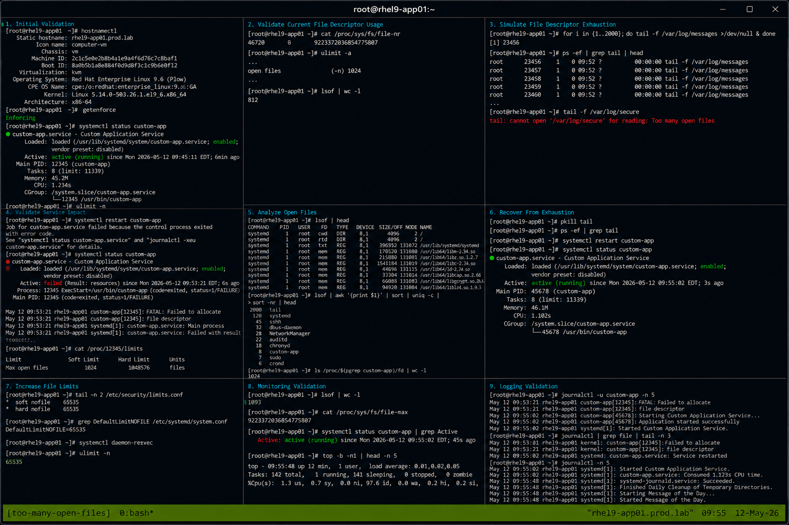

# Case 5 Too Many Open Files

## Overview

This lab demonstrates troubleshooting a "Too many open files" issue on RHEL 9.6 systems. The exercise covers identifying file descriptor exhaustion, analyzing process limits, validating service failures, monitoring open files, and restoring operational stability using enterprise Linux troubleshooting workflows.

The workflow follows realistic enterprise Linux operational practices with SELinux enforcing and firewalld enabled.

---

# Objective

In this lab you will:

- Identify file descriptor exhaustion
- Analyze open file usage
- Validate process and system limits
- Monitor active file descriptors
- Troubleshoot service failures
- Increase operational limits
- Validate recovery workflows
- Verify operational troubleshooting procedures

---

# Environment Information

| Hostname | Role | IP Address |
|---|---|---|
| rhel9-app01.prod.lab | Application Server | 192.168.60.170 |

Environment details:

- Operating System: RHEL 9.6
- Application Service: custom-app
- SELinux: Enforcing
- firewalld: Enabled
- Monitoring Utilities: lsof, ulimit

---

# Initial Validation

Verify hostname configuration.

```bash
hostnamectl
```

Expected output:

```text
Static hostname: rhel9-app01.prod.lab
```

---

Verify SELinux mode.

```bash
getenforce
```

Expected output:

```text
Enforcing
```

---

Verify application service state.

```bash
systemctl status custom-app
```

Expected output:

```text
active (running)
```

---

Verify current open file limits.

```bash
ulimit -n
```

Expected output:

```text
1024
```

---

# Validate Current File Descriptor Usage

Display system-wide file descriptor usage.

```bash
cat /proc/sys/fs/file-nr
```

Expected output:

```text
allocated unused max
```

---

Display current user limits.

```bash
ulimit -a
```

Expected output:

```text
open files
```

---

Verify active open files.

```bash
lsof | wc -l
```

Expected output:

```text
file count
```

---

# Simulate File Descriptor Exhaustion

Create multiple open file handles.

```bash
for i in {1..2000}; do tail -f /var/log/messages >/dev/null & done
```

---

Verify active tail processes.

```bash
ps -ef | grep tail
```

Expected output:

```text
tail -f
```

---

Attempt to open additional files.

```bash
tail -f /var/log/secure
```

Expected output:

```text
Too many open files
```

---

# Validate Service Impact

Restart the application service.

```bash
sudo systemctl restart custom-app
```

Expected output:

```text
Failed to allocate file descriptor
```

---

Verify failed service state.

```bash
systemctl status custom-app
```

Expected output:

```text
failed
```

---

Verify process limits.

```bash
cat /proc/$(pgrep custom-app)/limits
```

Expected output:

```text
Max open files
```

---

# Analyze Open Files

View active open files.

```bash
lsof | head
```

Expected output:

```text
COMMAND PID USER FD
```

---

View processes consuming descriptors.

```bash
lsof | awk '{print $1}' | sort | uniq -c | sort -nr | head
```

Expected output:

```text
tail
```

---

View file descriptor count per process.

```bash
ls /proc/$(pgrep custom-app)/fd | wc -l
```

Expected output:

```text
descriptor count
```

---

# Recover From Exhaustion

Terminate test processes.

```bash
pkill tail
```

---

Verify process cleanup.

```bash
ps -ef | grep tail
```

Expected output:

```text
No output
```

---

Restart application service.

```bash
sudo systemctl restart custom-app
```

---

Verify active service state.

```bash
systemctl status custom-app
```

Expected output:

```text
active (running)
```

---

# Increase File Limits

Edit system limits configuration.

```bash
sudo vi /etc/security/limits.conf
```

Add:

```text
* soft nofile 65535
* hard nofile 65535
```

---

Update systemd limits.

```bash
sudo vi /etc/systemd/system.conf
```

Add:

```text
DefaultLimitNOFILE=65535
```

---

Reload systemd configuration.

```bash
sudo systemctl daemon-reexec
```

---

Verify updated limits.

```bash
ulimit -n
```

Expected output:

```text
65535
```

---

# Monitoring Validation

Monitor open file usage.

```bash
lsof | wc -l
```

---

Monitor file descriptor limits.

```bash
cat /proc/sys/fs/file-max
```

Expected output:

```text
system limit
```

---

Monitor service state.

```bash
systemctl status custom-app
```

---

Monitor active processes.

```bash
top
```

Expected output:

```text
Tasks
```

---

# Logging Validation

Review application logs.

```bash
journalctl -u custom-app
```

Expected output:

```text
Too many open files
```

---

Review system logs.

```bash
journalctl | grep file
```

Expected output:

```text
file descriptor
```

---

Review recent logs.

```bash
journalctl -n 20
```

Expected output:

```text
systemd
```

---

# Troubleshooting

Verify current limits.

```bash
ulimit -a
```

---

Verify system-wide limits.

```bash
cat /proc/sys/fs/file-max
```

---

Verify process-specific limits.

```bash
cat /proc/$(pgrep custom-app)/limits
```

---

Verify open file counts.

```bash
lsof | wc -l
```

---

Verify SELinux mode.

```bash
getenforce
```

Expected output:

```text
Enforcing
```

---

# Persistence Validation

Reboot the server.

```bash
sudo reboot
```

---

Verify updated limits after reboot.

```bash
ulimit -n
```

Expected output:

```text
65535
```

---

Verify application service state.

```bash
systemctl status custom-app
```

Expected output:

```text
active (running)
```

---

Verify systemd limits persistence.

```bash
systemctl show --property DefaultLimitNOFILE
```

Expected output:

```text
65535
```

---

# Security Validation

Verify SELinux remains enforcing.

```bash
getenforce
```

Expected output:

```text
Enforcing
```

---

Verify active open files.

```bash
lsof | head
```

---

Verify running application processes.

```bash
ps -ef | grep custom-app
```

Expected output:

```text
custom-app
```

---

# Operational Recommendations

- Monitor file descriptor usage continuously
- Increase limits carefully based on workload requirements
- Monitor application process behavior
- Investigate abnormal open file growth immediately
- Use lsof regularly during troubleshooting
- Validate systemd limit configurations
- Document operational recovery procedures
- Monitor service restart failures carefully

---

# Operational Notes

File descriptor exhaustion commonly affects web servers, application services, databases, and long-running workloads.

During troubleshooting validate:

- Process limits
- System-wide file limits
- Open file counts
- Application service state
- File descriptor consumption
- Systemd limits
- SELinux operational state

---

# Expected Outcome

After completing this lab:

- File descriptor exhaustion is identified successfully
- Open file monitoring workflows operate correctly
- Service recovery functions properly
- Limit configuration changes persist successfully
- Monitoring and troubleshooting workflows function correctly
- SELinux remains enforcing
- Operational recovery workflows are validated

---


