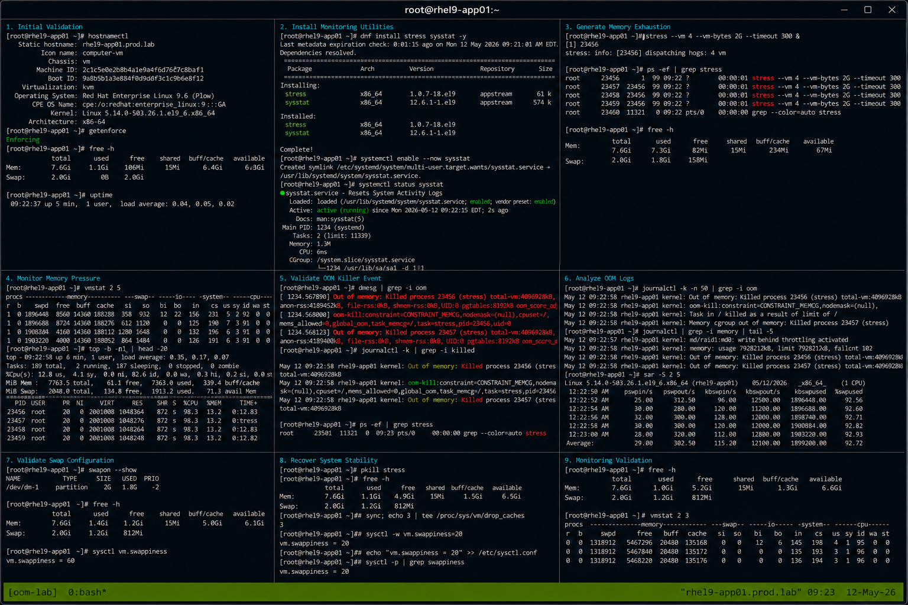

# Case 6 OOM Killer

## Overview

This lab demonstrates troubleshooting Out Of Memory (OOM) killer events on RHEL 9.6 systems. The exercise covers identifying memory exhaustion conditions, analyzing OOM killer logs, validating memory-intensive workloads, monitoring swap activity, and restoring operational stability using enterprise Linux troubleshooting workflows.

The workflow follows realistic enterprise Linux operational practices with SELinux enforcing and firewalld enabled.

---

# Objective

In this lab you will:

- Identify OOM killer events
- Analyze memory exhaustion conditions
- Monitor memory and swap usage
- Validate process resource consumption
- Review kernel OOM logs
- Recover from memory exhaustion
- Tune memory management behavior
- Verify operational troubleshooting workflows

---

# Environment Information

| Hostname | Role | IP Address |
|---|---|---|
| rhel9-app01.prod.lab | Application Server | 192.168.60.170 |

Environment details:

- Operating System: RHEL 9.6
- Monitoring Utilities: free, vmstat, top, sar
- SELinux: Enforcing
- firewalld: Enabled
- Memory Stress Utility: stress

---

# Initial Validation

Verify hostname configuration.

```bash
hostnamectl
```

Expected output:

```text
Static hostname: rhel9-app01.prod.lab
```

---

Verify SELinux mode.

```bash
getenforce
```

Expected output:

```text
Enforcing
```

---

Verify memory availability.

```bash
free -h
```

Expected output:

```text
Mem:
Swap:
```

---

Verify system uptime.

```bash
uptime
```

Expected output:

```text
load average
```

---

# Install Monitoring Utilities

Install required packages.

```bash
sudo dnf install stress sysstat -y
```

Expected output:

```text
Complete!
```

---

Enable sysstat service.

```bash
sudo systemctl enable --now sysstat
```

---

Verify service state.

```bash
systemctl status sysstat
```

Expected output:

```text
active (running)
```

---

# Generate Memory Exhaustion

Launch memory stress workload.

```bash
stress --vm 4 --vm-bytes 2G --timeout 300 &
```

Expected output:

```text
stress:
```

---

Verify stress processes.

```bash
ps -ef | grep stress
```

Expected output:

```text
stress
```

---

Monitor memory usage.

```bash
free -h
```

Expected output:

```text
low free memory
```

---

# Monitor Memory Pressure

Monitor memory and swap activity.

```bash
vmstat 2 5
```

Expected output:

```text
si so
```

---

Monitor system load.

```bash
top
```

Expected output:

```text
%MEM
```

---

Monitor memory statistics.

```bash
sar -r 2 5
```

Expected output:

```text
kbmemfree
```

---

# Validate OOM Killer Event

Review kernel OOM logs.

```bash
dmesg | grep -i oom
```

Expected output:

```text
Out of memory
```

---

Review killed process logs.

```bash
journalctl -k | grep -i killed
```

Expected output:

```text
Killed process
```

---

Verify terminated processes.

```bash
ps -ef | grep stress
```

Expected output:

```text
No output
```

---

# Analyze OOM Logs

Review recent kernel logs.

```bash
journalctl -k -n 50
```

Expected output:

```text
oom-killer
```

---

Review memory-related logs.

```bash
journalctl | grep memory
```

Expected output:

```text
memory pressure
```

---

Review swap activity.

```bash
sar -S 2 5
```

Expected output:

```text
kbswpused
```

---

# Validate Swap Configuration

Verify active swap devices.

```bash
swapon --show
```

Expected output:

```text
/dev/dm-1
```

---

Verify swap usage.

```bash
free -h
```

Expected output:

```text
Swap:
```

---

Verify virtual memory configuration.

```bash
sysctl vm.swappiness
```

Expected output:

```text
60
```

---

# Recover System Stability

Terminate remaining stress workloads.

```bash
pkill stress
```

---

Verify memory recovery.

```bash
free -h
```

Expected output:

```text
available memory increased
```

---

Clear filesystem cache.

```bash
sync; echo 3 | sudo tee /proc/sys/vm/drop_caches
```

Expected output:

```text
3
```

---

# Tune Memory Parameters

Adjust swappiness temporarily.

```bash
sudo sysctl -w vm.swappiness=20
```

Expected output:

```text
vm.swappiness = 20
```

---

Persist swappiness configuration.

```bash
echo "vm.swappiness = 20" | sudo tee -a /etc/sysctl.conf
```

---

Reload sysctl configuration.

```bash
sudo sysctl -p
```

Expected output:

```text
vm.swappiness = 20
```

---

# Monitoring Validation

Monitor memory usage.

```bash
free -h
```

---

Monitor CPU and memory activity.

```bash
top
```

---

Monitor paging statistics.

```bash
vmstat 2 5
```

---

Monitor historical memory data.

```bash
sar -r
```

Expected output:

```text
Average
```

---

# Logging Validation

Review OOM logs.

```bash
journalctl -k | grep -i oom
```

---

Review stress process logs.

```bash
journalctl | grep stress
```

---

Review recent system logs.

```bash
journalctl -n 20
```

Expected output:

```text
systemd
```

---

# Troubleshooting

Verify memory availability.

```bash
free -h
```

---

Verify swap devices.

```bash
swapon --show
```

---

Verify memory-intensive processes.

```bash
ps aux --sort=-%mem | head
```

---

Verify current swappiness.

```bash
sysctl vm.swappiness
```

---

Verify SELinux mode.

```bash
getenforce
```

Expected output:

```text
Enforcing
```

---

# Persistence Validation

Reboot the server.

```bash
sudo reboot
```

---

Verify swappiness persistence.

```bash
sysctl vm.swappiness
```

Expected output:

```text
20
```

---

Verify sysstat service state.

```bash
systemctl status sysstat
```

Expected output:

```text
active (running)
```

---

Verify memory stability.

```bash
free -h
```

Expected output:

```text
available memory
```

---

# Security Validation

Verify SELinux remains enforcing.

```bash
getenforce
```

Expected output:

```text
Enforcing
```

---

Verify active memory-intensive workloads.

```bash
ps aux --sort=-%mem | head
```

---

Verify active swap devices.

```bash
swapon --show
```

Expected output:

```text
/dev/dm-1
```

---

# Operational Recommendations

- Monitor memory utilization continuously
- Investigate unexpected OOM events immediately
- Tune swappiness based on workload requirements
- Monitor swap activity regularly
- Investigate memory leaks quickly
- Maintain historical memory reporting
- Document operational recovery workflows
- Monitor application resource consumption carefully

---

# Operational Notes

OOM killer events commonly occur due to memory leaks, oversized workloads, insufficient swap, or application resource exhaustion.

During troubleshooting validate:

- Memory utilization
- Swap activity
- OOM killer logs
- Resource-intensive processes
- Swappiness configuration
- Historical memory usage
- SELinux operational state

---

# Expected Outcome

After completing this lab:

- OOM killer events are identified successfully
- Memory monitoring workflows operate correctly
- Swap analysis functions properly
- Memory recovery workflows function successfully
- Tuning configurations persist correctly
- SELinux remains enforcing
- Operational troubleshooting workflows are validated

---


