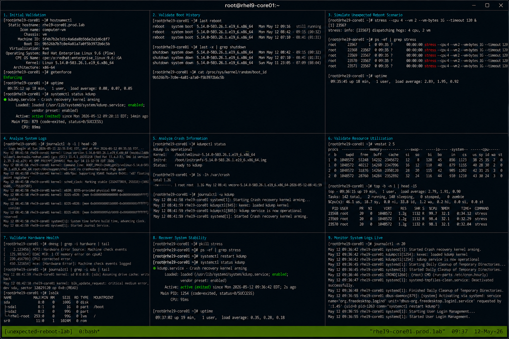

# Case 7 Unexpected Reboot

## Overview

This lab demonstrates troubleshooting unexpected system reboot events on RHEL 9.6 systems. The exercise covers identifying reboot causes, analyzing kernel and system logs, validating hardware and resource conditions, reviewing crash indicators, and restoring operational stability using enterprise Linux troubleshooting workflows.

The workflow follows realistic enterprise Linux operational practices with SELinux enforcing and firewalld enabled.

---

# Objective

In this lab you will:

- Identify unexpected reboot events
- Analyze system boot history
- Review kernel and crash logs
- Validate hardware and resource conditions
- Monitor system stability
- Troubleshoot reboot causes
- Verify service recovery
- Validate operational troubleshooting workflows

---

# Environment Information

| Hostname | Role | IP Address |
|---|---|---|
| rhel9-core01.prod.lab | Core Infrastructure Server | 192.168.60.190 |

Environment details:

- Operating System: RHEL 9.6
- SELinux: Enforcing
- firewalld: Enabled
- Monitoring Utilities: journalctl, last, vmstat
- Crash Utility: kdump

---

# Initial Validation

Verify hostname configuration.

```bash
hostnamectl
```

Expected output:

```text
Static hostname: rhel9-core01.prod.lab
```

---

Verify SELinux mode.

```bash
getenforce
```

Expected output:

```text
Enforcing
```

---

Verify system uptime.

```bash
uptime
```

Expected output:

```text
up
```

---

Verify kdump service state.

```bash
systemctl status kdump
```

Expected output:

```text
active (exited)
```

---

# Validate Boot History

Display reboot history.

```bash
last reboot
```

Expected output:

```text
reboot system boot
```

---

Display previous shutdown events.

```bash
last -x | grep shutdown
```

Expected output:

```text
shutdown
```

---

Verify current boot ID.

```bash
cat /proc/sys/kernel/random/boot_id
```

Expected output:

```text
UUID
```

---

# Simulate Unexpected Reboot Scenario

Generate system workload.

```bash
stress --cpu 4 --vm 2 --vm-bytes 1G --timeout 120 &
```

Expected output:

```text
stress:
```

---

Verify workload execution.

```bash
ps -ef | grep stress
```

Expected output:

```text
stress
```

---

Review current uptime during workload.

```bash
uptime
```

Expected output:

```text
load average
```

---

# Analyze System Logs

Review previous boot logs.

```bash
journalctl -b -1
```

Expected output:

```text
kernel:
```

---

Review kernel panic indicators.

```bash
journalctl -k | grep -i panic
```

Expected output:

```text
panic
```

---

Review hardware-related logs.

```bash
journalctl | grep -i error
```

Expected output:

```text
hardware error
```

---

# Analyze Crash Information

Verify crash dump configuration.

```bash
kdumpctl status
```

Expected output:

```text
Kdump is operational
```

---

Verify crash dump location.

```bash
ls -lh /var/crash
```

Expected output:

```text
vmcore
```

---

Review crash service logs.

```bash
journalctl -u kdump
```

Expected output:

```text
Starting Crash recovery kernel
```

---

# Validate Resource Utilization

Monitor memory and CPU activity.

```bash
vmstat 2 5
```

Expected output:

```text
memory cpu
```

---

Monitor system load.

```bash
top
```

Expected output:

```text
Tasks:
```

---

Monitor disk activity.

```bash
iostat 2 5
```

Expected output:

```text
Device
```

---

# Validate Hardware Health

Review hardware events.

```bash
dmesg | grep -i hardware
```

Expected output:

```text
hardware
```

---

Review storage-related messages.

```bash
journalctl | grep -i sda
```

Expected output:

```text
I/O error
```

---

Verify active block devices.

```bash
lsblk
```

Expected output:

```text
sda
```

---

# Recover System Stability

Terminate workload processes.

```bash
pkill stress
```

---

Verify workload cleanup.

```bash
ps -ef | grep stress
```

Expected output:

```text
No output
```

---

Restart failed services if required.

```bash
sudo systemctl restart kdump
```

---

Verify system stability.

```bash
uptime
```

Expected output:

```text
load average
```

---

# Monitoring Validation

Monitor system logs live.

```bash
journalctl -f
```

---

Monitor reboot events.

```bash
last reboot
```

---

Monitor system resource usage.

```bash
top
```

---

Monitor kernel messages.

```bash
dmesg -w
```

---

# Logging Validation

Review recent system logs.

```bash
journalctl -n 50
```

Expected output:

```text
systemd
```

---

Review kernel logs.

```bash
journalctl -k
```

Expected output:

```text
kernel
```

---

Review failed service logs.

```bash
systemctl --failed
```

Expected output:

```text
0 loaded units listed
```

---

# Troubleshooting

Verify uptime stability.

```bash
uptime
```

---

Verify boot history.

```bash
last reboot
```

---

Verify active services.

```bash
systemctl list-units --type=service
```

---

Verify kdump status.

```bash
kdumpctl status
```

Expected output:

```text
operational
```

---

Verify SELinux mode.

```bash
getenforce
```

Expected output:

```text
Enforcing
```

---

# Persistence Validation

Reboot the server.

```bash
sudo reboot
```

---

Verify clean system boot.

```bash
last reboot | head
```

Expected output:

```text
still running
```

---

Verify kdump service state after reboot.

```bash
systemctl status kdump
```

Expected output:

```text
active (exited)
```

---

Verify uptime after reboot.

```bash
uptime
```

Expected output:

```text
up
```

---

# Security Validation

Verify SELinux remains enforcing.

```bash
getenforce
```

Expected output:

```text
Enforcing
```

---

Verify running services.

```bash
systemctl --failed
```

Expected output:

```text
0 loaded units listed
```

---

Verify crash dump permissions.

```bash
ls -ld /var/crash
```

Expected output:

```text
drwx------
```

---

# Operational Recommendations

- Monitor reboot history continuously
- Investigate unexpected reboots immediately
- Enable and validate kdump services
- Monitor hardware and storage errors regularly
- Review kernel panic logs carefully
- Maintain crash dump retention policies
- Document operational recovery workflows
- Monitor resource-intensive workloads carefully

---

# Operational Notes

Unexpected reboot events commonly occur due to kernel panics, hardware failures, storage issues, memory exhaustion, or power-related interruptions.

During troubleshooting validate:

- Boot history
- Kernel logs
- Hardware events
- Crash dump availability
- System resource utilization
- Failed services
- SELinux operational state

---

# Expected Outcome

After completing this lab:

- Unexpected reboot events are identified successfully
- Boot history analysis functions correctly
- Crash log validation operates properly
- Resource monitoring workflows function successfully
- System recovery operations work correctly
- SELinux remains enforcing
- Operational troubleshooting workflows are validated

---


