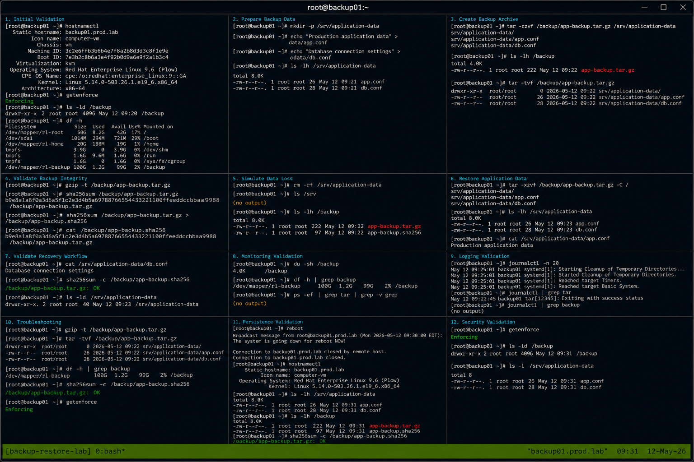

# Backup Restore Procedures

## Overview

This lab demonstrates enterprise Linux backup and restore workflows on RHEL 9.6 systems. The exercise covers creating backups, validating backup integrity, restoring application data, monitoring backup operations, and verifying disaster recovery readiness using realistic enterprise operational procedures.

The workflow follows practical Linux administration standards with SELinux enforcing and firewalld enabled.

---

# Objective

In this lab you will:

- Create filesystem backups
- Validate backup integrity
- Restore application data
- Monitor backup operations
- Verify archive consistency
- Analyze backup logs
- Validate recovery workflows
- Verify operational disaster recovery procedures

---

# Environment Information

| Hostname | Role | IP Address |
|---|---|---|
| backup01.prod.lab | Backup Management Server | 192.168.70.10 |
| app01.prod.lab | Application Server | 192.168.70.20 |

Environment details:

- Operating System: RHEL 9.6
- Backup Utility: tar
- SELinux: Enforcing
- firewalld: Enabled
- Backup Storage Path: /backup

---

# Initial Validation

Verify hostname configuration.

```bash
hostnamectl
```

Expected output:

```text
Static hostname: backup01.prod.lab
```

---

Verify SELinux mode.

```bash
getenforce
```

Expected output:

```text
Enforcing
```

---

Verify backup storage directory.

```bash
ls -ld /backup
```

Expected output:

```text
drwxr-xr-x
```

---

Verify available disk space.

```bash
df -h
```

Expected output:

```text
Avail
```

---

# Prepare Backup Data

Create application data directory.

```bash
sudo mkdir -p /srv/application-data
```

---

Create sample application files.

```bash
echo "Production application data" > /srv/application-data/app.conf
```

```bash
echo "Database connection settings" > /srv/application-data/db.conf
```

---

Verify application files.

```bash
ls -lh /srv/application-data
```

Expected output:

```text
app.conf
db.conf
```

---

# Create Backup Archive

Create compressed backup archive.

```bash
tar -czvf /backup/app-backup.tar.gz /srv/application-data
```

Expected output:

```text
srv/application-data
```

---

Verify backup archive creation.

```bash
ls -lh /backup
```

Expected output:

```text
app-backup.tar.gz
```

---

Verify archive contents.

```bash
tar -tvf /backup/app-backup.tar.gz
```

Expected output:

```text
app.conf
db.conf
```

---

# Validate Backup Integrity

Verify archive integrity.

```bash
gzip -t /backup/app-backup.tar.gz
```

Expected output:

```text
No output
```

---

Generate checksum for validation.

```bash
sha256sum /backup/app-backup.tar.gz
```

Expected output:

```text
SHA256 checksum
```

---

Store checksum file.

```bash
sha256sum /backup/app-backup.tar.gz > /backup/app-backup.sha256
```

---

Verify checksum file.

```bash
cat /backup/app-backup.sha256
```

Expected output:

```text
app-backup.tar.gz
```

---

# Simulate Data Loss

Remove application data.

```bash
rm -rf /srv/application-data
```

---

Verify deletion.

```bash
ls /srv
```

Expected output:

```text
No application-data directory
```

---

Verify backup archive still exists.

```bash
ls -lh /backup
```

Expected output:

```text
app-backup.tar.gz
```

---

# Restore Application Data

Restore backup archive.

```bash
tar -xzvf /backup/app-backup.tar.gz -C /
```

Expected output:

```text
srv/application-data
```

---

Verify restored files.

```bash
ls -lh /srv/application-data
```

Expected output:

```text
app.conf
db.conf
```

---

Verify restored file contents.

```bash
cat /srv/application-data/app.conf
```

Expected output:

```text
Production application data
```

---

# Validate Recovery Workflow

Verify restored configuration files.

```bash
cat /srv/application-data/db.conf
```

Expected output:

```text
Database connection settings
```

---

Verify archive checksum.

```bash
sha256sum -c /backup/app-backup.sha256
```

Expected output:

```text
OK
```

---

Verify filesystem permissions.

```bash
ls -ld /srv/application-data
```

Expected output:

```text
drwxr-xr-x
```

---

# Monitoring Validation

Monitor backup directory usage.

```bash
du -sh /backup
```

---

Monitor filesystem utilization.

```bash
df -h
```

---

Monitor active backup operations.

```bash
ps -ef | grep tar
```

Expected output:

```text
tar
```

---

Monitor system logs.

```bash
journalctl -f
```

---

# Logging Validation

Review recent system logs.

```bash
journalctl -n 20
```

Expected output:

```text
systemd
```

---

Review backup operation logs.

```bash
journalctl | grep tar
```

Expected output:

```text
backup
```

---

Review storage-related logs.

```bash
journalctl | grep backup
```

---

# Troubleshooting

Verify backup archive integrity.

```bash
gzip -t /backup/app-backup.tar.gz
```

---

Verify archive contents.

```bash
tar -tvf /backup/app-backup.tar.gz
```

---

Verify available storage capacity.

```bash
df -h
```

---

Verify checksum consistency.

```bash
sha256sum -c /backup/app-backup.sha256
```

Expected output:

```text
OK
```

---

Verify SELinux mode.

```bash
getenforce
```

Expected output:

```text
Enforcing
```

---

# Persistence Validation

Reboot the server.

```bash
sudo reboot
```

---

Verify restored application files.

```bash
ls -lh /srv/application-data
```

Expected output:

```text
app.conf
db.conf
```

---

Verify backup archives persist.

```bash
ls -lh /backup
```

Expected output:

```text
app-backup.tar.gz
```

---

Verify checksum validation.

```bash
sha256sum -c /backup/app-backup.sha256
```

Expected output:

```text
OK
```

---

# Security Validation

Verify SELinux remains enforcing.

```bash
getenforce
```

Expected output:

```text
Enforcing
```

---

Verify backup directory permissions.

```bash
ls -ld /backup
```

Expected output:

```text
drwxr-xr-x
```

---

Verify restored file ownership.

```bash
ls -l /srv/application-data
```

Expected output:

```text
root root
```

---

# Operational Recommendations

- Validate backups regularly
- Store checksum files separately
- Monitor backup storage utilization
- Test restore procedures periodically
- Automate backup scheduling
- Retain multiple backup generations
- Document operational recovery workflows
- Validate backup integrity after creation

---

# Operational Notes

Backup validation and restoration procedures are critical for enterprise Linux operational recovery workflows.

During troubleshooting validate:

- Backup archive integrity
- Filesystem permissions
- Available storage capacity
- Restore consistency
- Archive accessibility
- Checksum validation
- SELinux operational state

---

# Expected Outcome

After completing this lab:

- Backup creation workflows function correctly
- Archive validation operates successfully
- Application data restoration functions properly
- Checksum verification works correctly
- Monitoring and troubleshooting workflows operate successfully
- SELinux remains enforcing
- Operational disaster recovery workflows are validated

---


