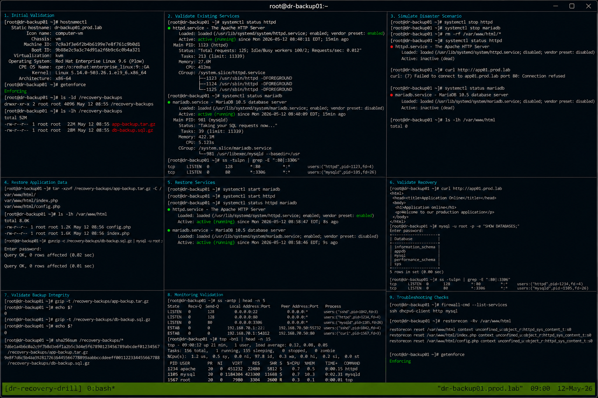

# Disaster Recovery Drill

## Overview

This lab demonstrates a full enterprise Linux disaster recovery drill on RHEL 9.6 systems. The exercise covers backup validation, service recovery, configuration restoration, system verification, and operational recovery testing using realistic enterprise workflows.

The workflow follows enterprise Linux operational standards with SELinux enforcing and firewalld enabled.

---

# Objective

In this lab you will:

- Validate disaster recovery readiness
- Restore critical application services
- Recover configuration files
- Validate service dependencies
- Verify backup integrity
- Monitor operational recovery
- Analyze recovery logs
- Validate complete recovery workflows

---

# Environment Information

| Hostname | Role | IP Address |
|---|---|---|
| dr-backup01.prod.lab | Backup Recovery Server | 192.168.70.50 |
| app01.prod.lab | Application Server | 192.168.70.20 |
| db01.prod.lab | Database Server | 192.168.70.30 |

Environment details:

- Operating System: RHEL 9.6
- Web Service: Apache HTTPD
- Database Service: MariaDB
- SELinux: Enforcing
- firewalld: Enabled
- Backup Path: /recovery-backups

---

# Initial Validation

Verify hostname configuration.

```bash
hostnamectl
```

Expected output:

```text
Static hostname: dr-backup01.prod.lab
```

---

Verify SELinux mode.

```bash
getenforce
```

Expected output:

```text
Enforcing
```

---

Verify backup storage path.

```bash
ls -ld /recovery-backups
```

Expected output:

```text
drwxr-xr-x
```

---

Verify available recovery archives.

```bash
ls -lh /recovery-backups
```

Expected output:

```text
app-backup.tar.gz
db-backup.sql.gz
```

---

# Validate Existing Services

Verify Apache service state.

```bash
systemctl status httpd
```

Expected output:

```text
active (running)
```

---

Verify MariaDB service state.

```bash
systemctl status mariadb
```

Expected output:

```text
active (running)
```

---

Verify active listening ports.

```bash
ss -tulpn
```

Expected output:

```text
:80
:3306
```

---

# Simulate Disaster Scenario

Stop Apache service.

```bash
sudo systemctl stop httpd
```

---

Stop MariaDB service.

```bash
sudo systemctl stop mariadb
```

---

Remove application data.

```bash
rm -rf /var/www/html/*
```

---

Verify service outage.

```bash
systemctl status httpd
```

Expected output:

```text
inactive (dead)
```

---

# Validate Failure State

Attempt HTTP access.

```bash
curl http://app01.prod.lab
```

Expected output:

```text
Connection refused
```

---

Verify database service state.

```bash
systemctl status mariadb
```

Expected output:

```text
inactive (dead)
```

---

Verify empty application directory.

```bash
ls -lh /var/www/html
```

Expected output:

```text
No application files
```

---

# Restore Application Data

Extract application backup.

```bash
tar -xzvf /recovery-backups/app-backup.tar.gz -C /
```

Expected output:

```text
var/www/html
```

---

Verify restored application files.

```bash
ls -lh /var/www/html
```

Expected output:

```text
index.php
config.php
```

---

Restore database backup.

```bash
gunzip -c /recovery-backups/db-backup.sql.gz | mysql -u root -p
```

Expected output:

```text
Query OK
```

---

# Restore Services

Start MariaDB service.

```bash
sudo systemctl start mariadb
```

---

Start Apache service.

```bash
sudo systemctl start httpd
```

---

Verify active services.

```bash
systemctl status httpd mariadb
```

Expected output:

```text
active (running)
```

---

# Validate Recovery

Verify web application access.

```bash
curl http://app01.prod.lab
```

Expected output:

```text
Application online
```

---

Verify database connectivity.

```bash
mysql -u root -p -e "SHOW DATABASES;"
```

Expected output:

```text
information_schema
```

---

Verify listening ports.

```bash
ss -tulpn | grep -E '80|3306'
```

Expected output:

```text
LISTEN
```

---

# Validate Backup Integrity

Verify application archive integrity.

```bash
gzip -t /recovery-backups/app-backup.tar.gz
```

Expected output:

```text
No output
```

---

Verify database backup integrity.

```bash
gzip -t /recovery-backups/db-backup.sql.gz
```

Expected output:

```text
No output
```

---

Generate backup checksums.

```bash
sha256sum /recovery-backups/*
```

Expected output:

```text
SHA256 checksums
```

---

# Monitoring Validation

Monitor Apache logs.

```bash
journalctl -fu httpd
```

---

Monitor MariaDB logs.

```bash
journalctl -fu mariadb
```

---

Monitor active connections.

```bash
ss -antp
```

---

Monitor system resource usage.

```bash
top
```

Expected output:

```text
Tasks:
```

---

# Logging Validation

Review Apache logs.

```bash
journalctl -u httpd
```

---

Review MariaDB logs.

```bash
journalctl -u mariadb
```

---

Review recovery-related logs.

```bash
journalctl | grep recovery
```

Expected output:

```text
restore completed
```

---

# Troubleshooting

Verify restored application files.

```bash
ls -lh /var/www/html
```

---

Verify active services.

```bash
systemctl status httpd mariadb
```

---

Verify firewall access.

```bash
firewall-cmd --list-services
```

Expected output:

```text
http mysql
```

---

Verify SELinux context restoration.

```bash
restorecon -Rv /var/www/html
```

Expected output:

```text
restorecon reset
```

---

Verify SELinux mode.

```bash
getenforce
```

Expected output:

```text
Enforcing
```

---

# Persistence Validation

Reboot the application server.

```bash
sudo reboot
```

---

Verify Apache service after reboot.

```bash
systemctl status httpd
```

Expected output:

```text
active (running)
```

---

Verify MariaDB service after reboot.

```bash
systemctl status mariadb
```

Expected output:

```text
active (running)
```

---

Verify web application access.

```bash
curl http://app01.prod.lab
```

Expected output:

```text
Application online
```

---

# Security Validation

Verify SELinux remains enforcing.

```bash
getenforce
```

Expected output:

```text
Enforcing
```

---

Verify firewall services.

```bash
firewall-cmd --list-services
```

Expected output:

```text
http mysql
```

---

Verify restored file permissions.

```bash
ls -l /var/www/html
```

Expected output:

```text
apache apache
```

---

# Operational Recommendations

- Test disaster recovery procedures regularly
- Validate backup integrity continuously
- Maintain service dependency documentation
- Monitor recovery completion carefully
- Validate SELinux contexts after restore
- Store backups securely and redundantly
- Document operational recovery workflows
- Perform periodic disaster recovery drills

---

# Operational Notes

Disaster recovery validation ensures enterprise Linux environments can recover critical workloads quickly and consistently.

During troubleshooting validate:

- Backup integrity
- Service recovery
- Database accessibility
- Firewall access
- SELinux contexts
- Application functionality
- System resource stability

---

# Expected Outcome

After completing this lab:

- Disaster recovery workflows function correctly
- Service restoration operates successfully
- Backup validation functions properly
- Application and database recovery complete successfully
- Monitoring and troubleshooting workflows operate correctly
- SELinux remains enforcing
- Operational recovery readiness is validated

---


