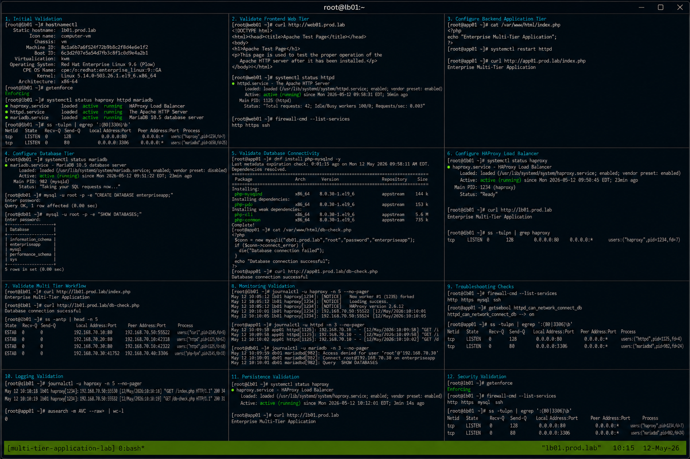

# Multi Tier Application

## Overview

This lab demonstrates deployment and validation of a multi-tier enterprise application on RHEL 9.6 systems. The exercise covers configuring a frontend web server, backend application services, database connectivity, load balancing validation, monitoring workflows, and operational troubleshooting using realistic enterprise Linux practices.

The workflow follows enterprise Linux operational standards with SELinux enforcing and firewalld enabled.

---

# Objective

In this lab you will:

- Configure a multi-tier application stack
- Validate frontend web services
- Configure backend application connectivity
- Validate database communication
- Monitor operational services
- Analyze logs across application tiers
- Troubleshoot service dependencies
- Verify enterprise operational workflows

---

# Environment Information

| Hostname | Role | IP Address |
|---|---|---|
| lb01.prod.lab | HAProxy Load Balancer | 192.168.70.10 |
| web01.prod.lab | Apache Frontend Server | 192.168.70.20 |
| app01.prod.lab | Application Server | 192.168.70.30 |
| db01.prod.lab | MariaDB Database Server | 192.168.70.40 |

Environment details:

- Operating System: RHEL 9.6
- Load Balancer: HAProxy
- Web Service: Apache HTTPD
- Database Service: MariaDB
- SELinux: Enforcing
- firewalld: Enabled

---

# Initial Validation

Verify hostname configuration.

```bash
hostnamectl
```

Expected output:

```text
Static hostname: lb01.prod.lab
```

---

Verify SELinux mode.

```bash
getenforce
```

Expected output:

```text
Enforcing
```

---

Verify active services.

```bash
systemctl status haproxy httpd mariadb
```

Expected output:

```text
active (running)
```

---

Verify listening ports.

```bash
ss -tulpn
```

Expected output:

```text
:80
:3306
```

---

# Validate Frontend Web Tier

Verify Apache web access.

```bash
curl http://web01.prod.lab
```

Expected output:

```text
Apache Test Page
```

---

Verify frontend service state.

```bash
systemctl status httpd
```

Expected output:

```text
active (running)
```

---

Verify frontend firewall rules.

```bash
firewall-cmd --list-services
```

Expected output:

```text
http https
```

---

# Configure Backend Application Tier

Create backend application page.

```bash
sudo tee /var/www/html/index.php > /dev/null <<EOF
<?php
echo "Enterprise Multi-Tier Application";
?>
EOF
```

---

Verify application page.

```bash
cat /var/www/html/index.php
```

Expected output:

```text
Enterprise Multi-Tier Application
```

---

Restart Apache service.

```bash
sudo systemctl restart httpd
```

---

Verify application response.

```bash
curl http://app01.prod.lab/index.php
```

Expected output:

```text
Enterprise Multi-Tier Application
```

---

# Configure Database Tier

Verify MariaDB service state.

```bash
systemctl status mariadb
```

Expected output:

```text
active (running)
```

---

Create application database.

```bash
mysql -u root -p -e "CREATE DATABASE enterpriseapp;"
```

Expected output:

```text
Query OK
```

---

Verify database creation.

```bash
mysql -u root -p -e "SHOW DATABASES;"
```

Expected output:

```text
enterpriseapp
```

---

# Validate Database Connectivity

Install PHP MariaDB module.

```bash
sudo dnf install php-mysqlnd -y
```

Expected output:

```text
Complete!
```

---

Create database validation script.

```bash
sudo tee /var/www/html/db-check.php > /dev/null <<EOF
<?php
$conn = new mysqli("db01.prod.lab","root","password","enterpriseapp");
if ($conn->connect_error) {
  die("Database connection failed");
}
echo "Database connection successful";
?>
EOF
```

---

Verify database connectivity.

```bash
curl http://app01.prod.lab/db-check.php
```

Expected output:

```text
Database connection successful
```

---

# Configure HAProxy Load Balancer

Verify HAProxy service state.

```bash
systemctl status haproxy
```

Expected output:

```text
active (running)
```

---

Verify HAProxy backend connectivity.

```bash
curl http://lb01.prod.lab
```

Expected output:

```text
Enterprise Multi-Tier Application
```

---

Verify listening ports.

```bash
ss -tulpn | grep haproxy
```

Expected output:

```text
:80
```

---

# Validate Multi Tier Workflow

Verify frontend application access.

```bash
curl http://lb01.prod.lab/index.php
```

Expected output:

```text
Enterprise Multi-Tier Application
```

---

Verify backend database validation.

```bash
curl http://lb01.prod.lab/db-check.php
```

Expected output:

```text
Database connection successful
```

---

Verify active backend connections.

```bash
ss -antp
```

Expected output:

```text
ESTAB
```

---

# Monitoring Validation

Monitor HAProxy logs.

```bash
journalctl -fu haproxy
```

---

Monitor Apache logs.

```bash
journalctl -fu httpd
```

---

Monitor MariaDB logs.

```bash
journalctl -fu mariadb
```

---

Monitor active system resources.

```bash
top
```

Expected output:

```text
Tasks:
```

---

# Logging Validation

Review HAProxy logs.

```bash
journalctl -u haproxy
```

---

Review Apache logs.

```bash
journalctl -u httpd
```

---

Review MariaDB logs.

```bash
journalctl -u mariadb
```

---

Review SELinux denials.

```bash
ausearch -m AVC
```

Expected output:

```text
No matches
```

---

# Troubleshooting

Verify service states.

```bash
systemctl status haproxy httpd mariadb
```

---

Verify firewall access.

```bash
firewall-cmd --list-services
```

Expected output:

```text
http https mysql
```

---

Verify SELinux HTTPD database access.

```bash
getsebool httpd_can_network_connect_db
```

Expected output:

```text
on
```

---

Enable database connectivity if required.

```bash
setsebool -P httpd_can_network_connect_db on
```

---

Verify listening ports.

```bash
ss -tulpn
```

Expected output:

```text
:80
:3306
```

---

# Persistence Validation

Reboot all application servers.

```bash
sudo reboot
```

---

Verify HAProxy service after reboot.

```bash
systemctl status haproxy
```

Expected output:

```text
active (running)
```

---

Verify Apache service after reboot.

```bash
systemctl status httpd
```

Expected output:

```text
active (running)
```

---

Verify MariaDB service after reboot.

```bash
systemctl status mariadb
```

Expected output:

```text
active (running)
```

---

Verify application functionality.

```bash
curl http://lb01.prod.lab
```

Expected output:

```text
Enterprise Multi-Tier Application
```

---

# Security Validation

Verify SELinux remains enforcing.

```bash
getenforce
```

Expected output:

```text
Enforcing
```

---

Verify firewall services.

```bash
firewall-cmd --list-services
```

Expected output:

```text
http https mysql
```

---

Verify backend service exposure.

```bash
ss -tulpn
```

Expected output:

```text
:80
:3306
```

---

# Operational Recommendations

- Monitor all application tiers continuously
- Validate backend database connectivity regularly
- Centralize application and database logs
- Monitor HAProxy backend health checks
- Validate SELinux booleans after updates
- Monitor firewall policies carefully
- Document operational recovery procedures
- Validate application functionality after maintenance

---

# Operational Notes

Multi-tier enterprise applications rely on frontend, backend, and database service coordination across multiple Linux systems.

During troubleshooting validate:

- Service dependencies
- Database connectivity
- Firewall access
- SELinux booleans
- Load balancer health
- Application logs
- Listening ports

---

# Expected Outcome

After completing this lab:

- Multi-tier application workflows function correctly
- Frontend and backend connectivity operate successfully
- Database validation functions properly
- HAProxy load balancing operates correctly
- Monitoring and troubleshooting workflows function successfully
- SELinux remains enforcing
- Enterprise operational workflows are validated

---


