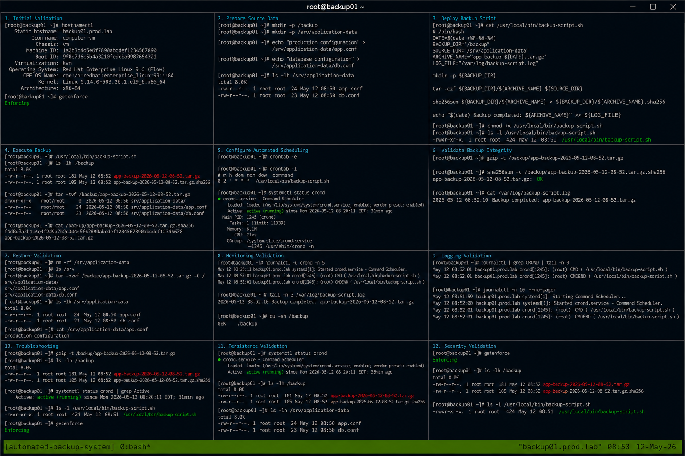

# Automated Backup System

## Overview

This project demonstrates an enterprise Linux automated backup solution using Bash scripting on RHEL 9.6 systems. The implementation provides scheduled filesystem backups, archive compression, checksum validation, logging, and operational recovery workflows using realistic Linux administration practices.

The solution follows enterprise operational standards with SELinux enforcing and firewalld enabled.

---

# Objective

In this project you will:

- Configure automated filesystem backups
- Create reusable backup scripts
- Implement compressed archive generation
- Validate backup integrity using checksums
- Configure operational logging
- Automate backup execution
- Verify recovery workflows
- Validate enterprise backup operations

---

# Environment Information

| Hostname | Role | IP Address |
|---|---|---|
| backup01.prod.lab | Backup Automation Server | 192.168.80.10 |

Environment details:

- Operating System: RHEL 9.6
- Shell Environment: Bash
- SELinux: Enforcing
- firewalld: Enabled
- Backup Path: /backup
- Source Path: /srv/application-data

---

# Initial Validation

Verify hostname configuration.

```bash
hostnamectl
```

Expected output:

```text
Static hostname: backup01.prod.lab
```

---

Verify SELinux mode.

```bash
getenforce
```

Expected output:

```text
Enforcing
```

---

Verify backup storage path.

```bash
mkdir -p /backup
```

---

Verify source application directory.

```bash
mkdir -p /srv/application-data
```

---

Create sample application files.

```bash
echo "production configuration" > /srv/application-data/app.conf
```

```bash
echo "database configuration" > /srv/application-data/db.conf
```

---

Verify application files.

```bash
ls -lh /srv/application-data
```

Expected output:

```text
app.conf
db.conf
```

---

# Backup Script Deployment

Create backup script.

```bash
vi /usr/local/bin/backup-script.sh
```

---

Add the following script.

```bash
#!/bin/bash

DATE=$(date +%F-%H-%M)
BACKUP_DIR="/backup"
SOURCE_DIR="/srv/application-data"
ARCHIVE_NAME="app-backup-${DATE}.tar.gz"
LOG_FILE="/var/log/backup-script.log"

mkdir -p ${BACKUP_DIR}

tar -czf ${BACKUP_DIR}/${ARCHIVE_NAME} ${SOURCE_DIR}

sha256sum ${BACKUP_DIR}/${ARCHIVE_NAME} \
> ${BACKUP_DIR}/${ARCHIVE_NAME}.sha256

echo "$(date) Backup completed: ${ARCHIVE_NAME}" \
>> ${LOG_FILE}
```

---

Apply executable permissions.

```bash
chmod +x /usr/local/bin/backup-script.sh
```

---

Verify script permissions.

```bash
ls -l /usr/local/bin/backup-script.sh
```

Expected output:

```text
-rwxr-xr-x
```

---

# Execute Backup Workflow

Run the backup script.

```bash
/usr/local/bin/backup-script.sh
```

---

Verify generated backups.

```bash
ls -lh /backup
```

Expected output:

```text
app-backup
sha256
```

---

Verify backup archive contents.

```bash
tar -tvf /backup/*.tar.gz
```

Expected output:

```text
srv/application-data
```

---

Verify checksum generation.

```bash
cat /backup/*.sha256
```

Expected output:

```text
SHA256
```

---

# Configure Automated Scheduling

Edit root crontab.

```bash
crontab -e
```

---

Add automated backup schedule.

```cron
0 2 * * * /usr/local/bin/backup-script.sh
```

---

Verify cron configuration.

```bash
crontab -l
```

Expected output:

```text
backup-script.sh
```

---

Verify cron service state.

```bash
systemctl status crond
```

Expected output:

```text
active (running)
```

---

# Backup Validation

Verify archive integrity.

```bash
gzip -t /backup/*.tar.gz
```

Expected output:

```text
No output
```

---

Validate generated checksum.

```bash
sha256sum -c /backup/*.sha256
```

Expected output:

```text
OK
```

---

Verify backup logging.

```bash
cat /var/log/backup-script.log
```

Expected output:

```text
Backup completed
```

---

# Restore Validation

Remove source application data.

```bash
rm -rf /srv/application-data
```

---

Verify deletion.

```bash
ls /srv
```

Expected output:

```text
No application-data directory
```

---

Restore backup archive.

```bash
tar -xzvf /backup/*.tar.gz -C /
```

Expected output:

```text
srv/application-data
```

---

Verify restored files.

```bash
ls -lh /srv/application-data
```

Expected output:

```text
app.conf
db.conf
```

---

Verify restored content.

```bash
cat /srv/application-data/app.conf
```

Expected output:

```text
production configuration
```

---

# Monitoring Validation

Monitor cron service logs.

```bash
journalctl -u crond
```

---

Monitor backup logs.

```bash
tail -f /var/log/backup-script.log
```

---

Monitor backup directory usage.

```bash
du -sh /backup
```

---

Monitor system resource usage.

```bash
top
```

Expected output:

```text
Tasks:
```

---

# Logging Validation

Review backup script logs.

```bash
cat /var/log/backup-script.log
```

---

Review cron logs.

```bash
journalctl | grep CROND
```

Expected output:

```text
CMD
```

---

Review recent system logs.

```bash
journalctl -n 20
```

Expected output:

```text
systemd
```

---

# Troubleshooting

Verify backup archive integrity.

```bash
gzip -t /backup/*.tar.gz
```

---

Verify backup permissions.

```bash
ls -lh /backup
```

---

Verify cron service state.

```bash
systemctl status crond
```

---

Verify script execution permissions.

```bash
ls -l /usr/local/bin/backup-script.sh
```

Expected output:

```text
-rwxr-xr-x
```

---

Verify SELinux mode.

```bash
getenforce
```

Expected output:

```text
Enforcing
```

---

# Persistence Validation

Reboot the server.

```bash
sudo reboot
```

---

Verify cron service after reboot.

```bash
systemctl status crond
```

Expected output:

```text
active (running)
```

---

Verify backup archives persist.

```bash
ls -lh /backup
```

Expected output:

```text
app-backup
```

---

Verify restored application data.

```bash
ls -lh /srv/application-data
```

Expected output:

```text
app.conf
db.conf
```

---

# Security Validation

Verify SELinux remains enforcing.

```bash
getenforce
```

Expected output:

```text
Enforcing
```

---

Verify backup file permissions.

```bash
ls -lh /backup
```

---

Verify script ownership.

```bash
ls -l /usr/local/bin/backup-script.sh
```

Expected output:

```text
root root
```

---

# Operational Recommendations

- Validate backup integrity regularly
- Store backups on separate storage systems
- Monitor cron execution continuously
- Rotate backup archives periodically
- Test restore workflows frequently
- Monitor backup storage utilization
- Centralize backup logging
- Document operational recovery procedures

---

# Operational Notes

Automated backup workflows are critical for enterprise Linux operational recovery and disaster preparedness.

During troubleshooting validate:

- Backup archive integrity
- Cron execution
- Script permissions
- Storage capacity
- Checksum validation
- Restore functionality
- SELinux operational state

---

# Expected Outcome

After completing this project:

- Automated backup workflows function correctly
- Backup archives generate successfully
- Checksum validation operates properly
- Restore workflows function successfully
- Cron scheduling operates correctly
- Monitoring and troubleshooting workflows function properly
- SELinux remains enforcing

---


