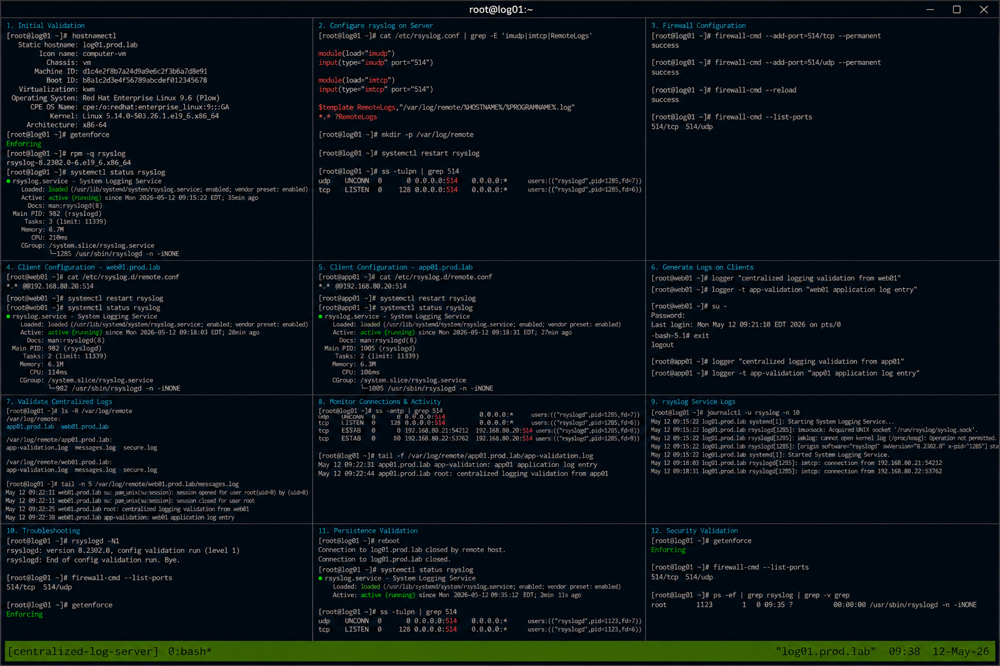

# rsyslog Configuration

## Overview

This document demonstrates enterprise Linux rsyslog configuration for centralized logging on RHEL 9.6 systems. The implementation enables remote log forwarding, centralized log collection, TCP/UDP logging services, and operational monitoring workflows using realistic enterprise Linux administration practices.

The environment follows enterprise operational standards with SELinux enforcing and firewalld enabled.

---

# Objective

In this configuration guide you will:

- Configure rsyslog centralized logging
- Enable TCP and UDP log reception
- Configure client log forwarding
- Validate remote logging workflows
- Monitor centralized log activity
- Verify logging persistence
- Troubleshoot logging failures
- Validate enterprise operational logging

---

# Environment Information

| Hostname | Role | IP Address |
|---|---|---|
| log01.prod.lab | Centralized Log Server | 192.168.80.20 |
| web01.prod.lab | Client Web Server | 192.168.80.21 |
| app01.prod.lab | Client Application Server | 192.168.80.22 |

Environment details:

- Operating System: RHEL 9.6
- Logging Utility: rsyslog
- SELinux: Enforcing
- firewalld: Enabled
- Logging Ports: TCP/UDP 514

---

# Initial Validation

Verify hostname configuration.

```bash
hostnamectl
```

Expected output:

```text
Static hostname: log01.prod.lab
```

---

Verify SELinux mode.

```bash
getenforce
```

Expected output:

```text
Enforcing
```

---

Verify rsyslog package installation.

```bash
rpm -q rsyslog
```

Expected output:

```text
rsyslog
```

---

Verify rsyslog service state.

```bash
systemctl status rsyslog
```

Expected output:

```text
active (running)
```

---

# Configure rsyslog Server

Edit rsyslog configuration file.

```bash
vi /etc/rsyslog.conf
```

---

Enable UDP logging service.

```text
module(load="imudp")
input(type="imudp" port="514")
```

---

Enable TCP logging service.

```text
module(load="imtcp")
input(type="imtcp" port="514")
```

---

Configure remote log storage template.

```text
$template RemoteLogs,"/var/log/remote/%HOSTNAME%/%PROGRAMNAME%.log"
*.* ?RemoteLogs
```

---

Create centralized log directory.

```bash
mkdir -p /var/log/remote
```

---

Set directory permissions.

```bash
chmod 755 /var/log/remote
```

---

Restart rsyslog service.

```bash
systemctl restart rsyslog
```

---

Verify listening ports.

```bash
ss -tulpn | grep 514
```

Expected output:

```text
udp
tcp
```

---

# Configure Firewall Access

Allow rsyslog TCP traffic.

```bash
firewall-cmd --add-port=514/tcp --permanent
```

Expected output:

```text
success
```

---

Allow rsyslog UDP traffic.

```bash
firewall-cmd --add-port=514/udp --permanent
```

Expected output:

```text
success
```

---

Reload firewall configuration.

```bash
firewall-cmd --reload
```

Expected output:

```text
success
```

---

Verify firewall ports.

```bash
firewall-cmd --list-ports
```

Expected output:

```text
514/tcp 514/udp
```

---

# Configure Client Log Forwarding

Edit client rsyslog configuration.

```bash
vi /etc/rsyslog.d/remote.conf
```

---

Add remote forwarding configuration.

```text
*.* @@192.168.80.20:514
```

---

Restart rsyslog service on client systems.

```bash
systemctl restart rsyslog
```

---

Verify rsyslog service state.

```bash
systemctl status rsyslog
```

Expected output:

```text
active (running)
```

---

# Generate Validation Logs

Generate system validation log.

```bash
logger "centralized logging validation"
```

---

Generate application validation log.

```bash
logger -t app-validation "application logging test"
```

---

Generate authentication log entry.

```bash
su -
```

Expected output:

```text
Authentication failure
```

---

# Validate Centralized Logging

Verify remote log directory structure.

```bash
ls -R /var/log/remote
```

Expected output:

```text
web01.prod.lab
app01.prod.lab
```

---

Verify centralized message logs.

```bash
tail -f /var/log/remote/web01.prod.lab/messages.log
```

Expected output:

```text
centralized logging validation
```

---

Verify application logs.

```bash
tail -f /var/log/remote/app01.prod.lab/app-validation.log
```

Expected output:

```text
application logging test
```

---

# Monitoring Validation

Monitor rsyslog service.

```bash
systemctl status rsyslog
```

---

Monitor active logging connections.

```bash
ss -antp | grep 514
```

Expected output:

```text
ESTAB
```

---

Monitor remote log activity.

```bash
tail -f /var/log/remote/*/*.log
```

---

Monitor system resource utilization.

```bash
top
```

Expected output:

```text
rsyslogd
```

---

# Logging Validation

Review rsyslog logs.

```bash
journalctl -u rsyslog
```

Expected output:

```text
Started System Logging Service
```

---

Review recent system logs.

```bash
journalctl -n 20
```

Expected output:

```text
systemd
```

---

Review remote forwarding activity.

```bash
journalctl | grep rsyslog
```

Expected output:

```text
imtcp
imudp
```

---

# Troubleshooting

Validate rsyslog configuration syntax.

```bash
rsyslogd -N1
```

Expected output:

```text
End of config validation run
```

---

Verify listening ports.

```bash
ss -tulpn | grep 514
```

---

Verify firewall rules.

```bash
firewall-cmd --list-ports
```

---

Verify remote log directory permissions.

```bash
ls -ld /var/log/remote
```

Expected output:

```text
drwxr-xr-x
```

---

Verify SELinux mode.

```bash
getenforce
```

Expected output:

```text
Enforcing
```

---

# Persistence Validation

Reboot the centralized log server.

```bash
sudo reboot
```

---

Verify rsyslog service after reboot.

```bash
systemctl status rsyslog
```

Expected output:

```text
active (running)
```

---

Verify listening ports after reboot.

```bash
ss -tulpn | grep 514
```

Expected output:

```text
514/tcp
514/udp
```

---

Verify remote logging functionality.

```bash
logger "post reboot validation"
```

Expected output:

```text
No output
```

---

# Security Validation

Verify SELinux remains enforcing.

```bash
getenforce
```

Expected output:

```text
Enforcing
```

---

Verify firewall exposure.

```bash
firewall-cmd --list-ports
```

Expected output:

```text
514/tcp 514/udp
```

---

Verify rsyslog process ownership.

```bash
ps -ef | grep rsyslog
```

Expected output:

```text
root
```

---

# Operational Recommendations

- Centralize enterprise logs for operational visibility
- Monitor rsyslog service continuously
- Implement log rotation policies
- Restrict centralized log server access
- Validate forwarding after system updates
- Monitor storage utilization regularly
- Archive historical logs periodically
- Document operational recovery workflows

---

# Operational Notes

Centralized rsyslog deployments improve enterprise Linux operational monitoring, troubleshooting, and security visibility across infrastructure environments.

During troubleshooting validate:

- rsyslog service state
- Listening ports
- Firewall rules
- Remote forwarding configuration
- Log directory permissions
- SELinux operational state
- Network connectivity

---

# Expected Outcome

After completing this configuration:

- Centralized logging functions correctly
- Remote forwarding operates successfully
- TCP and UDP log collection function properly
- Monitoring and troubleshooting workflows operate correctly
- Logging persistence functions successfully
- SELinux remains enforcing
- Enterprise operational logging workflows are validated

---


