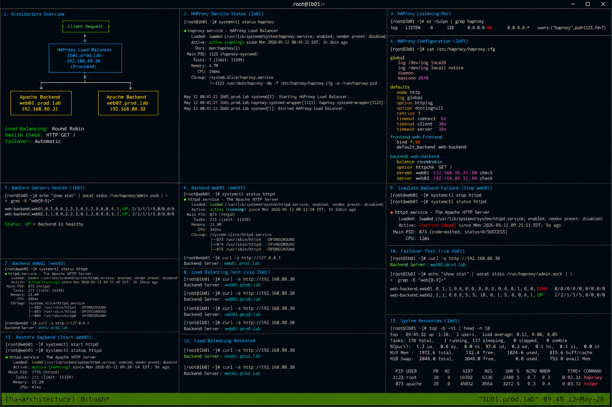

# Highly Available Web Platform Architecture

## Overview

This document demonstrates the architecture design for a highly available enterprise Linux web platform using HAProxy and Apache HTTPD on RHEL 9.6 systems. The environment provides frontend load balancing, backend redundancy, health monitoring, failover handling, and operational resilience using realistic enterprise Linux practices.

The implementation follows enterprise operational standards with SELinux enforcing and firewalld enabled.

---

# Objective

In this architecture guide you will:

- Understand highly available web platform design
- Configure frontend and backend service topology
- Validate backend redundancy workflows
- Monitor HAProxy health checks
- Analyze operational traffic flow
- Troubleshoot backend connectivity
- Validate failover architecture
- Verify enterprise operational workflows

---

# Environment Information

| Hostname | Role | IP Address |
|---|---|---|
| lb01.prod.lab | HAProxy Load Balancer | 192.168.80.30 |
| web01.prod.lab | Apache Backend Server | 192.168.80.31 |
| web02.prod.lab | Apache Backend Server | 192.168.80.32 |

Environment details:

- Operating System: RHEL 9.6
- Load Balancer: HAProxy
- Web Service: Apache HTTPD
- SELinux: Enforcing
- firewalld: Enabled

---

# Architecture Overview

The environment uses a frontend HAProxy node to distribute HTTP traffic across multiple Apache backend servers.

Traffic flow:

```text
Client Request
       |
       v
+-------------------+
| HAProxy Frontend  |
| lb01.prod.lab     |
| 192.168.80.30     |
+-------------------+
       |
       +-------------------+
       |                   |
       v                   v
+----------------+   +----------------+
| web01.prod.lab |   | web02.prod.lab |
| 192.168.80.31  |   | 192.168.80.32  |
| Apache HTTPD   |   | Apache HTTPD   |
+----------------+   +----------------+
```

---

# Initial Validation

Verify hostname configuration.

```bash
hostnamectl
```

Expected output:

```text
Static hostname: lb01.prod.lab
```

---

Verify SELinux mode.

```bash
getenforce
```

Expected output:

```text
Enforcing
```

---

Verify backend connectivity.

```bash
ping -c 2 192.168.80.31
```

Expected output:

```text
2 received
```

---

```bash
ping -c 2 192.168.80.32
```

Expected output:

```text
2 received
```

---

# Validate Backend Web Servers

Verify Apache service state.

```bash
systemctl status httpd
```

Expected output:

```text
active (running)
```

---

Verify listening ports.

```bash
ss -tulpn | grep :80
```

Expected output:

```text
httpd
```

---

Verify backend response from web01.

```bash
curl http://192.168.80.31
```

Expected output:

```text
Backend Server: web01.prod.lab
```

---

Verify backend response from web02.

```bash
curl http://192.168.80.32
```

Expected output:

```text
Backend Server: web02.prod.lab
```

---

# Validate HAProxy Frontend

Verify HAProxy service state.

```bash
systemctl status haproxy
```

Expected output:

```text
active (running)
```

---

Verify frontend listening port.

```bash
ss -tulpn | grep haproxy
```

Expected output:

```text
:80
```

---

Verify HAProxy configuration syntax.

```bash
haproxy -c -f /etc/haproxy/haproxy.cfg
```

Expected output:

```text
Configuration file is valid
```

---

# Validate Traffic Flow

Send validation request through HAProxy.

```bash
curl http://192.168.80.30
```

Expected output:

```text
Backend Server
```

---

Repeat request validation.

```bash
curl http://192.168.80.30
```

Expected output:

```text
Backend Server
```

---

Verify active frontend connections.

```bash
ss -antp | grep :80
```

Expected output:

```text
ESTAB
```

---

# Validate Backend Health Checks

Review HAProxy logs.

```bash
journalctl -u haproxy
```

Expected output:

```text
Health check
```

---

Verify backend availability.

```bash
curl http://192.168.80.31
```

Expected output:

```text
Backend Server
```

---

```bash
curl http://192.168.80.32
```

Expected output:

```text
Backend Server
```

---

# Simulate Backend Failure

Stop Apache service on web01.

```bash
systemctl stop httpd
```

---

Verify failed backend state.

```bash
systemctl status httpd
```

Expected output:

```text
inactive (dead)
```

---

Validate failover operation.

```bash
curl http://192.168.80.30
```

Expected output:

```text
Backend Server: web02.prod.lab
```

---

# Restore Backend Availability

Restart Apache service.

```bash
systemctl start httpd
```

---

Verify restored backend state.

```bash
systemctl status httpd
```

Expected output:

```text
active (running)
```

---

Validate load balancing restoration.

```bash
curl http://192.168.80.30
```

Expected output:

```text
Backend Server
```

---

# Monitoring Validation

Monitor HAProxy service.

```bash
systemctl status haproxy
```

---

Monitor Apache backend services.

```bash
systemctl status httpd
```

---

Monitor active frontend connections.

```bash
ss -antp | grep :80
```

---

Monitor system resource utilization.

```bash
top
```

Expected output:

```text
haproxy
```

---

# Logging Validation

Review HAProxy logs.

```bash
journalctl -u haproxy
```

Expected output:

```text
Server web01 is DOWN
```

---

Review Apache logs.

```bash
journalctl -u httpd
```

Expected output:

```text
Started The Apache HTTP Server
```

---

Review recent system logs.

```bash
journalctl -n 20
```

Expected output:

```text
systemd
```

---

# Troubleshooting

Validate HAProxy configuration syntax.

```bash
haproxy -c -f /etc/haproxy/haproxy.cfg
```

---

Verify frontend listening ports.

```bash
ss -tulpn | grep :80
```

---

Verify backend connectivity.

```bash
curl http://192.168.80.31
```

---

Verify firewall configuration.

```bash
firewall-cmd --list-services
```

Expected output:

```text
http
```

---

Verify SELinux mode.

```bash
getenforce
```

Expected output:

```text
Enforcing
```

---

# Persistence Validation

Reboot the HAProxy server.

```bash
sudo reboot
```

---

Verify HAProxy service after reboot.

```bash
systemctl status haproxy
```

Expected output:

```text
active (running)
```

---

Verify frontend accessibility.

```bash
curl http://192.168.80.30
```

Expected output:

```text
Backend Server
```

---

Verify firewall persistence.

```bash
firewall-cmd --list-services
```

Expected output:

```text
http
```

---

# Security Validation

Verify SELinux remains enforcing.

```bash
getenforce
```

Expected output:

```text
Enforcing
```

---

Verify listening ports.

```bash
ss -tulpn
```

Expected output:

```text
:80
```

---

Verify active services.

```bash
systemctl list-units --type=service
```

Expected output:

```text
haproxy.service
httpd.service
```

---

# Operational Recommendations

- Monitor backend health continuously
- Validate failover operations regularly
- Centralize HAProxy and Apache logs
- Restrict unnecessary exposed services
- Monitor frontend traffic patterns
- Validate SELinux policies after updates
- Document operational recovery procedures
- Test backend failover scenarios frequently

---

# Operational Notes

Highly available Linux web platforms rely on frontend load balancing and backend redundancy to maintain operational continuity during backend failures.

During troubleshooting validate:

- Backend health status
- HAProxy configuration
- Firewall rules
- Apache service state
- Active frontend connections
- Failover operations
- SELinux operational state

---

# Expected Outcome

After completing this architecture validation:

- HAProxy frontend architecture functions correctly
- Backend redundancy operates successfully
- Failover workflows function properly
- Monitoring and troubleshooting workflows operate correctly
- Backend recovery operations function successfully
- SELinux remains enforcing
- Enterprise high availability workflows are validated

---


