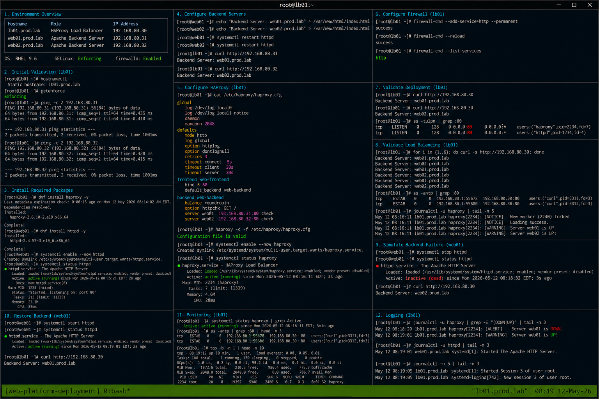

# Highly Available Web Platform Deployment

## Overview

This deployment guide demonstrates implementation of a highly available enterprise Linux web platform using HAProxy and Apache HTTPD on RHEL 9.6 systems. The environment provides frontend load balancing, backend redundancy, failover handling, and operational monitoring using realistic enterprise Linux administration practices.

The implementation follows enterprise operational standards with SELinux enforcing and firewalld enabled.

---

# Objective

In this deployment guide you will:

- Deploy HAProxy load balancing
- Configure Apache backend servers
- Implement backend health checks
- Validate frontend traffic flow
- Configure firewall access
- Monitor operational services
- Troubleshoot failover conditions
- Validate enterprise deployment workflows

---

# Environment Information

| Hostname | Role | IP Address |
|---|---|---|
| lb01.prod.lab | HAProxy Load Balancer | 192.168.80.30 |
| web01.prod.lab | Apache Backend Server | 192.168.80.31 |
| web02.prod.lab | Apache Backend Server | 192.168.80.32 |

Environment details:

- Operating System: RHEL 9.6
- Load Balancer: HAProxy
- Web Service: Apache HTTPD
- SELinux: Enforcing
- firewalld: Enabled

---

# Initial Validation

Verify hostname configuration.

```bash
hostnamectl
```

Expected output:

```text
Static hostname: lb01.prod.lab
```

---

Verify SELinux mode.

```bash
getenforce
```

Expected output:

```text
Enforcing
```

---

Verify backend connectivity.

```bash
ping -c 2 192.168.80.31
```

Expected output:

```text
2 received
```

---

```bash
ping -c 2 192.168.80.32
```

Expected output:

```text
2 received
```

---

# Install Required Packages

Install HAProxy on load balancer.

```bash
dnf install haproxy -y
```

Expected output:

```text
Complete!
```

---

Install Apache on backend servers.

```bash
dnf install httpd -y
```

Expected output:

```text
Complete!
```

---

Enable Apache service.

```bash
systemctl enable --now httpd
```

---

Verify Apache service state.

```bash
systemctl status httpd
```

Expected output:

```text
active (running)
```

---

# Configure Backend Servers

Create backend page on web01.

```bash
echo "Backend Server: web01.prod.lab" \
> /var/www/html/index.html
```

---

Create backend page on web02.

```bash
echo "Backend Server: web02.prod.lab" \
> /var/www/html/index.html
```

---

Restart Apache services.

```bash
systemctl restart httpd
```

---

Verify backend responses.

```bash
curl http://192.168.80.31
```

Expected output:

```text
Backend Server: web01.prod.lab
```

---

```bash
curl http://192.168.80.32
```

Expected output:

```text
Backend Server: web02.prod.lab
```

---

# Configure HAProxy

Edit HAProxy configuration.

```bash
vi /etc/haproxy/haproxy.cfg
```

---

Add frontend configuration.

```haproxy
frontend web-frontend
    bind *:80
    default_backend web-backend
```

---

Add backend configuration.

```haproxy
backend web-backend
    balance roundrobin
    option httpchk GET /
    server web01 192.168.80.31:80 check
    server web02 192.168.80.32:80 check
```

---

Validate configuration syntax.

```bash
haproxy -c -f /etc/haproxy/haproxy.cfg
```

Expected output:

```text
Configuration file is valid
```

---

Enable and start HAProxy.

```bash
systemctl enable --now haproxy
```

---

Verify HAProxy service state.

```bash
systemctl status haproxy
```

Expected output:

```text
active (running)
```

---

# Configure Firewall Access

Allow HTTP service.

```bash
firewall-cmd --add-service=http --permanent
```

Expected output:

```text
success
```

---

Reload firewall configuration.

```bash
firewall-cmd --reload
```

Expected output:

```text
success
```

---

Verify firewall services.

```bash
firewall-cmd --list-services
```

Expected output:

```text
http
```

---

# Validate Deployment

Send validation request through HAProxy.

```bash
curl http://192.168.80.30
```

Expected output:

```text
Backend Server
```

---

Repeat validation request.

```bash
curl http://192.168.80.30
```

Expected output:

```text
Backend Server
```

---

Verify listening ports.

```bash
ss -tulpn | grep :80
```

Expected output:

```text
haproxy
httpd
```

---

# Validate Load Balancing

Run multiple validation requests.

```bash
for i in {1..6}; do curl -s http://192.168.80.30; done
```

Expected output:

```text
Backend Server: web01.prod.lab
Backend Server: web02.prod.lab
```

---

Verify active frontend connections.

```bash
ss -antp | grep :80
```

Expected output:

```text
ESTAB
```

---

Review backend states.

```bash
journalctl -u haproxy
```

Expected output:

```text
Server web01 is UP
```

---

# Simulate Backend Failure

Stop Apache service on web01.

```bash
systemctl stop httpd
```

---

Verify failed backend state.

```bash
systemctl status httpd
```

Expected output:

```text
inactive (dead)
```

---

Validate HAProxy failover.

```bash
curl http://192.168.80.30
```

Expected output:

```text
Backend Server: web02.prod.lab
```

---

# Restore Backend Availability

Start Apache service.

```bash
systemctl start httpd
```

---

Verify restored backend state.

```bash
systemctl status httpd
```

Expected output:

```text
active (running)
```

---

Validate restored load balancing.

```bash
curl http://192.168.80.30
```

Expected output:

```text
Backend Server
```

---

# Monitoring Validation

Monitor HAProxy service.

```bash
systemctl status haproxy
```

---

Monitor backend Apache services.

```bash
systemctl status httpd
```

---

Monitor frontend traffic.

```bash
ss -antp | grep :80
```

---

Monitor system resource utilization.

```bash
top
```

Expected output:

```text
haproxy
```

---

# Logging Validation

Review HAProxy logs.

```bash
journalctl -u haproxy
```

Expected output:

```text
Server web01 is DOWN
```

---

Review Apache logs.

```bash
journalctl -u httpd
```

Expected output:

```text
Started The Apache HTTP Server
```

---

Review recent system logs.

```bash
journalctl -n 20
```

Expected output:

```text
systemd
```

---

# Troubleshooting

Validate HAProxy configuration syntax.

```bash
haproxy -c -f /etc/haproxy/haproxy.cfg
```

---

Verify listening ports.

```bash
ss -tulpn | grep :80
```

---

Verify backend connectivity.

```bash
curl http://192.168.80.31
```

---

Verify firewall rules.

```bash
firewall-cmd --list-services
```

Expected output:

```text
http
```

---

Verify SELinux mode.

```bash
getenforce
```

Expected output:

```text
Enforcing
```

---

# Persistence Validation

Reboot the HAProxy server.

```bash
sudo reboot
```

---

Verify HAProxy service after reboot.

```bash
systemctl status haproxy
```

Expected output:

```text
active (running)
```

---

Verify backend accessibility.

```bash
curl http://192.168.80.30
```

Expected output:

```text
Backend Server
```

---

Verify firewall persistence.

```bash
firewall-cmd --list-services
```

Expected output:

```text
http
```

---

# Security Validation

Verify SELinux remains enforcing.

```bash
getenforce
```

Expected output:

```text
Enforcing
```

---

Verify active listening ports.

```bash
ss -tulpn
```

Expected output:

```text
:80
```

---

Verify active services.

```bash
systemctl list-units --type=service
```

Expected output:

```text
haproxy.service
httpd.service
```

---

# Operational Recommendations

- Monitor backend health continuously
- Validate failover workflows regularly
- Centralize HAProxy and Apache logs
- Restrict unnecessary exposed services
- Monitor frontend traffic patterns
- Validate SELinux policies after updates
- Document operational recovery workflows
- Test backend recovery procedures regularly

---

# Operational Notes

Highly available Linux web deployments rely on frontend load balancing and backend redundancy to maintain operational continuity during backend failures.

During troubleshooting validate:

- Backend health status
- HAProxy configuration
- Apache service state
- Firewall rules
- Active frontend connections
- Load balancing behavior
- SELinux operational state

---

# Expected Outcome

After completing this deployment:

- HAProxy load balancing functions correctly
- Backend redundancy operates successfully
- Failover workflows function properly
- Monitoring and troubleshooting workflows operate correctly
- Backend recovery operations function successfully
- SELinux remains enforcing
- Enterprise deployment workflows are validated

---


