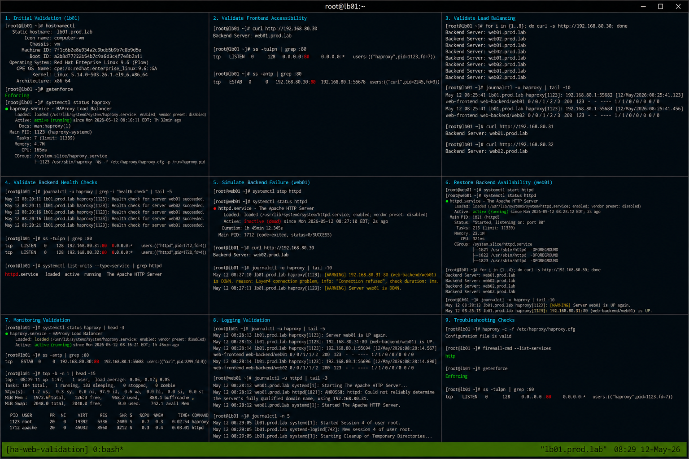

# Highly Available Web Platform Validation

## Overview

This validation guide demonstrates operational testing and verification of a highly available enterprise Linux web platform using HAProxy and Apache HTTPD on RHEL 9.6 systems. The environment validates frontend load balancing, backend redundancy, failover handling, monitoring workflows, and operational recovery using realistic enterprise Linux administration practices.

The implementation follows enterprise operational standards with SELinux enforcing and firewalld enabled.

---

# Objective

In this validation guide you will:

- Validate HAProxy load balancing
- Verify backend redundancy operations
- Test backend failover workflows
- Monitor frontend traffic distribution
- Analyze operational logs
- Troubleshoot backend failures
- Validate recovery operations
- Verify enterprise operational workflows

---

# Environment Information

| Hostname | Role | IP Address |
|---|---|---|
| lb01.prod.lab | HAProxy Load Balancer | 192.168.80.30 |
| web01.prod.lab | Apache Backend Server | 192.168.80.31 |
| web02.prod.lab | Apache Backend Server | 192.168.80.32 |

Environment details:

- Operating System: RHEL 9.6
- Load Balancer: HAProxy
- Web Service: Apache HTTPD
- SELinux: Enforcing
- firewalld: Enabled

---

# Initial Validation

Verify hostname configuration.

```bash
hostnamectl
```

Expected output:

```text
Static hostname: lb01.prod.lab
```

---

Verify SELinux mode.

```bash
getenforce
```

Expected output:

```text
Enforcing
```

---

Verify HAProxy service state.

```bash
systemctl status haproxy
```

Expected output:

```text
active (running)
```

---

Verify Apache backend services.

```bash
systemctl status httpd
```

Expected output:

```text
active (running)
```

---

# Validate Frontend Accessibility

Verify HAProxy frontend response.

```bash
curl http://192.168.80.30
```

Expected output:

```text
Backend Server
```

---

Verify frontend listening ports.

```bash
ss -tulpn | grep :80
```

Expected output:

```text
haproxy
```

---

Verify active frontend connections.

```bash
ss -antp | grep :80
```

Expected output:

```text
ESTAB
```

---

# Validate Load Balancing

Run multiple frontend requests.

```bash
for i in {1..8}; do curl -s http://192.168.80.30; done
```

Expected output:

```text
Backend Server: web01.prod.lab
Backend Server: web02.prod.lab
```

---

Verify backend traffic distribution.

```bash
journalctl -u haproxy | tail -10
```

Expected output:

```text
web01
web02
```

---

Verify backend server accessibility.

```bash
curl http://192.168.80.31
```

Expected output:

```text
Backend Server: web01.prod.lab
```

---

```bash
curl http://192.168.80.32
```

Expected output:

```text
Backend Server: web02.prod.lab
```

---

# Validate Backend Health Checks

Verify HAProxy health checks.

```bash
journalctl -u haproxy
```

Expected output:

```text
Health check
```

---

Verify backend listening ports.

```bash
ss -tulpn | grep :80
```

Expected output:

```text
httpd
```

---

Verify active backend services.

```bash
systemctl list-units --type=service | grep httpd
```

Expected output:

```text
httpd.service
```

---

# Simulate Backend Failure

Stop Apache service on web01.

```bash
systemctl stop httpd
```

---

Verify failed backend state.

```bash
systemctl status httpd
```

Expected output:

```text
inactive (dead)
```

---

Validate HAProxy failover.

```bash
curl http://192.168.80.30
```

Expected output:

```text
Backend Server: web02.prod.lab
```

---

Review HAProxy failure logs.

```bash
journalctl -u haproxy | tail -10
```

Expected output:

```text
Server web01 is DOWN
```

---

# Restore Backend Availability

Restart Apache service on web01.

```bash
systemctl start httpd
```

---

Verify restored backend service.

```bash
systemctl status httpd
```

Expected output:

```text
active (running)
```

---

Validate restored load balancing.

```bash
for i in {1..4}; do curl -s http://192.168.80.30; done
```

Expected output:

```text
Backend Server
```

---

Review HAProxy recovery logs.

```bash
journalctl -u haproxy | tail -10
```

Expected output:

```text
Server web01 is UP
```

---

# Monitoring Validation

Monitor HAProxy service state.

```bash
systemctl status haproxy
```

---

Monitor Apache backend services.

```bash
systemctl status httpd
```

---

Monitor frontend traffic.

```bash
ss -antp | grep :80
```

---

Monitor system resource utilization.

```bash
top
```

Expected output:

```text
haproxy
```

---

# Logging Validation

Review HAProxy logs.

```bash
journalctl -u haproxy
```

Expected output:

```text
Server web01
```

---

Review Apache logs.

```bash
journalctl -u httpd
```

Expected output:

```text
Started The Apache HTTP Server
```

---

Review recent system logs.

```bash
journalctl -n 20
```

Expected output:

```text
systemd
```

---

# Troubleshooting

Validate HAProxy configuration syntax.

```bash
haproxy -c -f /etc/haproxy/haproxy.cfg
```

Expected output:

```text
Configuration file is valid
```

---

Verify frontend listening ports.

```bash
ss -tulpn | grep :80
```

---

Verify backend connectivity.

```bash
curl http://192.168.80.31
```

---

Verify firewall rules.

```bash
firewall-cmd --list-services
```

Expected output:

```text
http
```

---

Verify SELinux mode.

```bash
getenforce
```

Expected output:

```text
Enforcing
```

---

# Persistence Validation

Reboot the load balancer server.

```bash
sudo reboot
```

---

Verify HAProxy service after reboot.

```bash
systemctl status haproxy
```

Expected output:

```text
active (running)
```

---

Verify backend accessibility.

```bash
curl http://192.168.80.30
```

Expected output:

```text
Backend Server
```

---

Verify firewall persistence.

```bash
firewall-cmd --list-services
```

Expected output:

```text
http
```

---

# Security Validation

Verify SELinux remains enforcing.

```bash
getenforce
```

Expected output:

```text
Enforcing
```

---

Verify active listening ports.

```bash
ss -tulpn
```

Expected output:

```text
:80
```

---

Verify active services.

```bash
systemctl list-units --type=service
```

Expected output:

```text
haproxy.service
httpd.service
```

---

# Operational Recommendations

- Monitor backend health continuously
- Validate failover workflows regularly
- Centralize HAProxy and Apache logs
- Restrict unnecessary exposed services
- Monitor frontend traffic patterns
- Validate SELinux policies after updates
- Document operational recovery workflows
- Test backend recovery procedures frequently

---

# Operational Notes

Highly available Linux web environments rely on frontend load balancing and backend redundancy to maintain operational continuity during backend service failures.

During troubleshooting validate:

- Backend health status
- HAProxy configuration
- Apache service state
- Firewall rules
- Active frontend connections
- Failover behavior
- SELinux operational state

---

# Expected Outcome

After completing this validation:

- HAProxy load balancing functions correctly
- Backend redundancy operates successfully
- Failover workflows function properly
- Monitoring and troubleshooting workflows operate correctly
- Backend recovery operations function successfully
- SELinux remains enforcing
- Enterprise operational validation workflows are confirmed

---


