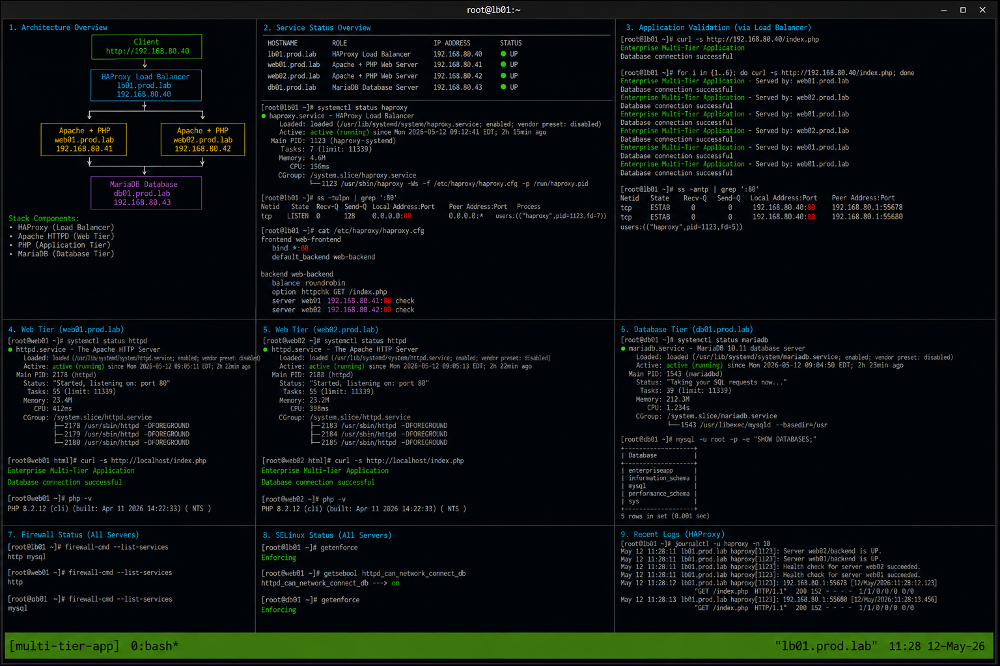

# Multi Tier Linux Application

## Overview

This project demonstrates deployment of a multi-tier enterprise Linux application on RHEL 9.6 systems. The environment includes HAProxy load balancing, Apache frontend services, PHP application processing, and MariaDB database connectivity using realistic enterprise Linux operational workflows.

The implementation follows enterprise operational standards with SELinux enforcing and firewalld enabled.

---

# Objective

In this project you will:

- Deploy a multi-tier Linux application stack
- Configure frontend and backend services
- Validate database connectivity
- Configure load balancing workflows
- Monitor operational services
- Analyze application logs
- Troubleshoot service dependencies
- Validate enterprise deployment workflows

---

# Environment Information

| Hostname | Role | IP Address |
|---|---|---|
| lb01.prod.lab | HAProxy Load Balancer | 192.168.80.40 |
| web01.prod.lab | Apache PHP Server | 192.168.80.41 |
| web02.prod.lab | Apache PHP Server | 192.168.80.42 |
| db01.prod.lab | MariaDB Database Server | 192.168.80.43 |

Environment details:

- Operating System: RHEL 9.6
- Load Balancer: HAProxy
- Web Service: Apache HTTPD
- Application Runtime: PHP
- Database Service: MariaDB
- SELinux: Enforcing
- firewalld: Enabled

---

# Initial Validation

Verify hostname configuration.

```bash
hostnamectl
```

Expected output:

```text
Static hostname: lb01.prod.lab
```

---

Verify SELinux mode.

```bash
getenforce
```

Expected output:

```text
Enforcing
```

---

Verify backend connectivity.

```bash
ping -c 2 192.168.80.41
```

Expected output:

```text
2 received
```

---

```bash
ping -c 2 192.168.80.42
```

Expected output:

```text
2 received
```

---

```bash
ping -c 2 192.168.80.43
```

Expected output:

```text
2 received
```

---

# Install Required Packages

Install Apache and PHP packages.

```bash
dnf install httpd php php-mysqlnd -y
```

Expected output:

```text
Complete!
```

---

Install MariaDB server.

```bash
dnf install mariadb-server -y
```

Expected output:

```text
Complete!
```

---

Enable required services.

```bash
systemctl enable --now httpd mariadb
```

---

Verify service state.

```bash
systemctl status httpd mariadb
```

Expected output:

```text
active (running)
```

---

# Configure Database Tier

Secure MariaDB installation.

```bash
mysql_secure_installation
```

---

Create application database.

```bash
mysql -u root -p -e "CREATE DATABASE enterpriseapp;"
```

Expected output:

```text
Query OK
```

---

Create application user.

```bash
mysql -u root -p -e \
"CREATE USER 'appuser'@'%' IDENTIFIED BY 'StrongPassword';"
```

---

Grant database permissions.

```bash
mysql -u root -p -e \
"GRANT ALL PRIVILEGES ON enterpriseapp.* TO 'appuser'@'%';"
```

---

Reload database privileges.

```bash
mysql -u root -p -e "FLUSH PRIVILEGES;"
```

---

# Configure PHP Application Tier

Create application page.

```bash
vi /var/www/html/index.php
```

---

Add PHP application content.

```php
<?php
echo "Enterprise Multi-Tier Application<br>";

$conn = new mysqli(
    "192.168.80.43",
    "appuser",
    "StrongPassword",
    "enterpriseapp"
);

if ($conn->connect_error) {
    die("Database connection failed");
}

echo "Database connection successful";
?>
```

---

Restart Apache service.

```bash
systemctl restart httpd
```

---

Verify PHP application response.

```bash
curl http://192.168.80.41/index.php
```

Expected output:

```text
Enterprise Multi-Tier Application
Database connection successful
```

---

# Configure HAProxy Load Balancer

Install HAProxy.

```bash
dnf install haproxy -y
```

Expected output:

```text
Complete!
```

---

Edit HAProxy configuration.

```bash
vi /etc/haproxy/haproxy.cfg
```

---

Add frontend configuration.

```haproxy
frontend web-frontend
    bind *:80
    default_backend web-backend
```

---

Add backend configuration.

```haproxy
backend web-backend
    balance roundrobin
    option httpchk GET /index.php
    server web01 192.168.80.41:80 check
    server web02 192.168.80.42:80 check
```

---

Validate HAProxy configuration.

```bash
haproxy -c -f /etc/haproxy/haproxy.cfg
```

Expected output:

```text
Configuration file is valid
```

---

Enable and start HAProxy.

```bash
systemctl enable --now haproxy
```

---

# Configure Firewall Access

Allow HTTP service.

```bash
firewall-cmd --add-service=http --permanent
```

Expected output:

```text
success
```

---

Allow MariaDB service.

```bash
firewall-cmd --add-service=mysql --permanent
```

Expected output:

```text
success
```

---

Reload firewall configuration.

```bash
firewall-cmd --reload
```

Expected output:

```text
success
```

---

Verify firewall services.

```bash
firewall-cmd --list-services
```

Expected output:

```text
http mysql
```

---

# Configure SELinux Access

Enable HTTPD database connectivity.

```bash
setsebool -P httpd_can_network_connect_db on
```

---

Verify SELinux boolean.

```bash
getsebool httpd_can_network_connect_db
```

Expected output:

```text
on
```

---

# Validate Application Workflow

Verify HAProxy frontend response.

```bash
curl http://192.168.80.40/index.php
```

Expected output:

```text
Enterprise Multi-Tier Application
```

---

Verify database connectivity.

```bash
curl http://192.168.80.40/index.php
```

Expected output:

```text
Database connection successful
```

---

Verify load balancing functionality.

```bash
for i in {1..6}; do curl -s http://192.168.80.40/index.php; done
```

Expected output:

```text
web01
web02
```

---

# Monitoring Validation

Monitor HAProxy service.

```bash
systemctl status haproxy
```

---

Monitor Apache services.

```bash
systemctl status httpd
```

---

Monitor MariaDB service.

```bash
systemctl status mariadb
```

---

Monitor active frontend connections.

```bash
ss -antp | grep :80
```

Expected output:

```text
ESTAB
```

---

# Logging Validation

Review HAProxy logs.

```bash
journalctl -u haproxy
```

Expected output:

```text
Health check
```

---

Review Apache logs.

```bash
journalctl -u httpd
```

Expected output:

```text
Started The Apache HTTP Server
```

---

Review MariaDB logs.

```bash
journalctl -u mariadb
```

Expected output:

```text
ready for connections
```

---

# Troubleshooting

Validate HAProxy configuration syntax.

```bash
haproxy -c -f /etc/haproxy/haproxy.cfg
```

---

Verify listening ports.

```bash
ss -tulpn
```

Expected output:

```text
:80
:3306
```

---

Verify database connectivity.

```bash
mysql -u appuser -p -h 192.168.80.43
```

Expected output:

```text
MariaDB
```

---

Verify firewall services.

```bash
firewall-cmd --list-services
```

Expected output:

```text
http mysql
```

---

Verify SELinux mode.

```bash
getenforce
```

Expected output:

```text
Enforcing
```

---

# Persistence Validation

Reboot all application servers.

```bash
sudo reboot
```

---

Verify HAProxy service after reboot.

```bash
systemctl status haproxy
```

Expected output:

```text
active (running)
```

---

Verify Apache service after reboot.

```bash
systemctl status httpd
```

Expected output:

```text
active (running)
```

---

Verify MariaDB service after reboot.

```bash
systemctl status mariadb
```

Expected output:

```text
active (running)
```

---

Verify application accessibility.

```bash
curl http://192.168.80.40/index.php
```

Expected output:

```text
Enterprise Multi-Tier Application
```

---

# Security Validation

Verify SELinux remains enforcing.

```bash
getenforce
```

Expected output:

```text
Enforcing
```

---

Verify firewall exposure.

```bash
firewall-cmd --list-services
```

Expected output:

```text
http mysql
```

---

Verify active listening ports.

```bash
ss -tulpn
```

Expected output:

```text
:80
:3306
```

---

# Operational Recommendations

- Monitor backend health continuously
- Centralize HAProxy and Apache logs
- Monitor database connectivity regularly
- Validate SELinux booleans after updates
- Monitor firewall exposure carefully
- Test failover workflows periodically
- Document operational recovery procedures
- Monitor application response times continuously

---

# Operational Notes

Multi-tier enterprise Linux applications rely on frontend load balancing, backend web services, and stable database connectivity to maintain operational continuity.

During troubleshooting validate:

- Backend health status
- Database connectivity
- HAProxy configuration
- Firewall rules
- SELinux booleans
- Active frontend connections
- Application service states

---

# Expected Outcome

After completing this project:

- Multi-tier application workflows function correctly
- HAProxy load balancing operates successfully
- Database connectivity functions properly
- Monitoring and troubleshooting workflows operate correctly
- Service recovery operations function successfully
- SELinux remains enforcing
- Enterprise deployment workflows are validated

---


