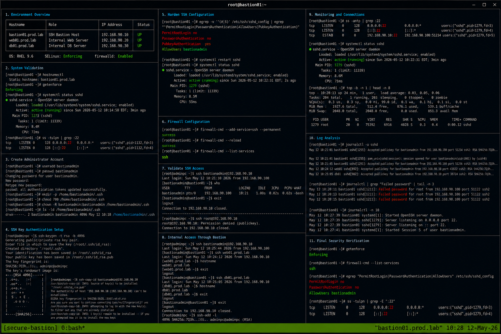

# Secure SSH Bastion Host

## Overview

This project demonstrates deployment of a secure enterprise Linux SSH bastion host on RHEL 9.6 systems. The environment provides centralized administrative access, hardened SSH configurations, firewall restrictions, logging validation, and operational monitoring using realistic enterprise Linux administration workflows.

The implementation follows enterprise operational standards with SELinux enforcing and firewalld enabled.

---

# Objective

In this project you will:

- Deploy a secure SSH bastion host
- Configure hardened SSH access controls
- Restrict administrative access
- Configure firewall protections
- Validate centralized SSH access
- Monitor authentication logs
- Troubleshoot SSH connectivity
- Validate enterprise security workflows

---

# Environment Information

| Hostname | Role | IP Address |
|---|---|---|
| bastion01.prod.lab | Secure SSH Bastion Host | 192.168.90.10 |
| web01.prod.lab | Internal Web Server | 192.168.90.20 |
| db01.prod.lab | Internal Database Server | 192.168.90.30 |

Environment details:

- Operating System: RHEL 9.6
- SSH Service: OpenSSH
- SELinux: Enforcing
- firewalld: Enabled
- Administrative Access: SSH Key Authentication

---

# Initial Validation

Verify hostname configuration.

```bash
hostnamectl
```

Expected output:

```text
Static hostname: bastion01.prod.lab
```

---

Verify SELinux mode.

```bash
getenforce
```

Expected output:

```text
Enforcing
```

---

Verify SSH service state.

```bash
systemctl status sshd
```

Expected output:

```text
active (running)
```

---

Verify listening SSH port.

```bash
ss -tulpn | grep :22
```

Expected output:

```text
sshd
```

---

# Configure Administrative User

Create bastion administrator account.

```bash
useradd bastionadmin
```

---

Configure administrator password.

```bash
passwd bastionadmin
```

---

Create SSH directory.

```bash
mkdir -p /home/bastionadmin/.ssh
```

---

Set SSH directory permissions.

```bash
chmod 700 /home/bastionadmin/.ssh
```

---

Configure ownership.

```bash
chown -R bastionadmin:bastionadmin /home/bastionadmin/.ssh
```

---

# Configure SSH Key Authentication

Generate SSH key pair.

```bash
ssh-keygen -t rsa -b 4096
```

Expected output:

```text
id_rsa
id_rsa.pub
```

---

Copy public key to bastion host.

```bash
ssh-copy-id bastionadmin@192.168.90.10
```

Expected output:

```text
Number of key(s) added
```

---

Verify authorized keys.

```bash
cat /home/bastionadmin/.ssh/authorized_keys
```

Expected output:

```text
ssh-rsa
```

---

# Harden SSH Configuration

Edit SSH daemon configuration.

```bash
vi /etc/ssh/sshd_config
```

---

Disable root login.

```text
PermitRootLogin no
```

---

Disable password authentication.

```text
PasswordAuthentication no
```

---

Restrict allowed users.

```text
AllowUsers bastionadmin
```

---

Enable public key authentication.

```text
PubkeyAuthentication yes
```

---

Restart SSH service.

```bash
systemctl restart sshd
```

---

Verify SSH service state.

```bash
systemctl status sshd
```

Expected output:

```text
active (running)
```

---

# Configure Firewall Access

Allow SSH service.

```bash
firewall-cmd --add-service=ssh --permanent
```

Expected output:

```text
success
```

---

Reload firewall configuration.

```bash
firewall-cmd --reload
```

Expected output:

```text
success
```

---

Verify firewall services.

```bash
firewall-cmd --list-services
```

Expected output:

```text
ssh
```

---

# Validate SSH Access

Test SSH key authentication.

```bash
ssh bastionadmin@192.168.90.10
```

Expected output:

```text
Last login
```

---

Verify failed root login.

```bash
ssh root@192.168.90.10
```

Expected output:

```text
Permission denied
```

---

Verify active SSH sessions.

```bash
who
```

Expected output:

```text
pts
```

---

# Validate Internal Access Workflow

Connect to internal web server through bastion.

```bash
ssh web01.prod.lab
```

Expected output:

```text
Last login
```

---

Connect to internal database server.

```bash
ssh db01.prod.lab
```

Expected output:

```text
Last login
```

---

Verify SSH agent forwarding.

```bash
ssh-add -l
```

Expected output:

```text
RSA
```

---

# Monitoring Validation

Monitor SSH service state.

```bash
systemctl status sshd
```

---

Monitor active SSH connections.

```bash
ss -antp | grep :22
```

Expected output:

```text
ESTAB
```

---

Monitor authentication activity.

```bash
journalctl -fu sshd
```

---

Monitor system resource utilization.

```bash
top
```

Expected output:

```text
sshd
```

---

# Logging Validation

Review SSH authentication logs.

```bash
journalctl -u sshd
```

Expected output:

```text
Accepted publickey
```

---

Review failed authentication attempts.

```bash
journalctl | grep "Failed password"
```

Expected output:

```text
Failed password
```

---

Review recent system logs.

```bash
journalctl -n 20
```

Expected output:

```text
systemd
```

---

# Troubleshooting

Validate SSH configuration syntax.

```bash
sshd -t
```

Expected output:

```text
No output
```

---

Verify listening SSH port.

```bash
ss -tulpn | grep :22
```

---

Verify firewall services.

```bash
firewall-cmd --list-services
```

Expected output:

```text
ssh
```

---

Verify SSH directory permissions.

```bash
ls -ld /home/bastionadmin/.ssh
```

Expected output:

```text
drwx------
```

---

Verify SELinux mode.

```bash
getenforce
```

Expected output:

```text
Enforcing
```

---

# Persistence Validation

Reboot the bastion server.

```bash
sudo reboot
```

---

Verify SSH service after reboot.

```bash
systemctl status sshd
```

Expected output:

```text
active (running)
```

---

Verify SSH accessibility.

```bash
ssh bastionadmin@192.168.90.10
```

Expected output:

```text
Last login
```

---

Verify firewall persistence.

```bash
firewall-cmd --list-services
```

Expected output:

```text
ssh
```

---

# Security Validation

Verify SELinux remains enforcing.

```bash
getenforce
```

Expected output:

```text
Enforcing
```

---

Verify exposed listening ports.

```bash
ss -tulpn
```

Expected output:

```text
:22
```

---

Verify restricted SSH access.

```bash
grep AllowUsers /etc/ssh/sshd_config
```

Expected output:

```text
AllowUsers bastionadmin
```

---

# Operational Recommendations

- Restrict SSH access to trusted administrators
- Enforce SSH key authentication only
- Disable direct root login
- Monitor authentication logs continuously
- Rotate SSH keys periodically
- Restrict exposed services carefully
- Centralize bastion logging workflows
- Validate SSH hardening after updates

---

# Operational Notes

Secure SSH bastion hosts provide centralized administrative access while reducing exposure of internal Linux infrastructure systems.

During troubleshooting validate:

- SSH service state
- Firewall configuration
- SSH key permissions
- Authentication logs
- SELinux operational state
- SSH daemon configuration
- Active SSH sessions

---

# Expected Outcome

After completing this project:

- Secure SSH bastion access functions correctly
- SSH hardening workflows operate successfully
- Administrative access restrictions function properly
- Monitoring and troubleshooting workflows operate correctly
- Firewall protections remain operational
- SELinux remains enforcing
- Enterprise SSH security workflows are validated

---


